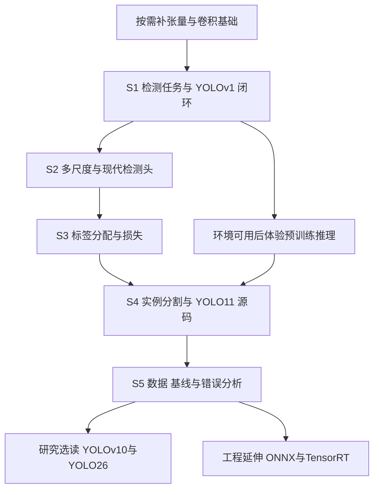

# YOLO 基础模型学习路线与学习手册（终极版）

更新日期：2026-10-01。适用目标：理解目标检测的基本思想，读懂 YOLO 的重要论文，并把知识落实到当前杯子、瓶子、手机三类实例分割项目。

**推荐主线：检测任务与评价 → YOLOv1 的完整闭环 → 现代多尺度检测 → 标签分配与损失 → YOLO11-seg 的掩膜和源码 → 数据、基线与错误分析。YOLOv10、YOLO26 和部署作为后续专题。**

这份文档是课程总入口，统一学习顺序、重点、练习与验收；原论文的深入讲解由配套讲义承担。所谓“终极版”，指把当前学习目标和材料组织成一条完整路线，后续仍可根据实操发现修订。

资料已经准备好，不代表你已经完成学习或模型实验。本文件的学习勾选项初始均未勾选；项目中的训练精度、加速效果和结构改进仍需要真实实验。

## 阅读导航

- [1. 学到什么程度算完成](#goals)
- [2. 路线的组织原则与总图](#route)
- [3. 六个阶段与十八课](#lessons)
- [4. 核心知识：串起一个完整模型](#concepts)
- [5. 论文怎么选、怎么读、怎么评价创新](#papers)
- [6. 当前项目的源码阅读地图](#code)
- [7. 手算练习与参考答案](#exercises)
- [8. 自测、复习与笔记模板](#review)
- [9. 与工程计划的衔接](#project)
- [10. 进阶方向与首次学习安排](#advanced)
- [11. 学习验收记录与资料索引](#records)

<a id="goals"></a>
## 1. 学到什么程度算完成

### 1.1 先明确我们的教学目标

学习 YOLO，最重要的是建立一套能解释预测、训练和评价的知识结构。面对任何一个版本，你都应能回答：输入是什么？输出如何表示？哪些预测接受什么监督？推理怎样把张量还原为目标？实验如何证明它有效？

对于你当前的方向，最终还要解释：为什么两个同类杯子能有各自的掩膜，以及为什么检测框正确时轮廓仍可能不准确。

| 完成层次 | 应具备的能力 | 可以提供的证据 |
| --- | --- | --- |
| 检测入门 | 解释框、类别、分数、IoU、AP、NMS，区分训练与推理 | 一张流程图；坐标、匹配与 NMS 的手算 |
| 现代模型理解 | 解释多尺度特征、解耦头、anchor-free、标签分配和 DFL | 对比表；候选数计算；损失与监督示意图 |
| 实例分割理解 | 解释共享原型、实例系数、掩膜生成和坐标还原 | 原型组合算例；真实模型的输出形状记录 |
| 源码与实验理解 | 根据固定版本追踪实际实现，判断数据与错误问题 | 源码调用地图；基线记录；失败案例分析 |
| 研究阅读能力 | 说明新方法解决了什么问题，实验支持了多强的结论 | 一页论文卡片；消融表分析；公平对照设计 |

**基础课程完成的标准，是前四层有对应证据。**不要求先复现所有历史版本，也不要求先完成 TensorRT 部署。

### 1.2 前置知识只补到够用

开始前做一次简短自检。不会的内容随课补，不需要先重学整门深度学习课程。

| 前置内容 | 最低要求 | 主要用在什么地方 |
| --- | --- | --- |
| Python 与数组 | 看懂索引、循环、函数、矩阵乘法和 reshape | 处理框、系数与原型 |
| 张量 | 理解 batch、channel、height、width；区分维度顺序 | 阅读模型输入输出 |
| 卷积网络 | 理解卷积、步长、下采样、上采样、特征通道 | 阅读 Backbone 与特征融合 |
| 优化与反向传播 | 理解参数、损失、梯度、优化器和一次参数更新 | 阅读训练流程 |
| 基本函数 | 理解 sigmoid、softmax、对数和期望 | 类别、掩膜与 DFL |

如果你能解释 `[2,3,640,640]`，会做 `[5,32] @ [32,100]`，并知道损失下降意味着模型在拟合训练监督，就可以开始。链式法则的完整推导、所有卷积模块的内部细节放到出现具体疑问时再补。

<a id="route"></a>
## 2. 路线的组织原则与总图

### 2.1 为什么这样安排

**第一，先建立完整闭环。**先理解一次检测如何发生，再深入每个模块。否则容易认识许多术语，却无法解释图像怎样变成预测。

**第二，按问题依赖安排论文。**YOLOv1 适合解释最早的统一预测思想；YOLOv3 适合解释多尺度；YOLOX 适合解释现代预测头和样本分配。TOOD、GFL、YOLACT 用来回答特定问题。版本编号并不意味着必须逐篇顺序学习。

**第三，把评价提前。**在训练模型之前，就应知道什么叫预测正确、为什么重复框是错误、为什么 box mAP 与 mask mAP 不一样。否则后面很难判断训练结果。

**第四，把早期推理体验和深入源码分开。**环境可用时，完成检测入门即可体验一次预训练分割推理。深入源码和损失放在具备概念之后，不要求第一课读懂整个仓库。

**第五，当前项目有稳定的锚点。**主线使用方案中的 YOLO11n-seg。YOLO26 是后续研究阅读对象；更换项目模型需要实测理由。现有官方文档也区分检测、实例分割等任务，实例分割输出每个对象的掩膜、类别和分数。[官方任务说明](https://docs.ultralytics.com/tasks/segment)

### 2.2 总体依赖关系



### 2.3 六阶段总览

| 阶段 | 核心问题 | 主要材料 | 结束时的成果 |
| --- | --- | --- | --- |
| S0：按需补基础 | 能否读懂张量和训练循环？ | 本文前置自检；必要的基础知识 | 张量运算与卷积尺寸说明 |
| S1：第 1—4 课 | 一次检测怎样表示、训练、推理和评价？ | YOLOv1 基础卷 | 检测闭环图；手算与指标解释 |
| S2：第 5—7 课 | 现代模型怎样处理尺度、框表示和任务冲突？ | 过渡讲义；YOLOv3；YOLOX | 新旧模型对比图 |
| S3：第 8—10 课 | 大量候选怎样获得有效监督？ | 过渡讲义；TOOD、GFL 选读 | 分配、DFL 与损失笔记 |
| S4：第 11—14 课 | 多个实例怎样获得各自的轮廓？ | YOLACT 选读；YOLO11 官方实现 | 分割链路图；真实张量记录 |
| S5：第 15—18 课 | 怎样训练、评价并解释当前模型？ | 本文；项目方案与进度表 | 数据检查表；基线与错误报告 |

十八课是十八个学习单元，不代表十八天。每课可以拆成“阅读、练习、复述、核查”几次完成；实际速度取决于前置知识和环境。未完成上一课的关键练习时，优先修补该问题。

<a id="lessons"></a>
## 3. 六个阶段与十八课

### S0：准备——先让张量能在脑中流动

先解释 `B×C×H×W`：B 张图片，每张 C 个通道，空间大小 H×W。卷积层不仅改变空间大小，也会改变通道数；通道是不同特征响应，不是不同目标实例。

用纸计算输入 640×640 在累计步长 8、16、32 下的空间大小。再解释为什么 `[5,32] @ [32,100]` 会得到 `[5,100]`。这两项贯穿整个课程。

**通过条件：**能区分空间位置、通道、实例和类别这四个概念。如果只是 Python 不熟，可以边学边练；如果完全不理解卷积和梯度，先补这两项，再进入损失推导。

### S1：第 1—4 课，建立 YOLOv1 的完整闭环

#### 第 1 课：模型到底要回答什么问题？

**重点：**图像分类、目标检测、语义分割、实例分割的区别；框的两种常见坐标表示；IoU 的意义。

**读什么：**[YOLOv1 基础卷](YOLOv1_原论文精读与基础模型学习.md)第 1 节、第 4.4—4.5 节、第 10.1 节。原论文先读摘要、Introduction 和图 1，不需要从参考文献开始。

**怎么练：**画一张有两个杯子的图，分别写出四种任务的期望输出。选两个框手算 IoU。说明“识别出杯子”为什么还不足以判为检测正确。

**验收：**用自己的话解释类别、实例、框和掩膜；把 `xyxy` 与中心宽高互相转换；说明 IoU 同时受位置和尺寸影响。

#### 第 2 课：YOLOv1 的核心创新与输出表示

**重点：**研究背景、统一检测预测、网格责任、`7×7×30`、每单元共享类别、框置信度与类别分数。

**读什么：**基础卷第 2—4 节；原论文 §2 Unified Detection。背景部分理解过去的多阶段流程即可，第一次不必记住所有历史方法的榜单。

**怎么练：**给定图像尺寸和真实框中心，确定所属单元，编码再解码。解释 `30=2×5+20` 和 `98=7×7×2` 分别代表什么。

**验收：**能够说明 YOLOv1 如何把检测组织为固定长度的整图预测；知道两个框预测器并不让一个单元稳定表示任意两个独立目标；不会把 98 个候选说成最多必然检测到 98 个目标。

#### 第 3 课：为什么模型会学会把框放对？

**重点：**责任分配、坐标与尺寸误差、目标置信度、背景置信度、类别误差；训练目标与推理分数的区别。

**读什么：**基础卷第 5 节看总体结构，第 6 节重点精读，第 7 节理解预训练、增强和优化。原论文 §2.1 Training 和损失公式配合阅读。

**怎么练：**把完整损失分成五部分，为每部分写“谁接受监督、目标是什么、错误会怎样”。完成基础卷第 6.10 节的手算，尤其注意两个框中谁负责目标。

**验收：**能说明为什么分类损失只在有目标单元上计算；为什么训练时可以用真值 IoU 定义目标，而推理时网络必须自己预测质量；能读懂一项损失的指示变量。

这里不要求你从零训练 YOLOv1。手算、小型数组练习和训练流程图已经足以验证这一阶段的理解。

#### 第 4 课：怎样从候选框得到可信的评估？

**重点：**置信度筛选、逐类 NMS、预测与真值匹配、Precision、Recall、AP、mAP，以及速度口径。

**读什么：**基础卷第 8—10 节；第 11 节挑一张精度速度表和错误分解图，第 13—14 节理解结论与闭环。全部历史实验细节可以第二遍补读。

**怎么练：**手算三个候选的 NMS；把五个预测按分数排序，逐个标记 TP/FP，写出 Precision 与 Recall。重复检测同一个真值时，后续重复预测应视为 FP。

**验收：**画出训练与推理两条链路；区分 NMS 阈值和评估匹配 IoU 阈值；解释 mAP50 与 mAP50-95 的差别，以及为何不能直接比较不同数据集的 mAP。

**S1 毕业成果：**一张完整检测图、一份手算记录、一段能够口头讲清的 YOLOv1 创新与局限说明。原论文所有内容的详细解释已在基础卷保留，第一次学习只按上述重点推进。

环境可用时，此时可以进行一次官方预训练分割模型推理，观察框、实例掩膜和漏检。它是理解对象的体验，模型是否适合本项目仍由后续数据和评价判断。

### S2：第 5—7 课，从 YOLOv1 走到现代检测

#### 第 5 课：为什么需要多个特征尺度？

**重点：**不同尺寸目标、下采样、细节与语义、跨尺度融合；多尺度训练与多尺度特征预测的区别。

**读什么：**[过渡讲义](02_从YOLOv1到现代YOLO_检测与实例分割基础.md)第 1—2 节；[YOLOv3](../ref/YOLOv3_2018_1804.02767.pdf) §2，尤其 §2.3 Predictions Across Scales。需要理解 anchor 背景时，再补 [YOLO9000](../ref/YOLO9000_2016_1612.08242.pdf) §2 的对应内容。

**怎么练：**画 P3/P4/P5，标出 640 输入下的 80×80、40×40、20×20；计算现代三尺度候选位置数。另算 320 输入的结果，说明输入增大怎样影响计算负担。

**验收：**解释高分辨率特征为什么有助于小目标，又为什么仍需要更深层语义；知道上采样不能凭空恢复原图已经丢失的细节。

#### 第 6 课：anchor box、参考点和 anchor-free

**重点：**先验框、空间参考位置、框偏移和四边距离；“无锚框”并不意味着没有空间参考。

**读什么：**过渡讲义第 3 节；YOLOv3 §2.1；[YOLOX](../ref/YOLOX_2021_2107.08430.pdf) §2.1 中 Anchor-free。YOLO9000 的维度聚类和直接位置预测按需补读。

**怎么练：**画一个参考点与一个真实框，用左、上、右、下四个距离表示框；解释为何一个候选点可以预测任意合理大小的框。

**验收：**能分别定义 anchor box、anchor point、候选框和真实实例。遇到源码中的 `anchors` 变量时，先检查它的内容是中心点还是宽高先验，不能只凭变量名判断模型类型。

#### 第 7 课：为什么分类和定位要拆分预测分支？

**重点：**共享特征与任务特定分支；分类判断“是什么”，回归判断“在哪里”；解耦预测头的动机与代价。

**读什么：**过渡讲义第 4 节；YOLOX §2.1 Decoupled head 与对应结构图、消融实验。

**怎么练：**画一个共享输入、分类分支和回归分支的预测头。对比 YOLOX 与当前 YOLO11 的分数通道：不要默认每个现代模型都有同样的 objectness 分支。

**验收：**解释任务解耦为何可能改善优化，同时也可能增加计算；能用消融结果讨论具体论文证据，而不是说“解耦一定更好”。

**S2 毕业成果：**一张现代检测结构图，以及 YOLOv1、YOLOv3、YOLOX、当前 YOLO11 的概念对比表。重点比较空间尺度、框表示、预测分支、监督和后处理。

### S3：第 8—10 课，理解训练机制

#### 第 8 课：大量候选中，谁负责真实目标？

**重点：**标签分配、正负样本、一对多与一对一、分类与定位的对齐；训练分配与推理筛选是两个环节。

**读什么：**过渡讲义第 5 节；YOLOX 的 Multi positives 和 SimOTA；[TOOD](../ref/TOOD_2021_2108.07755.pdf) 中任务对齐学习部分。只需先掌握基本动机、对齐指标和选择逻辑。

**怎么练：**画一个真值框和周围候选点，标出哪些候选有资格参与分配；给定候选的类别分数与 IoU，计算简化对齐度并排序。

**验收：**能说明“没有正样本”的后果；为什么可以让多个候选拟合同一个目标；为什么分数高但定位差的候选不一定是更好的训练对象。

SimOTA 与当前 YOLO11 的任务对齐分配不能混为一个算法。TOOD 提供概念来源，实际筛选规则和参数以锁定实现为准。

#### 第 9 课：框损失与 DFL 各自在学什么？

**重点：**整体框几何关系、距离的离散分布表示、相邻 bins 的软监督、期望解码、单位转换。

**读什么：**过渡讲义第 6 节；[GFL](../ref/GFL_2020_2006.04388.pdf) 中 General Distribution 与 Distribution Focal Loss。Quality Focal Loss 先理解背景，不把论文所有组件都视为 YOLO11 的原样实现。

**怎么练：**把连续距离 3.4 写成 bin 3 和 bin 4 的监督权重；计算期望；乘步长得到像素距离。解释为什么分类和框损失之外还可能有 DFL。

**验收：**区分 DFL、IoU 类损失与类别损失；区分回归分布的训练通道数和解码后的四个框参数；知道 bins 通常表达距离取值，并不是图像类别。

#### 第 10 课：把监督、损失和训练日志连起来

**重点：**一次训练迭代的完整步骤；多项损失的加权；分类目标可能含质量信息；训练集损失与验证表现的关系。

**读什么：**过渡讲义第 5—6 节复习；官方快照的 `v8DetectionLoss`、`BboxLoss`、`DFLoss` 入口。类名中的 `v8` 不代表你正在训练 YOLOv8，须根据实际模型调用链判断。

**怎么练：**写出“前向 → 解码与分配 → 计算损失 → 反向 → 更新参数”的流程。为每项损失标注目标、正样本范围和权重来源。

**验收：**能解释为什么不同损失数值大小不宜直接当成任务重要性排名；训练损失持续下降、验证 mask mAP 不升时，应检查哪些数据和泛化问题。

**S3 毕业成果：**一张监督关系图、一个 DFL 算例和一份损失解释表。此时应能回答“网络为什么能学会检测”，而不仅是“网络有哪些层”。

### S4：第 11—14 课，进入实例分割与实际源码

#### 第 11 课：为什么两个杯子可以得到不同掩膜？

**重点：**像素分类与实例区分；共享原型、实例系数、线性组合与 sigmoid。

**读什么：**过渡讲义第 7 节；[YOLACT](../ref/YOLACT_2019_1904.02689.pdf) 中 Prototype Generation、Mask Coefficients 和 Mask Assembly。

**怎么练：**完成本文两个原型、两个实例的算例。把原型看作可组合的空间基底，给不同实例使用不同系数，观察输出变化。

**验收：**解释原型数量为何不等于类别数量；为什么同类实例可以有不同系数；为什么掩膜生成还需要实例选择和空间还原。

YOLACT 用于讲清这一设计范式；当前 YOLO11-seg 的分支、损失与后处理仍按其实现解释。

#### 第 12 课：读懂 YOLO11-seg 的计算路径

**重点：**Backbone、融合路径、最终 Segment，P3/P4/P5 的来源；配置文件、模块代码与实际模型的对应关系。

**读什么：**[源码地图](#code)；本地固定快照的分割 YAML、`Detect`、`Segment`；[YOLO11 官方文档](https://docs.ultralytics.com/models/yolo11)。

**怎么练：**从最终 `Segment` 反向追踪三个输入层，再向前追踪原型和系数分支。只在追踪到模块时补读 C3k2、SPPF、C2PSA 的内部细节，不必第一遍全部展开。

**验收：**画出当前模型主图；说明 YAML 中 `head:` 字段还包含特征融合层；指出模型规模与类别数在哪里影响结构。环境可用时记录真实特征大小，未运行前保留“理论预期”标记。

#### 第 13 课：区分训练、推理、导出的实际输出

**重点：**raw 张量、已解码候选、处理后的 `Results`；普通推理与导出分支的封装差别；候选与掩膜系数的对应关系。

**读什么：**过渡讲义第 7.4 节；本地 `head.py` 的相关 `forward` 与推理分支；官方实例分割接口说明。

**怎么练：**建立输出表，记录模型版本、权重、输入、模式、返回类型、每个张量的 shape 和含义。预训练 COCO 模型使用实际 `model.names`；三类输出必须来自正确构建的三类模型。

**验收：**能解释本文 `[1,39,8400]` 的适用条件，不把它写成所有模型的固定格式；能确认筛选后每个框仍与自己的系数对应。

环境尚未可用时，先完成理论表和代码追踪，实测部分保持待完成。基础阅读可以继续；真实前向记录不能靠猜测替代。

#### 第 14 课：掩膜怎样还原到原图，怎样接受监督？

**重点：**原型组合、裁剪、缩放与去补边；实例掩膜监督；box mAP 与 mask mAP 的不同。

**读什么：**过渡讲义第 7 节；固定版本的分割损失和预测后处理实现。已保存快照包含损失文件，后处理还须在实际安装版本中继续查阅。

**怎么练：**给一张非正方形图记录缩放比例与四侧补边，说明框和掩膜怎样返回原图。检查一次两杯同屏、空背景、遮挡图的输出；记录是定位问题、分类问题还是轮廓问题。

**验收：**可以口述“图像 → 特征 → 候选与原型 → 筛选 → 实例掩膜 → 原图结果”；知道插值、裁剪和阈值的次序会影响边缘，正式复现以锁定代码为准。

**S4 毕业成果：**当前模型计算图、三种模式的输出表、一份掩膜生成与还原记录。源码阅读完成和实测完成分开验收。

### S5：第 15—18 课，把理解转化为可信实验

#### 第 15 课：训练数据必须表达正确的问题

**重点：**每实例标注、类别映射、空背景、遗漏标注、轮廓质量、独立数据划分。

**读什么：**[项目背景梳理](YOLO_项目背景与技术学习梳理.md)第 4 节；工程进度 M2；官方分割数据格式按实际版本查阅。

**怎么练：**先画若干代表性样本并检查标注，不急于追求数量。同类两个对象应有两份实例标签。列出拍摄组、物体、背景与划分关系，避免相邻视频帧进入不同集合。

**验收：**能说明为什么框标签不能代替轮廓标签；为什么遗漏杯子会影响训练；为什么随机打散近重复视频帧可能高估泛化。

#### 第 16 课：先建立基线，再判断优化

**重点：**预训练体验、三类微调、公共与自采数据、训练配置、验证选模、测试冻结。

**读什么：**项目背景第 5 节；工程 M3；完整方案中的 E0—E3。

**怎么练：**先写实验表：模型、初始化、数据划分、输入尺寸、种子、训练预算、增强、选权重规则、评价集。实际环境和数据具备后，先做小规模流程检查，再正式训练。

**验收：**能区分 E0 的预训练观察与 E1/E2 的三类微调；不会用一次训练成功证明泛化；能解释为何测试集不应反复用于调参。

#### 第 17 课：读指标，也读失败图像

**重点：**总体与每类指标；小目标、遮挡、光照和背景的错误分组；定位、分类、重复实例、掩膜边缘的问题区分。

**读什么：**本文评价说明；基础卷第 10 节；工程 M3/M8 的报告要求。

**怎么练：**用一组固定案例建立错误表，先记录实际现象，再写原因假设。把“瓶子被漏检”和“瓶子框对了但轮廓漏掉细长部分”分开。

**验收：**每个优化建议至少对应一个真实问题与一种可验证的变化；box mAP 和 mask mAP 分开报告；没有实测时不填虚构数值。

#### 第 18 课：怎样设计一个公平的改进实验？

**重点：**研究假设、控制变量、初始化、计算预算、速度与精度取舍、负结果。

**读什么：**项目背景第 6 节；工程 M4；任一已读论文的消融表。

**怎么练：**为项目已有 P3-SE 设想写一页实验设计：要解决哪个已观察错误？为什么该位置可能有用？与什么基线对比？哪些条件保持一致？哪些结果会支持放弃？

**验收：**区分研究假设与已证实结论；知道加入已有 SE 模块不自动形成原创贡献；微小收益需要检查波动，不能只取最好一次结果。

**S5 毕业成果：**一份包含数据、配置、指标与案例的基线报告，以及一个可执行的对照设计。结构修改的实际训练属于后续工程工作，不是完成学习路线时必须虚构的成果。

<a id="concepts"></a>
## 4. 核心知识：串起一个完整模型

### 4.1 先理解表示，再理解优化

目标检测输出的是一个集合。第 k 个对象通常包括类别、分数和框；实例分割还包括该对象的掩膜。网络首先生成大量候选，再根据分数和实例筛选逻辑得到最终集合。

这里有三种不同的“数量”：候选位置数量、真实实例数量和保留预测数量。它们不能互换。640 输入下的 8400 个位置来自特征图，画面中可能只有两只杯子；筛选后预测也可能是零个、两个或若干误检。

### 4.2 YOLOv1 的历史表示

在 VOC 的设定中，S=7、B=2、C=20，每个单元输出 B 个框的中心、宽高、置信度，以及一组共享类别分数：

$$
S\times S\times(B\cdot5+C)=7\times7\times30.
$$

网格依据真实目标的中心安排责任。预测单元不是从原图裁出的独立小图片；网络仍然处理整图。

YOLOv1 论文的框置信度定义为目标存在程度与定位质量的组合，类别最终分数再结合该单元的条件类别分数。推理时不存在可供计算的真值 IoU；网络学习的是这一量的估计。论文末层是线性输出，不能把其所有数值视为严格受约束的概率。完整公式、责任指示量和局限见基础卷第 4、6 节。

### 4.3 现代表示：从多个尺度上的参考点预测框

假设输入大小 I×I，三个尺度的步长是 8、16、32，且 I 可整除这些步长，位置数为：

$$
N=(I/8)^2+(I/16)^2+(I/32)^2.
$$

一个参考点可以使用四边距离表达框：

$$
(x_1,y_1,x_2,y_2)=(x_a-l,\ y_a-t,\ x_a+r,\ y_a+b).
$$

这个公式说明一种常见框解码思路，具体张量是否存储上述形式，仍需检查模型代码。模型输出也可能已被转换为中心宽高。

YOLOv3 使用先验框，YOLOX 采用 anchor-free 设计，当前 YOLO11 使用参考点和分布式距离回归等机制。它们不是同一张量格式。特别是当前快照中 YOLO11 常规解码后的检测部分包含四个框参数和类别分数，不应套用旧版固定的“objectness × 类别概率”处理。

### 4.4 分配是监督设计的一部分

训练有真实框，推理没有真实框。标签分配发生在训练中：为候选确定匹配真值和监督目标。

一对多可以让多个候选学习同一目标，提高监督覆盖，但推理中可能出现重复预测，需要相应处理。一对一强调唯一预测关系，是理解某些 NMS-free 系统的重要基础；是否能够去掉 NMS 还取决于完整训练设计与实际分支。

任务对齐的教学指标可以写成：

$$
a=p^\alpha\,q^\beta,
$$

其中 p 是对应类别的预测分数，q 表示定位质量。这个式子帮助解释为什么要协调识别和定位。实际算法还涉及候选空间限制、top-k、匹配冲突和目标归一化，不能只拿这一个式子代替完整实现。

### 4.5 DFL：学习一个距离分布

令一个边界距离的预测分布为 \(\pi_i\)，解码距离可以写成期望：

$$
\hat d=\sum_i i\pi_i.
$$

对连续真值 d，令 \(u=\lfloor d\rfloor\)、\(v=u+1\)，常见相邻双位置监督为：

$$
L_{DFL}=-(v-d)\log\pi_u-(d-u)\log\pi_v.
$$

当 d=3.4 时，监督权重为 0.6 与 0.4。分布监督表达边界距离，IoU 类损失约束解码后整体框的几何关系；它们可以同时存在。详细限制、边界处理和 reduction 以固定实现为准。

### 4.6 掩膜：共享空间基底，使用实例自己的组合系数

设共享原型 \(P\in\mathbb{R}^{n_m\times H_p\times W_p}\)，保留 K 个实例后的系数 \(A\in\mathbb{R}^{K\times n_m}\)。展开空间维后：

$$
Z=A\,P_{flat},\qquad \hat M=\sigma(Z).
$$

Z 是 K 个实例的低分辨率 mask logits。sigmoid 得到逐像素值；经过与参考实现一致的裁剪、缩放、去补边、阈值化等步骤，形成原图中的实例掩膜。

不要把每个原型强行解释成“杯子模板”或“瓶子模板”。这些基底由训练学习，通道的意义不必对应人类命名。不同实例有不同系数，因此可以组合出不同轮廓。

### 4.7 当前三类模型的理论张量账本

下表适用条件是：YOLO11 常规非端到端分割路径，batch=1、640×640 输入、三类、32 个掩膜系数、常规无内置 NMS 导出。它是理论账本，尚不能代替本机输出检查。

| 张量 | 理论形状 | 含义 |
| --- | --- | --- |
| 输入 | `[1,3,640,640]` | 网络输入图像 |
| 三尺度空间大小 | `80×80 / 40×40 / 20×20` | 特征位置；通道数另查模型规模 |
| 解码后的候选输出 | `[1,39,8400]` | 4 框参数 + 3 类别分数 + 32 系数 |
| 原型 | `[1,32,160,160]` | 共享低分辨率掩膜基底 |
| 保留实例的系数 | `[K,32]` | K 个实例各自的组合权重 |
| 组合后的 logits | `[K,160,160]` | 裁剪还原前的实例掩膜 |

COCO 预训练模型有 80 类，不能直接用三类的 39 通道解释其输出。训练模式、封装接口、内置 NMS、动态输入或另一模型版本也会改变返回格式。实测表必须单独记录。

### 4.8 指标如何连接到研究结论

IoU 是交集与并集的比例。框 IoU 比较矩形，mask IoU 比较像素区域。一个预测成为 TP，通常需要满足类别与位置匹配条件，并且遵循评估器的一对一匹配规则。

$$
Precision=\frac{TP}{TP+FP},\qquad Recall=\frac{TP}{TP+FN}.
$$

AP 根据某类别的预测分数排序和匹配结果形成 PR 评价；mAP 再对类别求平均。COCO 的 mAP50-95 还在 0.50 到 0.95、步长 0.05 的多个 IoU 阈值上取平均。AP 的插值和采样规则随评估协议而异，不能用任意课堂面积算法冒充官方结果。

对于分割项目，至少区分 box mAP、mask mAP、每类指标与具体失败案例。两个模型的 mAP 相差一点时，还要检查数据、随机波动和评价设置。

速度也有不同含义：模型执行时间、完整处理时间、处理 FPS 和采集到显示的延迟。论文里某 GPU 上的模型时间不能直接作为本机摄像头体验的承诺。

<a id="papers"></a>
## 5. 论文怎么选、怎么读、怎么评价创新

### 5.1 按课程需要使用本地文献

下列论文均已有本地文件，版本和下载来源见 [资料目录](../ref/README_文献目录与来源.md)。整篇精读只对 YOLOv1 作为当前基础要求；其他论文按本路线选段，不把十余篇全部读完设为开始项目的前置条件。

| 文献 | 定位 | 先读什么 | 先解决什么问题 |
| --- | --- | --- | --- |
| [YOLOv1](../ref/YOLO.pdf) | 基础精读 | 摘要、§2、损失、推理、主要实验与结论 | 完整检测如何统一表示和学习 |
| [YOLO9000](../ref/YOLO9000_2016_1612.08242.pdf) | 历史过渡选读 | §2 中 anchors、卷积预测、位置与多尺度训练 | 先验框和训练尺度从何而来 |
| [YOLOv3](../ref/YOLOv3_2018_1804.02767.pdf) | 多尺度核心选读 | §2，重点跨尺度预测 | 大小目标如何共同处理 |
| [YOLOX](../ref/YOLOX_2021_2107.08430.pdf) | 现代检测核心选读 | §2.1 与主消融表 | 解耦头、anchor-free、样本分配 |
| [TOOD](../ref/TOOD_2021_2108.07755.pdf) | 训练专题 | Task Alignment Learning | 分类与定位如何对齐 |
| [GFL](../ref/GFL_2020_2006.04388.pdf) | 回归专题 | 分布式表示与 DFL | 连续边界距离如何监督 |
| [YOLACT](../ref/YOLACT_2019_1904.02689.pdf) | 分割专题 | 原型、系数、组合与相关实验 | 多实例掩膜如何高效生成 |
| [YOLOv7](../ref/YOLOv7_2022_2207.02696.pdf) | 后续选读 | 训练设计与消融 | 结构与训练策略怎样协同 |
| [YOLOv10](../ref/YOLOv10_2024_2405.14458.pdf) | 端到端进阶 | Consistent Dual Assignments | 怎样同时兼顾训练监督与唯一预测 |
| [YOLOv12](../ref/YOLOv12_2025_2502.12524.pdf) | 结构研究选读 | 注意力设计、效率与消融 | 注意力在检测中有什么收益和代价 |
| [YOLO26](../ref/YOLO26_2026_2606.03748.pdf) | 当前进阶主文献 | §3 Method、§4 Experiments，重点检测与分割 | 新的端到端与多任务设计怎样组成系统 |

YOLO11 的当前实用学习资料采用官方实现，而不是把标题含“YOLO11”的任意应用文章当成开发团队原论文。YOLO 系列也不是由单一团队连续完成的统一课程，版本号不能直接代表方法的包含关系。

### 5.2 每篇文献用五个问题组织

你最初要求按照研究背景、研究目标、研究方法、模型评估和研究结论来学。以后每篇论文都按这个结构整理，重要机制再深入到公式、图与代码。

| 阅读部分 | 应回答的问题 | 需要留下的内容 |
| --- | --- | --- |
| 研究背景 | 旧方法具体在哪种情况下遇到困难？ | 一个可理解的失败场景 |
| 研究目标 | 作者希望改善精度、速度、训练还是部署？ | 明确目标与适用边界 |
| 研究方法 | 改了表示、结构、分配、损失还是后处理？ | 输入输出图、公式与因果解释 |
| 模型评估 | 结果是否来自可比较条件？消融支持哪个组件？ | 主表与关键消融的解释 |
| 研究结论 | 证据支持什么，尚未回答什么？ | 贡献、限制、可迁移部分 |

“教授式讲解”应该把问题、机制和证据连接起来。例如，说明多尺度有助于小目标时，还要解释空间分辨率、语义融合与算力之间的关系，而不是只翻译论文句子。

### 5.3 三遍阅读法

**第一遍，抓问题。**读摘要、引言末段、总图和结论。写出“旧方法的问题—作者改变的环节—希望改善的指标”。若还说不清这三点，先不要逐符号推导。

**第二遍，抓机制。**精读与你当前阶段相关的方法部分，为每个公式写清输入、输出、单位、适用对象和训练/推理位置。通过小算例判断自己是否理解。

**第三遍，抓证据。**读消融、失败案例和实验设置。检查基线、数据、输入尺寸、模型规模、初始化与速度环境。再判断哪些机制值得进入当前项目。

第一遍没有读完全部附录很正常；关键是第二遍能解释方法，第三遍能判断证据。YOLOv1 全文讲义可作查阅材料，其他专题尚未逐篇写成同等规模精读卷。

### 5.4 创新点的判断标准

创新需要回答一个具体问题，并说明相较已有方法改变了什么。可以分别讨论新表示、新监督、新结构、新训练策略和新的系统组合，再评价证据。

以 YOLOv1 为例，重点在整图统一检测预测、网格化输出及联合优化带来的实时检测方案；不能把“使用卷积网络”本身说成作者首创。以当前项目为例，加入成熟的 SE 是待验证改进，不能因为模块新接入自己的模型就称为原创方法。

评估组件时，问三个问题：只改变该组件时效果怎样？成本增加多少？改善是否稳定且能在目标场景复现？总体模型更好，不自动证明其中每个模块都有效。

### 5.5 为什么 YOLO26 放在进阶阶段

核查的原始论文是 *Ultralytics YOLO26: Unified Real-Time End-to-End Vision Models*，arXiv:2606.03748，首次提交 2026-06-02。本路线按预印本记录，会议状态不作推断。[论文原始记录](https://arxiv.org/abs/2606.03748)

它适合后续研究阅读，因为覆盖检测与实例分割，与你的方向有关。建议结合本地原文理解：双分支监督与推理关系、去除 DFL 的设计、MuSGD、Progressive Loss、小目标分配 STAL，以及分割原型和辅助监督。

这些问题涉及结构、监督、优化和部署，需要前面的知识作为支撑。理解 DFL 后再分析为什么某个新系统选择不用它，会比背诵“新版删除 DFL”深入得多。

阅读时把论文提出的机制、论文报告的结果和本机尚未验证的表现分开记录。对当前 YOLO11 与 YOLO26 的实际比较，应固定数据、评价和计时条件；不能仅凭发布时间决定替换。

<a id="code"></a>
## 6. 当前项目的源码阅读地图

### 6.1 先固定版本，避免边读边漂移

现有阅读快照来自 `ultralytics/ultralytics` 的 commit `6956125297ae5a90f5d6d371cca93ea51d8320f9`，保存于 `ref/official_sources/`。这提供可追溯的阅读依据，不意味着本机已安装或实际使用了该版本。

实操时另外记录 Python、PyTorch、Ultralytics、硬件、权重来源和实际源码路径。若安装版本与快照不同，比较关键差异后使用与实验相符的实现。尤其不要一边读最新在线文档，一边按旧输出格式写部署代码。

### 6.2 按调用问题阅读，先不展开所有模块

| 阅读顺序 | 本地材料 | 需要找出的内容 |
| --- | --- | --- |
| 1：模型配置 | [yolo11-seg.yaml](../ref/official_sources/ultralytics__cfg__models__11__yolo11-seg.yaml) | 类别数、规模、连接、最终 Segment 输入 |
| 2：预测头 | [head.py](../ref/official_sources/ultralytics__nn__modules__head.py) | Detect 与 Segment、分类与回归、原型与系数、模式差异 |
| 3：标签分配 | [tal.py](../ref/official_sources/ultralytics__utils__tal.py) | 候选条件、对齐度、选择、冲突处理与目标 |
| 4：损失 | [loss.py](../ref/official_sources/ultralytics__utils__loss.py) | 检测、DFL、分割损失，输入和 reduction |
| 5：实际后处理 | 实际安装版本的分割 predictor 与 ops | 筛选、NMS、系数索引、mask 还原 |
| 6：训练入口 | 实际安装版本的 trainer 与数据管线 | 数据、增强、优化、验证和保存 |

官方 YAML 当前最终 Segment 接收第 16、19、22 层对应的 P3/P4/P5。索引是该配置的连接关系；模型规模影响内部通道，修改插层后索引也可能改变。[固定配置来源](https://github.com/ultralytics/ultralytics/blob/6956125297ae5a90f5d6d371cca93ea51d8320f9/ultralytics/cfg/models/11/yolo11-seg.yaml)

### 6.3 阅读一个函数时，固定写五项

1. 它在训练、推理还是导出中运行？
2. 输入是什么类型、形状和单位？
3. 输出是什么类型、形状和含义？
4. 它依赖哪些分配或筛选结果？
5. 哪一个小例子能检查其行为？

遇到长函数先找返回值，再追踪核心张量。暂时跳过设备优化、兼容分支等细节，但把影响输出模式的条件写下来。源码阅读应服务于模型解释，不以浏览完全部文件为目标。

<a id="exercises"></a>
## 7. 手算练习与参考答案

以下是教学算例，不是训练结果；模型相关设定在题目中明确给定。建议先独立计算，再核对答案。

### 练习 A：YOLOv1 网格编码

图像大小 448×448，S=7。真实框中心是 `(160,224)`，宽 112，高 56。采用从 0 开始的列、行索引，单元范围按左闭右开约定。

**问题：**所属单元是什么？局部中心与全图归一化宽高是多少？怎样还原中心？

**答案：**单元边长 64，列 2、行 3；局部中心 `(0.5,0.5)`；宽高 `(0.25,0.125)`。中心还原为 `((2+0.5)/7×448, (3+0.5)/7×448)=(160,224)`。局部中心和宽高的归一化参照不同，是最容易混淆的地方。

### 练习 B：同尺寸框平移后的 IoU

框 A 为 `(0,0,10,10)`，框 B 为 `(2,0,12,10)`，坐标采用连续面积计算。

**答案：**交集 80，两个框各 100，并集 120，IoU 为 `2/3≈0.6667`。若框缩小而像素平移保持不变，IoU 往往下降更多，帮助解释小目标的定位敏感性。

### 练习 C：NMS 与类别

三个框同属杯子：A 分数 0.9、B 分数 0.8、C 分数 0.7。A 与 B 的 IoU 为 0.8，C 与 A/B 的 IoU 都为 0.1；NMS 阈值设为 0.5。

**答案：**先保留 A，抑制 B，再保留 C。若 B 是另一类别，在通常逐类别 NMS 中不因与 A 重叠而被该比较抑制；类别无关 NMS 的规则则不同。这里的阈值是推理去重阈值，不是评估 TP 的匹配阈值。

### 练习 D：候选位置与先验框

输入 640，步长 8、16、32；每位置一个 anchor-free 候选。另设一个教学用 anchor-based 模型，每位置三个先验框。

**答案：**前者位置数 `6400+1600+400=8400`；后者框候选数为 `3×8400=25200`。输入 320 时前者为 `1600+400+100=2100`。候选数不等于最终实例数。

### 练习 E：参考点与四边距离

参考点 `(100,120)`，四边距离 `(l,t,r,b)=(30,20,50,40)`，全部使用像素单位。

**答案：**框为 `(70,100,150,160)`，中心 `(110,130)`，宽高 `(80,60)`。参考点可以不在框中心，因此不要默认预测框的中心等于参考点。

### 练习 F：简化任务对齐

教学设定 `a=p×IoU²`。候选 A 的 p=0.9、IoU=0.4；B 的 p=0.7、IoU=0.8。

**答案：**A 为 0.144，B 为 0.448。在该简化指标中 B 更优，尽管分类分数较低。这不是当前模型参数的声明；实际分配还须满足候选约束并处理冲突。

### 练习 G：DFL 双位置监督

距离 d=3.4，预测给 bin 3 概率 0.6、bin 4 概率 0.4，其余概率为 0；步长设为 8。

**答案：**相邻目标权重是 0.6、0.4；期望 `3×0.6+4×0.4=3.4`；像素距离 27.2；自然对数下交叉熵 `-0.6 ln0.6-0.4 ln0.4≈0.6730`。预测等于软目标时该损失也不必为零，不能把非零值直接视为训练失败。

### 练习 H：两只杯子的独立掩膜

使用两个 2×2 原型：

$$
P_1=\begin{bmatrix}1&0\\1&0\end{bmatrix},\qquad
P_2=\begin{bmatrix}0&1\\0&1\end{bmatrix}.
$$

实例 A 的系数是 `(2,-1)`，实例 B 是 `(-1,2)`。

**答案：**A 的 logits 左列为 2、右列为 -1；B 相反。sigmoid(2)≈0.8808，sigmoid(-1)≈0.2689；按 0.5 阈值，两个实例分别选择左、右区域。共享原型不意味着共享最终掩膜；真实模型有更多原型与复杂后处理。

### 练习 I：检测匹配与 PR

某类有两个真值。按分数从高到低有三个预测：第一个正确匹配真值 1；第二个再次匹配真值 1；第三个正确匹配真值 2，且都满足给定 IoU 条件。

**答案：**在通常一对一评估规则下依次为 TP、FP、TP。累计 `(P,R)` 是 `(1,0.5)`、`(0.5,0.5)`、`(2/3,1)`。重复预测使 Precision 降低；最终 Recall 达到 1 不代表没有错误。具体 AP 还要指定插值与采样协议。

### 练习 J：letterbox 与框还原

原图宽 1280、高 720，等比例缩放到 640×640，教学设定上下对称补边且无额外 stride 调整。网络坐标中的框为 `(100,200,300,400)`。

**答案：**缩放比例 0.5，缩放后 640×360，上下各补 140。去补边并除以比例得到原图框 `(200,120,600,520)`。真实实现须记录实际四侧补边与舍入，不能仅用理论对称值处理所有图片。

<a id="review"></a>
## 8. 自测、复习与笔记模板

### 8.1 每次学习使用同一个闭环

先提出本课问题，阅读相关讲义和原文；再画图或手算；合上资料口头复述；最后核对原文、公式或代码。只读懂文字但没有产生自己的图或解释时，暂不勾选验收。

建议在下一次学习开头复述上次内容，每完成一阶段再画一次整图链路。时间安排按实际可用时间调整，不设置尚未确认的每天学习时长。

### 8.2 十个毕业自测

| 问题 | 答案中必须出现的要点 |
| --- | --- |
| 为什么目标检测比分类复杂？ | 多目标、位置、类别、集合输出与匹配 |
| YOLOv1 的核心贡献是什么？ | 整图统一检测表示与联合预测；实时性及局限 |
| 8400 个位置是 8400 个目标吗？ | 特征图位置、候选与实际实例的区别 |
| anchor-free 为什么还可能需要 NMS？ | 去掉先验框没有消除重复预测 |
| 为什么分类分数高的框可能定位差？ | 不同任务的优化及质量对齐问题 |
| DFL 的 bins 是什么？ | 距离取值、相邻监督和期望解码 |
| 32 个原型是不是 32 个类别？ | 共享基底和实例自己的系数 |
| 为什么训练、普通推理与导出要分别看？ | raw/decoded/processed、模式与封装差别 |
| box mAP 高为什么 mask mAP 可能低？ | 框的几何正确不等于轮廓准确 |
| 怎样证明 P3-SE 值得保留？ | 真实问题、公平对照、稳定收益和成本 |

不要求背诵答案。能够结合当前项目举例，并回答一两个追问，才说明理解已形成。

### 8.3 一页论文笔记模板

```text
论文身份：标题、作者团队、年份、版本、原始链接
研究背景：旧方法在哪种具体情况下出现什么问题？
研究目标：希望改变哪个指标或系统能力？
核心方法：改变的环节；输入输出；公式；训练/推理区别
创新边界：与哪项已有方法比较；哪些只是继承组件？
关键证据：主实验、消融、成本、失败案例
结论边界：支持什么；没有证明什么；可比条件是什么？
与当前项目的关系：可借鉴的机制；迁移前需检查的条件
自己的复述：用一个例子说明整个方法
尚未解决：疑问及下一步查阅出处
```

### 8.4 源码与实验记录模板

```text
版本与环境：commit/包版本、权重、硬件
当前问题：本次要核查的行为
入口与调用：配置 → 模块 → 函数 → 返回值
输入输出：类型、shape、dtype、坐标与单位
模式：训练 / 普通推理 / 导出；相关参数
核查例子：输入、观察到的输出、与理论的差别
结论状态：理论推断 / 已运行核查 / 仍待确认
实验记录：数据划分、初始化、预算、指标、失败图像
```

<a id="project"></a>
## 9. 与工程计划的衔接

### 9.1 学习表与工程表各自负责什么

本文件负责知识顺序与能力验收；[分阶段推进与进度跟踪](../plan/00_YOLO_分阶段推进与进度跟踪.md)负责环境、数据、训练和部署任务。学习阶段 S1—S5 和工程模块 M0—M8 不是一套编号，不能按数字直接对应。

理论阅读不依赖 GPU；真实前向、训练、导出则需要相应环境。你可以先学 S1—S3，同时准备 M0，但尚未跑通模型时不能把 M1 的实操任务勾选完成。

| 学习成果 | 对接工程任务 | 到这里是否必须训练？ |
| --- | --- | --- |
| 区分任务、框与实例 | M1-01 | 否 |
| 当前结构图与模块说明 | M1-02 | 否，实测另记 |
| 真实前向与模式输出表 | M0 可用后，M1-03 | 不需正式训练 |
| 掩膜和后处理解释 | M1-04 | 不需正式训练 |
| 损失与评价解释 | M1-05 | 理论先完成，日志后核查 |
| 完整链路复述和笔记 | M1-06 | 按实际证据验收 |
| 数据质量与划分 | M2 | 否 |
| 基线与错误分析 | M3 | 需要实际训练/评价 |
| P3-SE 对照设计与执行 | M4 | 设计可先写，收益需实测 |
| 独立推理与部署 | M5—M7 | 后续工程延伸 |
| 综合报告 | M8 | 需要汇总真实证据 |

### 9.2 对当前实验矩阵的正确理解

| 实验 | 方案内容 | 能回答什么 |
| --- | --- | --- |
| E0 | COCO 预训练模型观察与环境验证 | 初始能力和链路可用性 |
| E1 | 原三类模型，公共训练池微调 | 三类任务基线 |
| E2 | 原三类模型，公共加自采训练池 | 场景适配方案效果 |
| E3 | 与 E2 同数据的 P3-SE 三类模型 | 结构调整的收益与代价 |

E1/E2 的数据数量和训练步骤可能不同，因此首先反映整体适配方案，而不能自动隔离自采数据来源的单独因果作用。E2/E3 才是当前结构对照的重点，要控制数据、预算、初始化与评价规则。

现阶段不能填写“SE 已提升精度”“已实时运行”“TensorRT 已加速”等结论。失败或无提升也应该保留，它们帮助判断方法适用性。

### 9.3 基础阶段的停止标准

当你能解释整条分割链路，记录真实输出，理解监督与评价，并为当前数据建立可信基线，基础模型学习就可以转入实践巩固。继续读更多论文应围绕具体问题展开。

例如，小目标漏检多，就继续查尺度、候选分配、数据分布与小目标监督；框正确但轮廓差，就查原型分辨率、标签和掩膜还原；模型执行快但显示卡顿，就进入系统计时与缓冲专题。

<a id="advanced"></a>
## 10. 进阶方向与首次学习安排

### 10.1 研究方向：YOLOv10 → YOLO26

进入条件：已能解释标签分配、DFL、重复预测、分割原型和评价。

按下面的问题精读，不必把论文所有任务分支同等展开：

1. **端到端预测：**YOLOv10 的一致双分配怎样协调一对多与一对一？训练与推理分别用哪个分支？
2. **回归设计：**YOLO26 对距离回归与 DFL 作了什么选择？收益是否来自完整系统？
3. **优化与监督：**MuSGD、Progressive Loss、STAL 各针对什么问题？对应消融如何设置？
4. **分割扩展：**原型与辅助监督怎样改善实例掩膜？它与检测分支怎样连接？
5. **证据核查：**区分任务、模型规模、预测分支、硬件与计时口径，讨论能否迁移到当前三类场景。

研究产出是一张方法对照表与一份证据分析。若要实际换模型，应另做相同数据和评价条件的实验；读取新论文并不自动完成模型迁移。

### 10.2 工程方向：ONNX → TensorRT → 实时系统

进入条件：已掌握预处理、输出形状、掩膜后处理和固定基线。具体工程步骤以现有实施方案为准。

先核对相同输入下的原始输出，再核对相同后处理结果，再比较完整评价；之后讨论低精度和性能。只有导出成功不能证明独立推理正确。测速应固定硬件、输入、阈值、批量和计时范围。

ONNX 与 TensorRT 学习可以解释执行与优化，但不应挤占第一轮检测基础。相关 API 会随版本变化，真正实施时重新查官方资料。

### 10.3 第一次就从这里开始

**第一次学习：**完成前置自检与第 1 课。画两个杯子的四种任务输出，算一个 IoU，写清框的坐标参照。

**第二次学习：**完成第 2 课。画 YOLOv1 的网格输出，做练习 A，解释 `7×7×30` 与候选数量。

**第三次学习：**进入第 3 课。把损失写成五部分，先说清监督，再完成手算。不要只抄公式。

随后完成第 4 课，把训练、推理、评价连成闭环，再推进现代检测。每次结束只记一个明确的下一步，例如“核查非负责预测器怎样计算背景置信度损失”，避免写泛泛的“继续学习 YOLO”。

<a id="records"></a>
## 11. 学习验收记录与资料索引

### 11.1 学习记录

以下保留为待验收状态。资料编写完成不自动勾选你的学习进度。

- [ ] S0：能解释张量维度、下采样与矩阵组合。
- [ ] S1：完成网格、坐标、IoU、损失、NMS 和评价练习；画出完整检测链路。
- [ ] S2：能解释多尺度、anchor-free 和解耦头；完成新旧模型对比。
- [ ] S3：能解释分配、几何损失和 DFL；完成训练监督图。
- [ ] S4-理论：能解释原型、系数、实例掩膜、源码路径与坐标还原。
- [ ] S4-实操：记录固定版本下真实前向与模式输出，检查代表性实例结果。
- [ ] S5-设计：完成数据划分、实验配置与公平对照设计。
- [ ] S5-实测：取得可信基线，保存指标与错误案例，能解释结果边界。
- [ ] 进阶研究：完成 YOLOv10/YOLO26 的方法与证据对照。
- [ ] 工程延伸：按独立工程任务完成导出、一致性与实时验证。

### 11.2 当前资料的职责

| 材料 | 应怎样使用 | 内容状态 |
| --- | --- | --- |
| 本手册 | 学习总入口，按课推进与验收 | 已编写 |
| [YOLOv1 精读基础卷](YOLOv1_原论文精读与基础模型学习.md) | 原论文背景、目标、创新、方法、公式、实验、结论和附录的详细讲解 | 已编写 |
| [现代检测与分割过渡讲义](02_从YOLOv1到现代YOLO_检测与实例分割基础.md) | 跨版本概念、现代训练和掩膜基础 | 已编写 |
| [项目背景与技术梳理](YOLO_项目背景与技术学习梳理.md) | 当前项目的任务、假设与工程边界 | 已编写，实操状态以后续证据为准 |
| [文献目录与来源](../ref/README_文献目录与来源.md) | 查原始论文、版本、校验与源码来源 | 已整理 |
| [项目进度跟踪](../plan/00_YOLO_分阶段推进与进度跟踪.md) | 环境、数据、实验与部署的任务验收 | 规划已建立，完成情况须逐项核查 |
| 各现代论文完整精读专题 | 若后续需要逐篇深入，再围绕问题编写 | 未全部编写，不能以已下载替代 |

### 11.3 来源、版本与更新边界

主线概念依据本地原始论文、配套讲义及保存的官方源码。具体文件和 arXiv 版本由 [论文清单](../ref/papers_manifest.json)记录，源码身份由 [快照清单](../ref/official_sources/snapshot_manifest.json)记录。

学习安排是面向当前目标的教学判断；示例均是显式给定条件的教学计算。模型结构与输出结论限定于对应版本和模式。论文指标属于作者报告，本机模型性能、环境可用性和课程掌握程度另行核查。

在线核查入口：[YOLO11 官方说明](https://docs.ultralytics.com/models/yolo11)、[实例分割任务说明](https://docs.ultralytics.com/tasks/segment)、[YOLO26 原始论文记录](https://arxiv.org/abs/2606.03748)。核查日期为 2026-09-30；后续运行时以锁定实验版本为准。
