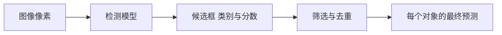

# 第一课：从一张图理解目标检测

编写日期：2026-10-02。对应学习路线第 1 课。本课是一篇可以直接跟读的入门讲义，只需要纸笔或计算器，不要求先学会卷积与反向传播。

**这次只解决三个问题：模型要输出什么？框怎样用数字表达？怎样判断预测位置是否准确？**

先顺序读第 1—5 节，照着算一遍，再完成第 6 节练习。达到第 7 节的标准后，接读 YOLOv1 的预测表示。完整课程安排查 [学习路线与学习手册](00_YOLO学习路线与学习手册_终极版.md)。

<a id="read"></a>
## 1. 从桌面上的两个杯子开始

同学，先想象一张照片：桌面上放着两个杯子。你看一眼，就能知道它们是什么、大概在哪里，以及每个杯子的轮廓。

但对计算机来说，输入首先是一组像素数值。我们必须明确要求模型回答哪一种问题，才能定义输出和训练目标。

| 任务 | 对两个杯子的回答 | 输出形式 |
| --- | --- | --- |
| 图像分类 | 这张图里有杯子 | 图像级类别或分数；不区分两个杯子的位置 |
| 目标检测 | 这里有一个杯子，那里还有一个杯子 | 每个杯子的矩形框、类别、分数 |
| 语义分割 | 这些像素属于杯子 | 像素类别图；两个杯子都标为同一个类别 |
| 实例分割 | 这些像素属于杯子 A，那些属于杯子 B | 每个杯子各自的掩膜，并关联类别等信息 |

**类别回答“是什么”，实例回答“是哪一个对象”。**两个杯子属于同一个类别，但它们是两个实例。即使位置很近或轮廓相接，也不能因为同类就合成一个实例。

这解释了你当前项目为什么选择实例分割：不仅要知道杯子、瓶子和手机的位置，还要得到每个对象自己的轮廓。YOLOv1 原论文讨论的是检测，本课先学检测，因为类别、框与实例关系也是理解后续分割的基础。

请停下来想一次：如果一个系统只输出“杯子：0.95”，你能据此知道两个杯子分别在哪儿吗？不能。这是图像级判断，尚未表达两个独立对象的位置。

## 2. 检测结果到底是什么？

给定一张宽 800、高 600 像素的教学图片，设两个杯子的真实框如下。它们是人为给定的数字，不是模型实测结果。

| 对象 | 类别 | 左上角 | 右下角 |
| --- | --- | --- | --- |
| 杯子 A | cup | `(100,120)` | `(300,420)` |
| 杯子 B | cup | `(500,180)` | `(620,420)` |

一个预测结果可以写成：

```text
预测 1：类别 cup，分数 0.92，框 (100,120,300,420)
预测 2：类别 cup，分数 0.88，框 (500,180,620,420)
```

这里有三种不同信息：

- **类别**：模型认为对象是什么。
- **框**：模型认为对象位于哪里，占据多大的矩形区域。
- **分数**：模型给这个预测的排序或筛选依据；其具体定义随版本变化。

这两个分数只是示意，不能解读成“真实正确率已经测到 92% 和 88%”。类别分数也不等于定位质量；模型可能很确信有杯子，却把框画偏。

照片里没有杯子时，合理输出可能是空集合；有三个杯子时，应有三个对应的预测。因此，最终结果数量随图像变化。后面会学习网络怎样从固定数量的候选中得到这种数量可变的结果。

一个框只是矩形近似，它里面可能包含桌面和杯把之间的空隙。掩膜则用像素表达轮廓。这就是“框正确”与“轮廓准确”不是同一件事的原因。

## 3. 把一个框变成四个数字

### 3.1 先约定坐标方向

图像坐标通常从左上角开始：x 向右增大，y 向下增大。这里使用连续几何坐标，宽高用坐标差计算，不添加 `+1`。

```text
(0,0) ───────────────→ x
  │
  │       (100,120) ┌──────────┐
  │                 │ 杯子 A   │
  │                 └──────────┘ (300,420)
  ↓
  y
```

注意，数组索引常写成 `[行,列]`，也就是 `[y,x]`；点坐标常写成 `(x,y)`。本课先按点坐标计算，后面写代码时再检查索引顺序。

### 3.2 角点表示：xyxy

杯子 A 的框可以写成：

$$
(x_1,y_1,x_2,y_2)=(100,120,300,420).
$$

宽度是 `300-100=200`，高度是 `420-120=300`。这四个数字足以确定矩形的位置和大小。

### 3.3 中心与宽高：xywh

同一个框也可以用中心和尺寸表示：

$$
x_c=\frac{x_1+x_2}{2},\quad y_c=\frac{y_1+y_2}{2},\quad
w=x_2-x_1,\quad h=y_2-y_1.
$$

因此杯子 A 是 `(200,270,200,300)`。这里前两个数字是中心，后两个是尺寸。

反向转换为：

$$
x_1=x_c-\frac w2,\quad y_1=y_c-\frac h2,\quad
x_2=x_c+\frac w2,\quad y_2=y_c+\frac h2.
$$

把 `(200,270,200,300)` 代入，便还原出 `(100,120,300,420)`。

**同一组四个数字，采用不同格式会表达不同的框。**所以看到模型输出时，第一件事是确认坐标格式、单位和参照图像，不能凭“四个数”就直接画框。

### 3.4 为什么要归一化？

为了用相对图像尺寸的方式表达位置，可以把横向量除以图像宽 W，纵向量除以图像高 H：

$$
(x_n,y_n,w_n,h_n)=
\left(\frac{x_c}{W},\frac{y_c}{H},\frac wW,\frac hH\right).
$$

杯子 A 在 800×600 图中的归一化表示是：

```text
(0.25, 0.45, 0.25, 0.50)
```

例如中心横坐标 0.25，意味着位于图像宽度的四分之一处。还原时，横向量乘 800，纵向量乘 600。

请特别留意：x 和宽度用图像宽归一化，y 和高度用图像高归一化。不能四个量都除以 800，也不能认为归一化意味着把坐标相加后等于 1。

本节讲的是**全图归一化**。下一课 YOLOv1 的局部中心坐标相对于网格单元定义，参照不同，届时再引入。

## 4. 怎样判断框画得准不准？

### 4.1 为什么“中心差不多”还不够？

假设模型画了一个很大的框，把杯子和大半张桌面都圈进去。杯子的确在框里，中心也可能很接近，但这个预测没有准确定位对象。

所以我们需要同时考察位置和尺寸。常用量是 IoU，即交并比：

$$
IoU=\frac{\text{两个框的交集面积}}{\text{两个框的并集面积}}.
$$

完全重合时 IoU=1，没有面积重叠时 IoU=0。中间的数值表示重叠程度；它不是类别预测概率。

### 4.2 用杯子 A 完整算一次

真实框 G：`(100,120,300,420)`。

预测框 P：`(120,140,320,440)`。

预测框与真实框大小相同，但向右、向下各偏了 20 像素。

交集的左上角必须同时处于两个框内，所以取左上角坐标的较大值；右下角取较小值：

```text
交集左上角：(max(100,120), max(120,140)) = (120,140)
交集右下角：(min(300,320), min(420,440)) = (300,420)
交集宽高：  180 × 280
交集面积：  50400
```

两个框各自面积都是 `200×300=60000`。把两个面积直接相加，会把重叠部分算两次，因此并集需要减去一次交集：

```text
并集面积 = 60000 + 60000 - 50400 = 69600
IoU = 50400 / 69600 = 21/29 ≈ 0.7241
```

计算无重叠框时，交集宽高还要分别与 0 取较大值，不能让负的宽高产生虚假的正面积。

### 4.3 IoU 达标，是否就算正确检测？

还需要类别正确，并满足评估器的匹配规则。例如，框画在杯子上，类别却预测为瓶子，即使 IoU=1，也不是正确的杯子检测。

假设这次教学评价规定类别正确且 IoU≥0.5 才有资格匹配，那么上述杯子预测满足位置条件。若采用更严格的 IoU≥0.75，它就不满足。这说明“准确”需要明确评价标准，不能只凭看起来差不多。

同一个真实杯子被重复预测两次，也不能算找到两个真实杯子。通常评估对一个真值只允许一个正确匹配，后续重复结果会成为错误预测。这里先建立直觉，NMS、AP 和完整匹配在后续课程学习。

## 5. 现在把模型的任务连起来

先把目标检测想成一个可学习映射：图像进去，框与类别信息出来。具体网络怎样生成这些信息，是下一课要回答的问题。



**训练时**，我们有标注：杯子在哪里、是什么类别。模型先预测，再通过损失衡量预测与监督目标的差异，更新参数。这好比有答案的练习，但损失的具体计算需要精确定义。

**推理时**，我们只有新图像，没有真实答案。模型使用已学参数预测结果，再按对应算法处理候选。此时不能拿不存在的真值来替它算定位质量。

由此自然出现下一课的研究问题：

> 一张图里的对象数量不固定，神经网络怎样安排输出？不同位置的预测由谁负责？

YOLOv1 用网格和固定候选组织这个问题。只要你理解本课的“类别—实例—框—评价”，下一课的网格就有了明确用途。

<a id="practice"></a>
## 6. 先独立练习，再看答案

### 题 1：分清任务

一张图里有三个杯子。某系统只输出一张像素类别图，把所有杯子像素都标为 `cup`，没有每个对象自己的标识或掩膜。它提供的是语义分割还是实例分割结果？为什么？

### 题 2：坐标转换

800×600 图中，一个框为 `(400,150,600,350)`。求中心宽高，再求全图归一化中心宽高。最后反向还原角点。

### 题 3：手算 IoU

框 A 为 `(0,0,10,10)`，框 B 为 `(2,0,12,10)`。求交集、并集和 IoU，采用本课连续面积约定。

### 题 4：识别错误

某预测类别是瓶子，分数 0.99，框与真实杯子完全重合。可以说它是一个正确的杯子检测吗？高分数改变答案吗？

### 题 5：解释你的项目

两只杯子的类别相同，为什么仍然需要两张实例掩膜？检测框能直接代替杯子的轮廓吗？

### 参考答案

1. **语义分割结果。**它表达每个像素属于哪种类别，没有直接提供三个对象各自的实例身份；不能把同类像素图直接当作三个实例掩膜。
2. 中心宽高 `(500,250,200,200)`；归一化约为 `(0.625,0.416667,0.25,0.333333)`。代入反向公式，还原 `(400,150,600,350)`。不要混用中心与角点。
3. 交集宽高 8×10，面积 80；两个框各 100；并集 120；IoU=2/3≈0.6667。
4. **不能。**位置吻合但类别错误，且 0.99 只是模型给出的高分，不能把错误预测变成正确预测。
5. 两个杯子是同类的不同对象，需要分别表达各自包含的像素。框是矩形近似，通常含背景，不能直接替代轮廓。

本课练习不要求计算 AP、推导反向传播或写训练代码。遇到不会的题，回到对应章节再算，不需要跳去读更新的论文。

<a id="next"></a>
## 7. 做到什么程度，再进入下一课？

合上资料，完成以下四项：

- 用两个杯子的例子解释分类、检测、语义分割、实例分割的不同输出。
- 独立把一个角点框转换为中心宽高，再归一化并还原。
- 手算一组框的 IoU，说明它衡量位置重叠，不是类别概率。
- 解释为什么“高分数、类别错”以及“同一个目标重复预测”都不能作为额外正确实例。

能够做到，就完成了本课的入门目标。若只在坐标上卡住，先复做题 2；若交并比不清楚，先画两个重叠矩形再复做题 3。第一课不需要以是否理解卷积网络作为通关条件。

**下一步的实际阅读材料：**打开 [YOLOv1 原论文精读与基础模型学习](YOLOv1_原论文精读与基础模型学习.md)，先读“导读”、第 3 节“研究目标与创新点”，再读第 4.1—4.4 节的网格、输出和坐标表示。

读到那里时，带着一个问题：**图里有两个杯子，为什么网络输出会是 `7×7×30`，而不是直接输出“两行杯子信息”？**随后对照学习手册练习 A 做一次网格编码。完整损失公式、历史榜单和现代版本暂时留到各自课程。

### 可选：结合已经跑通的模型观察

当前工作区的 [M0 环境与模型使用手册](../docs/M0_环境与模型使用手册.md)记载预训练推理已验证。可以查看已有结果，或按该手册运行一张图片，观察每个对象的框、类别和掩膜，再用本课概念解释它们。无需为本课重新安装依赖。

当前 COCO 预训练模型的类别映射与未来项目三类映射不同，使用实际 `model.names`；本课不会把未微调模型解释为已经完成三类训练。

### 内容依据

本课属于基础教学讲解，概念与现有 [YOLOv1 基础卷](YOLOv1_原论文精读与基础模型学习.md)第 1、4、10 节衔接。图片尺寸、框坐标和分数均为教学设定，没有使用或报告新的模型实验结果。本次编写未运行模型。
