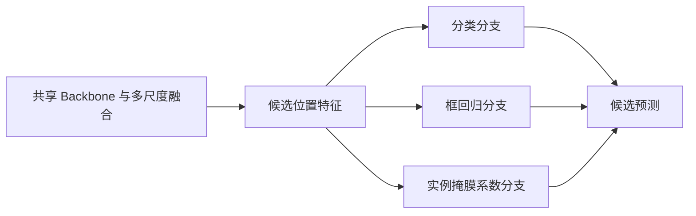

# 从 YOLOv1 到现代 YOLO：检测与实例分割基础

更新日期：2026-09-30；课程入口更新：2026-10-01。前置阅读：[YOLOv1 基础卷](YOLOv1_原论文精读与基础模型学习.md)第 4、6、8、10 节。完整课程安排见 [终极版学习手册](00_YOLO学习路线与学习手册_终极版.md)。

本讲义是概念过渡课，解释现代模型中反复出现的设计问题；不是把多个版本合并成一套“通用 YOLO 公式”。具体结构与输出必须对应版本。教学算例是帮助理解的自设例子，不是新实验结果。

## 1. 先建立一张地图：不变的是任务，变化的是实现

同学，读完第一代论文后，你已经理解了检测任务的闭环：图像输入、预测输出、真值匹配、损失训练和结果评估。现代检测仍然解决这个闭环，但把其中的许多机制换了。

| 问题 | YOLOv1 | 后续学习要掌握的变化 |
| --- | --- | --- |
| 用什么位置组织预测？ | 单个 7×7 网格 | 多尺度特征位置 |
| 如何表示框？ | 中心与整图宽高，平方根宽高监督 | anchor 偏移，或参考点与边界距离等 |
| 类别由谁预测？ | 每单元共享一组类别 | 候选位置/框有相应的类别预测 |
| 谁负责真实目标？ | 中心归属与最高 IoU 框 | 动态正样本选择、任务对齐或一对一分配 |
| 怎么组合特征？ | 卷积后全连接 | 全卷积预测与跨尺度融合 |
| 如何训练位置？ | 加权平方误差 | IoU 类几何损失，某些版本再结合 DFL |
| 怎么去重复？ | NMS | 普通密集输出仍用 NMS，部分模型有 NMS-free 路径 |
| 能不能给出轮廓？ | 本文只做框检测 | 分割头增加每个实例的掩膜 |

右列是设计范畴，不表示每一个后续模型都使用同一机制。尤其要区分 YOLOX、YOLO11 和 YOLO26。

## 2. 多尺度预测：让不同大小的目标有合适的观察位置

### 2.1 为什么一张很小的特征图不够？

输入图中的小杯子可能只占十几个像素。经过多次下采样，位置细节变得不清楚；而大目标需要更大范围的语义信息。单独选择“始终高分辨率”或“始终低分辨率”，都难同时满足计算和表达需求。

多尺度预测让网络在不同分辨率的特征上输出候选，高分辨率分支保留更多细节，低分辨率分支拥有更粗的空间表示与更大的感受范围。两者还能通过上采样和特征融合交换信息。

这不是简单把同一图片缩成三份，独立运行三个模型。通常是在一个共享网络内部，使用不同阶段和融合路径的特征。

### 2.2 P3、P4、P5 与候选数量

在本次核查的 YOLO11-seg 配置中，最终分割头使用步长 8、16、32 的三尺度特征，通常称 P3、P4、P5。

若输入为 640×640，则特征位置数为：

$$
N=80\times80+40\times40+20\times20=8400.
$$

| 级别 | 步长 | 特征尺寸 | 位置数 |
| --- | --- | --- | --- |
| P3 | 8 | 80×80 | 6400 |
| P4 | 16 | 40×40 | 1600 |
| P5 | 32 | 20×20 | 400 |

这是候选位置数量，不是物体数量。若某种 anchor-based 模型每位置使用三个 anchor box，框候选数还要乘 3；不能把所有版本都写成 8400 个框。

YOLOv3 的跨尺度预测是阅读这部分的好入口，见 [原论文 §2.3](../ref/YOLOv3_2018_1804.02767.pdf)。YOLO11 的具体融合连接则以[本地官方 YAML 快照](../ref/official_sources/ultralytics__cfg__models__11__yolo11-seg.yaml)为准。

### 2.3 多尺度训练与多尺度预测不同

多尺度训练，是训练过程中改变输入尺寸，让模型适应不同分辨率。多尺度预测，是同一次前向中在多个特征分辨率上预测。二者可以同时存在，也可以分别存在。

YOLO9000 / YOLOv2 中的多尺度训练可以用来理解前者；YOLOv3 的三个预测尺度用来理解后者。不要看到两个“多尺度”就认为它们是同一项创新。

## 3. Anchor box、参考点和 anchor-free

### 3.1 Anchor box 是什么？

Anchor box 是放在候选位置上的预设宽高模板。模型以这些模板为参照学习调整位置与尺寸。它不是最终检测框，也不是人工提前框好的真实目标。

若一位置有细长、宽扁、近正方形三种模板，模型可能更容易从接近目标形状的模板开始回归；但模板选择、匹配规则和更多候选也增加了设计和计算负担。

YOLOv2 通过框尺寸聚类等设计改进这类表示。你需要理解“先验与偏移”，但不必为了当前 anchor-free 模型继续手调一套 anchor 尺寸。

### 3.2 Anchor-free 不等于没有空间参考

Anchor-free 表示不依赖那种预设宽高模板，并不表示预测完全脱离位置。模型通常仍使用特征位置或参考点，学习框中心偏移或到边界的距离。

代码中的 `anchor_points` 往往是点坐标，而不是带有预设宽高的 anchor boxes。只看到变量名含 `anchor` 就断言模型是 anchor-based，会把两种概念混淆。

### 3.3 用四个距离表达框的教学例子

假设参考点在 $(100,120)$，到框左、上、右、下边界的距离为 $(l,t,r,b)=(30,20,50,40)$，则：

$$
x_{min}=100-30=70,\quad y_{min}=120-20=100,
$$

$$
x_{max}=100+50=150,\quad y_{max}=120+40=160.
$$

这是一种参考点距离编码的直观解释。距离若以特征步长单位表示，必须乘步长才得到输入像素；再考虑预处理的缩放和填充，才得到原图坐标。

不同 anchor-free 方法的编码不完全相同。例如 YOLOX 使用位置偏移与宽高表示，不能把这个四边距离例子直接冒充 YOLOX 的全部解码公式。

## 4. 解耦预测头：同一张特征图为何分出不同任务？

分类希望回答“这是杯子还是瓶子”，定位希望回答“边界应该移动多少”。两者需要的信息和最有用的梯度方向可能不同。

解耦头保留前面共享的图像表示，在靠近输出处设置不同分支，分别处理类别与框几何。它仍是一个联合训练模型，不是独立训练几个互不相干的网络。



图中的掩膜分支只在分割模型中需要。YOLOX 自身的检测解耦头还涉及其置信度/质量相关输出，不等于上图所有分割结构。

为什么推荐 YOLOX？其第 3 页图 2 直接对照耦合头与解耦头，第 2—4 页逐步介绍改动，适合初学者把“分支”与“任务”联系起来。见 [YOLOX 原文](../ref/YOLOX_2021_2107.08430.pdf)。

解耦增加分支后也会增加一定运算，不能只凭名字说一定更快。有效性需要看对应模型的消融与整体速度。

## 5. 标签分配：8400 个候选中，谁来学这个杯子？

### 5.1 为什么它和网络结构同样重要？

一个真实杯子附近可能有许多位置、多个尺度的候选框。训练必须决定哪些候选承担正监督、匹配哪个真值，哪些当作负样本。

这种机制称为标签分配。它不直接改变像素，却决定梯度落在什么预测位置；设计不好，即使特征很强，也可能没有合适的候选学习某个目标。

### 5.2 一对多与一对一

一对多允许多个候选学习同一个真值，提供丰富监督；推理时容易出现重复，需要处理。一对一则希望一个真值对应一个有效输出，更利于直接得到目标集合，但监督更稀疏，优化可能更困难。

这里说的是预测与真值的训练对应关系，不是一次只能识别一个目标，也不是一个目标只能占一个像素。

YOLOX 的 SimOTA 是动态分配的重要学习入口；TOOD 的任务对齐是另一条相关思想。它们并非同一个算法，不能把 SimOTA 和 TaskAlignedAssigner 当作同名实现。

### 5.3 为什么分类与定位要一起考虑？

假设候选 A 很像杯子，但框偏得很远；候选 B 分类略弱，却准确框住杯子。只按类别或只按 IoU 选择，都可能让训练与最终检测质量不一致。

任务对齐用分类表现与定位表现共同形成候选评分。简化理解可以写成：

$$
a=p^\alpha u^\beta,
$$

其中 $p$ 是目标类别分数，$u$ 是重叠或几何质量，指数调节两者的重要性。

**教学例子，参数不是项目默认值：**取 $\alpha=1,\beta=2$，候选 A 的 $p=0.9,u=0.4$，候选 B 的 $p=0.7,u=0.8$：

$$
a_A=0.9\times0.4^2=0.144,\qquad a_B=0.7\times0.8^2=0.448.
$$

按此评分 B 更合适。实际分配还包含空间候选过滤、top-k、多个真值竞争和目标分数归一化，不能把这一条乘法视为完整算法。

本次[官方 `tal.py` 快照](../ref/official_sources/ultralytics__utils__tal.py)的 `get_box_metrics` 有相应组合；其中几何质量计算使用截断到非负的 CIoU。论文推导与当前代码的具体选择要分别说明。

### 5.4 小目标为什么可能“没有人负责”？

如果规则只允许参考点位于真实框内部，小到两个参考点之间的框可能没有任何候选点满足条件。即使图像中确实有目标，分配阶段也可能无法提供有效正样本。

这类问题不同于“特征太粗看不清”。前者是监督覆盖，后者是视觉表达。因此小目标改进不能只盯着加高分辨率分支，后续读 YOLO26 的 STAL 时要带着这个区分。

## 6. 框回归：几何损失与 DFL 分别做什么？

### 6.1 几何损失关注整框关系

IoU 类损失把预测框与真值的几何匹配作为优化目标，某些形式还考虑中心距离、长宽比等因素。它比单独比较四个坐标更直接地描述框的空间关系，但具体形式有不同梯度和边界行为。

“用了 IoU 损失”不等于训练直接对 mAP 求导，评估仍包含离散匹配、类别与排序。

### 6.2 DFL 把一个距离表示为分布

先考虑一个边界距离 $d$。直接回归输出一个标量；分布式表示则输出一组离散位置的概率，最后用期望解码：

$$
\hat d=\sum_{k=0}^{R-1}kq_k,\qquad \sum_k q_k=1.
$$

DFL（Distribution Focal Loss）让真实连续值附近的离散位置接受监督。若 $d=3.4$，位于 3 和 4 之间，给 3 的权重 0.6，给 4 的权重 0.4：

$$
L_{DFL}=-0.6\log q_3-0.4\log q_4.
$$

如果 $q_3=0.6,q_4=0.4$ 且其他概率为零，则期望为 $3\times0.6+4\times0.4=3.4$，此目标分布的交叉熵约为 0.6730，**并不要求最优损失值必须为零**。

这是连续目标的线性插值监督，不是把真实框强行取整，也不是在图中随机抽一个框。DFL 的方法出处见 [GFL 第 4—5 页](../ref/GFL_2020_2006.04388.pdf)。

### 6.3 为什么训练通道和解码后通道不同？

对于四个边界距离，每个距离若有 16 个离散位置，训练框分支有 $4\times16=64$ 个原始通道。softmax 与期望解码后，得到 4 个距离，再组成 4 个框坐标。

因此，看到训练层有 64 个框通道，而推理输出只有 4 个框坐标，不是网络“丢了 60 个框”。64 是分布参数数量，不是框数量。

YOLO11 的框损失同时包括几何项与 DFL：前者约束完整框，后者约束距离分布。它们各有作用，不能互相替代为同一个概念。

### 6.4 两条不要照搬的规则

第一，YOLOv1 用平方误差分类，只在有目标单元计算该类别项；现代密集分类通常也要通过负位置类别监督抑制背景。不能把第一代的分类掩码逻辑套到所有版本。

第二，读 GFL 是为了理解分布式回归，不代表当前 YOLO11 的类别损失就是完整 GFL/QFL 方案。以本次[损失快照](../ref/official_sources/ultralytics__utils__loss.py)的 `v8DetectionLoss`、`BboxLoss`、`DFLoss` 分别核对。类名带 `v8` 也不意味着只有 YOLOv8 才能调用它。

## 7. 实例分割：怎样从共享原型得到两只杯子的轮廓？

### 7.1 框和掩膜各描述什么？

框给出矩形范围；mask 表示每个实例包含哪些像素。同一画面中两只杯子即使类别相同，也必须有两份可区分的掩膜。

若直接给每个候选运行完整的大型分割网络，会增加大量计算。原型与系数组合提供一种共享计算的方法。

### 7.2 原型与系数

设共享原型为：

$$
P\in\mathbb R^{M\times H_p\times W_p}.
$$

每个候选预测一组长度 $M$ 的系数。经过筛选的 $K$ 个实例形成：

$$
A\in\mathbb R^{K\times M}.
$$

将原型空间维展平，做矩阵乘法：

$$
Z=AP_{flat}\in\mathbb R^{K\times H_pW_p}.
$$

对 $Z$ 施加 sigmoid 等后处理，得到每个实例的掩膜概率，再按框、尺度和预处理变换还原。

**原型通道不是类别，系数不是类别概率。**它们是学习出来的空间基底和组合参数，不要求每个原型独立就是一只完整杯子，也不要求每个原型都有可解释的语义。

这一思路可以从 [YOLACT 方法节](../ref/YOLACT_2019_1904.02689.pdf)学习；YOLO11-seg 的实际原型生成、损失及后处理与 YOLACT 并不完全相同。

### 7.3 两个原型、两个实例的手算

为了看清线性组合，设共享原型只有两个 2×2 小矩阵：

$$
P_1=\begin{bmatrix}1&0\\1&0\end{bmatrix},\qquad
P_2=\begin{bmatrix}0&1\\0&1\end{bmatrix}.
$$

实例 A 的系数为 $(2,-1)$，实例 B 的系数为 $(-1,2)$，则：

$$
Z_A=\begin{bmatrix}2&-1\\2&-1\end{bmatrix},\qquad
Z_B=\begin{bmatrix}-1&2\\-1&2\end{bmatrix}.
$$

sigmoid(2) 约为 0.881，sigmoid(-1) 约为 0.269。以教学阈值 0.5 二值化，A 保留左列，B 保留右列。

同一套原型，通过不同系数形成两个独立实例。实际模型还需要裁剪和坐标还原；这个微型算例只解释“共享原型不等于所有实例共用一张 mask”。

### 7.4 当前三类项目的理论输出

以三类、32 个原型、640×640 输入、常规非端到端解码输出为例，候选字段数为：

$$
4\text{ 个框坐标}+3\text{ 个类别分数}+32\text{ 个掩膜系数}=39.
$$

因此理论候选张量是 `[1,39,8400]`；共享原型的典型尺寸为 `[1,32,160,160]`。这与已有项目方案一致，并且符合本次 `Segment` 快照的字段组织。

但这些仍是指定设置下的理论形状，不是已经完成本机模型前向验证。导出模式、模型分支、参数与代码版本改变，输出可能改变；必须读取实际输出名、shape 和 dtype。

YOLO11 的这类解码输出没有额外独立 objectness 字段。不要再凭第一代公式额外乘一次不存在的置信度。YOLOX 有自己的 objectness 设计，二者应区分。

## 8. NMS-free：不能简单删掉最后一行 NMS

普通一对多训练允许许多预测拟合同一个目标。把推理的 NMS 直接删除，就可能留下大量重复框，评估中的 FP 也会增加。

NMS-free 方法要让训练与输出方式共同支持有效的一对一集合预测。YOLOv10 的双分配思路是：一对多分支提供丰富监督，一对一分支学习适合推理的单匹配输出，二者使用一致的匹配度量。详细机制见 [原论文 §3.1](../ref/YOLOv10_2024_2405.14458.pdf)。

```text
训练：共享特征 → 一对多监督分支
              → 一对一监督分支

适用的推理路径：使用一对一分支 → 解码/选择结果
```

NMS-free 不等于没有阈值、top-k、坐标还原或掩膜后处理；它只是消除了基于重叠的 NMS 这一步。

YOLOv1 的“端到端”主要指联合训练；这些新方法还关注不依赖 NMS 的推理输出。两个时期的同一个词，其研究强调有所变化。

## 9. 带着哪些问题读 YOLO26？

新主文献见 [YOLO26 原论文](../ref/YOLO26_2026_2606.03748.pdf)。本文先给阅读问题，完整公式、实验与全部任务扩展留在后续专题精读。

| 原文章节 | 先问的问题 |
| --- | --- |
| §3.2.1 双头与 NMS-free | 训练和推理分别使用什么分支？ |
| §3.2.2 移除 DFL | 为什么 4×R 通道回归要简化？改变什么成本和表示限制？ |
| §3.3.1 MuSGD | 优化器怎样分工？与网络结构改进怎样区分？ |
| §3.3.2 Progressive Loss | 分支损失权重为何随训练变化？ |
| §3.3.3 STAL | 小目标缺少候选点时，分配如何补充覆盖？ |
| §3.4.1 实例分割 | 原型如何融合多尺度信息？辅助监督在训练和推理中各起什么作用？ |
| §4 实验与 §5 结论 | 指标、分支、计时和消融是否使用一致条件？结论是否超出实验？ |

YOLO26 并不是“YOLO11 保留全部机制再加几个模块”。至少框回归与推理分支就需要重新理解。你已经学过 DFL，才能判断删除它的意义；你理解普通分配，才能理解 STAL 和双分支训练。

另一个版本边界：截至本次保存的[官方 YOLO26 文档](../ref/official_sources/docs__en__models__yolo26.md)，支持一对多与一对一推理路径，默认和参数含义要按对应版本核查。看到论文说支持 NMS-free，不能据此假设每一种默认调用都使用这一分支。

## 10. 如何检验自己是否真的理解？

先不跑训练，完成四个小练习：

1. 输入从 640 改到 320，若仍使用步长 8/16/32，候选位置为多少？答案：$40^2+20^2+10^2=2100$。
2. 三类改成五类、其他设置不变，候选输出字段为多少？答案：$4+5+32=41$；原型数不因类别变化自动变成 5。
3. DFL 目标距离 3.4 位于步长 8 的特征坐标中，输入像素距离是多少？答案：27.2；还原原图前还要考虑缩放和填充。
4. 两个实例使用共享原型，是否一定得到相同掩膜？答案：不一定，系数与后处理不同即可得到不同实例。

进入源码学习后，再留下三项实际记录：

- 锁定版本下，YAML 的连接图和实际模块类型。
- 训练、普通推理、export 三种模式的输出包装及字段。
- 一个保留实例的框、类别分数、系数、原型组合与还原后的 mask。

完成这些记录，再讨论加入 SE 或换新模型，才能判断具体改变的是特征、监督、输出还是部署流程。

## 来源与状态

论文原件与版本记录见[文献目录](../ref/README_文献目录与来源.md)。本讲义选择阅读了相关方法部分，用于概念衔接，没有声称逐篇完成全部图表精读。

源码依据为 Ultralytics 官方仓库 commit `6956125297ae5a90f5d6d371cca93ea51d8320f9`，本地记录见 [snapshot_manifest.json](../ref/official_sources/snapshot_manifest.json)。快照只用于阅读，不是已经安装或执行的项目依赖。

当前资料工作已完成：概念过渡讲义、源码与论文入口、教学算例。真实张量、训练效果、模型改进和本机测速仍需实操验证。
