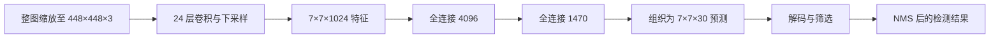

# YOLOv1 原论文精读与基础模型学习

> 课程定位更新（2026-10-01）：本文件保留为检测基础卷。阅读顺序、核心课与验收见 [YOLO 学习路线与学习手册（终极版）](00_YOLO学习路线与学习手册_终极版.md)，后续接读 [现代检测与实例分割过渡讲义](02_从YOLOv1到现代YOLO_检测与实例分割基础.md)与当前模型源码，YOLO26 放在进阶阶段。以下内容仍严格对应 YOLOv1。

学习对象：*You Only Look Once: Unified, Real-Time Object Detection*。作者：Joseph Redmon、Santosh Divvala、Ross Girshick、Ali Farhadi。首次 arXiv 投稿为 2015 年，发表于 CVPR 2016；本地文件为 arXiv:1506.02640v5，修订日期 2016-05-09。版本日期已与 [arXiv 记录](https://arxiv.org/abs/1506.02640)核对。

编写日期：2026-09-30。主要依据：[你下载的完整原论文](../ref/YOLO.pdf)，共 10 页，其中第 1—8 页为正文，第 9—10 页为参考文献。

**本讲义讲解的是第一代 YOLO，通常称为 YOLOv1。**理解它能帮助你掌握目标检测的基本逻辑，但后续版本的输出、损失和网络结构需要另外学习。文中的参数和实验数字均属于这篇论文，不能当作你本机或当前项目的实测结果。

阅读方式：先理解问题与预测表示，再读网络和损失，最后审视实验。带有“教学算例”“教学推导”“阅读判断”的内容是为了帮助理解所作的解释；不属于论文新增实验。

## 导读：这篇论文到底改变了什么？

同学，我们先抓住论文最重要的思想：**目标检测可以由一个神经网络直接完成从整张图像到一组检测框与类别分数的映射。**

在它之前，常见做法是先找可能有目标的区域，再逐个判断区域中的东西是什么，随后调整框、去掉重复结果。YOLO 把主要的可学习计算统一到一个网络里：输入整图，一次前向传播，同时输出所有位置的框和类别信息。

它的价值不只是“运行得快”。它重新安排了检测问题的计算方式、监督方式和输出表示。模型因此能共享整图计算，也能利用更大范围的上下文；同时，固定网格、粗特征和类别共享也给定位与密集目标检测带来了限制。

如果你读完只能记住一句话，就记住：**YOLOv1 用固定网格组织整图检测预测，以一次网络计算换取实时速度，同时承担定位精度和拥挤场景表达能力的代价。**

### 论文内容与讲义的对应关系

| 原文位置 | 主要内容 | 本讲义位置 |
| --- | --- | --- |
| Abstract，第 1 页 | 统一检测、速度、错误特征、泛化 | 导读、第 3、10—12 节 |
| §1 Introduction，第 1—2 页 | 研究背景与三项主要优势 | 第 1—3 节 |
| §2 Unified Detection，第 2 页 | 网格、框、置信度、类别、式（1） | 第 4 节 |
| §2.1 Network Design，第 2—3 页 | 24 层卷积、2 层全连接、Fast YOLO | 第 5 节 |
| §2.2 Training，第 3—4 页 | 预训练、激活、损失、训练策略 | 第 6—7 节 |
| §2.3 Inference，第 4 页 | 98 个候选框、筛选、NMS | 第 8 节 |
| §2.4 Limitations，第 4 页 | 密集小目标、特殊形状、定位困难 | 第 9 节 |
| §3 Comparison，第 4—5 页 | DPM、R-CNN、MultiBox 等 | 第 2、3 节 |
| §4.1—4.5 Experiments，第 5—8 页 | 速度、误差、融合、VOC2012、艺术画 | 第 10—11 节 |
| §5 Real-Time Detection，第 7—8 页 | 摄像头演示与定性结果 | 第 12 节 |
| §6 Conclusion，第 8 页 | 研究结论 | 第 13 节 |
| References，第 9—10 页 | 39 项参考资料 | 附录 C |

## 1. 研究背景：为什么目标检测比图像分类困难？

### 1.1 分类、定位、检测、分割分别问什么？

想象一张桌面照片，其中有两个杯子、一只瓶子和一部手机。

| 任务 | 要回答的问题 | 典型输出 |
| --- | --- | --- |
| 图像分类 | 整张图像属于什么类别？或有哪些类别存在？ | 图像级类别分数 |
| 单目标定位 | 指定目标是什么、在哪里？ | 一个类别和一个框 |
| 目标检测 | 每个目标是什么、在哪里？ | 多个框、类别和分数 |
| 语义分割 | 每个像素属于什么类别？ | 像素类别图 |
| 实例分割 | 每个目标分别包含哪些像素？ | 每个实例的独立掩膜 |

YOLOv1 解决的是目标检测。它可以给杯子画矩形框，但不会输出杯子边缘的逐像素轮廓，也不自动为移动中的杯子维持跨帧身份。

检测困难在于目标数量、位置、大小、遮挡和背景都不固定。分类网络的固定长度输出无法直接回答“这张图里有几个人，每个人在哪里”。因此检测系统需要一种机制，把数量可变的目标集合转化为网络能够训练和预测的固定表示。

YOLO 的网格与固定数量候选框，正是在解决这个表示问题。

### 1.2 用数学语言描述目标检测

输入图像可以表示为：

$$
I\in\mathbb{R}^{H\times W\times3}.
$$

理想的检测结果是一个集合：

$$
\mathcal D=\{(b_k,c_k,s_k)\}_{k=1}^{K},
$$

其中 $b_k$ 是第 $k$ 个框，$c_k$ 是类别，$s_k$ 是检测分数；$K$ 随图像变化。网络首先产生固定数量的候选，再通过筛选与去重得到数量可变的结果。

框通常可写成中心形式 $(x_c,y_c,w,h)$，也可以写成两个角点 $(x_{\min},y_{\min},x_{\max},y_{\max})$。两者可以互相转换。框只是目标位置的矩形近似，不是物体的真实轮廓。

### 1.3 作者为什么强调实时？

原文从人类视觉切入：人看到图像后，很快就能知道目标与位置；机器人、辅助视觉和驾驶等应用也需要及时响应。这是作者的研究动机，不是论文已经验证了自动驾驶安全性。

如果一个系统每张图要处理数秒，即使单张图检测很准确，也难以跟上摄像头中的变化。论文以每秒 30 帧及以上作为实时比较的门槛，希望在保持有用检测质量的同时达到这个速度。

这里已经出现了核心研究目标：**研究速度与精度的取舍，而不是只追求一个最高精度数字。**

## 2. 既有方法：YOLO 为什么要重组检测流程？

这一节同时解释原文 Introduction 与 §3 的相关工作。理解历史方法是为了看清 YOLO 的改变，不需要现在就实现所有算法。

### 2.1 滑动窗口与 DPM：在许多位置反复判断

滑动窗口的思想是：移动一个窗口，尝试不同大小，在每个窗口内判断是否存在目标。尺度和位置搜索可以覆盖目标，但候选数量很大。

DPM（Deformable Parts Model，可变形部件模型）用部件及其空间关系表示物体，通常基于 HOG 特征构建检测器。例如，一个人的头、躯干与腿可以有一定相对位移，从而适应姿态变化。

论文将这类方法描述为分离流程：特征提取、区域评分、框预测和后处理等环节各自承担任务。加速 DPM 的已有工作优化 HOG、级联和 GPU 计算，但仍受原有流程与表示方式约束。

YOLO 的不同在于，特征也参与检测任务的联合学习，而不是先固定一套手工特征后再训练检测器。

### 2.2 R-CNN：先提候选区域，再逐个识别

原始 R-CNN 的典型流程是：

```text
图像 → Selective Search 生成约 2000 个区域
     → 对区域提取卷积特征
     → SVM 分类
     → 框回归
     → 去重
```

Selective Search 根据图像区域的相似性产生可能包含目标的框。“候选区域”不代表已经识别出了目标；它只是给后续识别提供搜索范围。

原文指出，原始 R-CNN 各阶段需要分别处理和调节，测试一张图可超过 40 秒。这个数字描述的是论文引用的历史系统，不能套用到所有后续 R-CNN 方法。

### 2.3 Fast R-CNN 与 Faster R-CNN：必须区分

Fast R-CNN 共享整图卷积计算，从共享特征中为不同区域获取表示，分类和框回归也整合得更好。它仍依赖外部候选区域，论文的速度比较计入 Selective Search 的耗时。

Faster R-CNN 则通过区域提议网络生成候选，减少了这个瓶颈。它保留“候选区域生成，再对候选进行识别与回归”的两阶段组织方式。

同学，请避免一句不准确的概括：“R-CNN 家族都要为每个框重新跑整个 CNN。”这适合描述原始 R-CNN 的主要问题，却不适合描述 Fast/Faster R-CNN 的共享特征设计。

原文批评局部区域方法上下文不足时，也带有概括性。Fast R-CNN 的特征来自整图卷积，不是完全看不到背景；更合理的理解是：YOLO 的整图联合预测方式更直接地组织了全局信息，实验中表现为更少的背景误检。

### 2.4 论文还比较了哪些方法？

| 方法 | 原文强调的思路 | 与 YOLO 的关系 |
| --- | --- | --- |
| 单类别快速检测器 | 针对人脸、行人等特定任务高度优化 | YOLO 同时检测多类别，研究范围更广 |
| Deep MultiBox | 用 CNN 预测候选框 | 与直接预测框相似，但文中所比较的流程仍需进一步区域分类 |
| OverFeat | CNN 定位与高效滑窗检测 | 有共享计算，但原文认为其定位与检测流程仍分离、后处理较多 |
| MultiGrasp | 用网格回归可抓取区域 | 是 YOLO 网格表示的设计来源；抓取预测任务更简单 |
| R-CNN minus R | 使用固定框提议替代 Selective Search | 加速了候选阶段，但论文认为精度与速度仍有局限 |

这些比较提醒我们：**用 CNN 回归框、共享特征、使用网格，都有相关先例。**YOLO 的贡献需要从完整系统的组合和实验效果来判断，不能把所有构件都说成首次发明。

## 3. 研究目标与创新点：哪些贡献真正重要？

### 3.1 研究目标

作者希望建立一个多类别检测系统，满足以下要求：整图输入、联合预测位置与类别、主要可学习部分端到端训练、具备实时速度，并在标准检测数据集和分布变化下检验性能。

这几个目标不是完全独立的。统一预测可以减少重复计算；利用全图信息可能减少背景误检；强制固定输出可以提高效率，但也会限制密集目标的表示。

### 3.2 核心创新一：把检测组织为统一回归问题

网络直接学习：

$$
f_\theta:I\longmapsto \text{框坐标、框置信度和类别分数}.
$$

作者用“回归问题”强调从像素直接到结构化数值输出，不是说类别从此没有分类意义。网络仍然需要识别类别，只是在本文中类别分数也用平方误差训练。

最值得学习的创新是**问题重构**：不再只改善传统流程某一环节，而是改变整个任务在神经网络中的表达方式。

### 3.3 核心创新二：用网格组织固定长度的多目标预测

每个网格负责中心落在自己内部的目标，预测若干框与一组类别分数。这样，训练标签和网络输出能建立对应关系。

网格不是视觉上的装饰。它同时承担输出组织、目标归属和空间约束三项作用。你后面看到的密集目标困难，也来自这套规则。

### 3.4 核心创新三：整图共享计算与全局联合预测

一次卷积特征提取服务于所有输出。模型不需要对约 2000 个图像区域逐个重新提取独立特征；后续全连接层可以结合整个最终特征图的信息。

“全局推理”在这里指可利用整图上下文。它不代表显式建立了物体关系图，也不代表模型具有可解释的符号推理机制。

### 3.5 训练设计与实验贡献

YOLO 使用最高 IoU 的框预测器承担目标回归，配合坐标加权、背景置信度降权、宽高平方根误差来训练。它还通过错误类型分析展示与 Fast R-CNN 的互补，并在艺术作品人物检测中评估迁移表现。

这些是论文的重要设计与证据，但 leaky ReLU、dropout、数据增强、ImageNet 预训练和 NMS 都不应被说成该文原创。

**阅读判断：**这篇论文不是以复杂网络模块取胜。它用较简单的网络和输出规则，让一个完整的检测系统在当时获得有竞争力的实时表现。贡献集中在任务组织方式、系统效率和相应实验论证。

## 4. 研究方法的核心：从一张图到 7×7×30

原文位置：第 2 页，§2、图 2、式（1）。这是全文最重要的概念部分。

### 4.1 网格是责任划分，不是把图裁成 49 块

输入图像被划分为 $S\times S$ 网格。在 VOC 实验中 $S=7$，所以共有 49 个单元。

**如果目标中心落入第 $i$ 个单元，该单元负责检测该目标。**一个目标即使横跨多个单元，也根据中心归属选择负责单元。

请注意，网络仍然接收完整图像。它不会把 49 个小图分别送入 49 个独立网络；负责单元也不限于使用自己那一小块图像的信息。

### 4.2 一个单元输出什么？

一个单元预测 $B$ 个框，每个框含 5 个量：

$$
(x,y,w,h,q).
$$

这里用 $q$ 表示置信度，避免与类别数 $C$ 混淆。原文损失中把置信度写作 $C_i$。

此外，该单元预测 $C$ 个条件类别分数：

$$
p_i(c)=\Pr(\mathrm{Class}=c\mid\mathrm{Object}).
$$

**类别分数是每个单元一组，两个框共享这组分数。**每个框有自己的坐标和置信度，但没有自己独立的一组 20 类预测。

所以每个单元输出数为：

$$
5B+C.
$$

在 VOC 中 $B=2,C=20$，得到 $5\times2+20=30$，整图就是：

$$
7\times7\times30=1470\text{ 个数}.
$$

其中框坐标为 $49\times2\times4=392$ 个，框置信度为 98 个，类别分数为 $49\times20=980$ 个，三者共 1470 个。

常见错误是写成 $7\times7\times2\times25$。这等于给每个框都配上独立类别分数，已经改变了 YOLOv1 的表示。

### 4.3 为什么两个框不等于稳定识别两个独立目标？

假设同一单元中有一个杯子中心和一个瓶子中心。两个框可以给出两组坐标，但共享同一组类别分数，训练监督也不能自然为它们分别提供两个独立类别标签。

标准 YOLOv1 标签表示按单元组织一个目标监督，而两个预测器通过竞争选择其中一个来拟合该目标。它们不是预先分配为“目标 1”和“目标 2”。因此，两个同类目标中心落入同一单元也会产生冲突。

你应理解为：**两个框提供不同的框预测机会，有利于形成尺寸、比例等方面的专门化；它们并没有解决同一单元内任意多实例的表示问题。**

网络输出 98 个候选框，也不等于保证可以检测 98 个任意排列的目标。数量只是候选规模，实际能力还受空间分布、监督表示和去重影响。

### 4.4 坐标是相对于什么定义的？

设负责单元的列号为 $u$，行号为 $v$，均从 0 开始。框中心的 $x,y$ 是相对单元的局部偏移；宽高 $w,h$ 则相对整张图像归一化。

全图归一化中心为：

$$
x_c=\frac{u+x}{S},\qquad y_c=\frac{v+y}{S}.
$$

若需要还原到宽 $W$、高 $H$ 的原图：

$$
X_c=W\frac{u+x}{S},\qquad Y_c=H\frac{v+y}{S},
$$

$$
W_b=Ww,\qquad H_b=Hh.
$$

随后计算角点：

$$
X_{\min}=X_c-\frac{W_b}{2},\quad X_{\max}=X_c+\frac{W_b}{2},
$$

$$
Y_{\min}=Y_c-\frac{H_b}{2},\quad Y_{\max}=Y_c+\frac{H_b}{2}.
$$

这里假设按论文把原图直接缩放到 448×448，没有额外 padding。如果采用带填充的预处理，还必须扣除填充后再还原，不能直接套以上公式。

**教学算例：**原图为 640×480，一个框中心为 $(320,240)$，宽高为 $(128,144)$。

全图归一化中心是 $(0.5,0.5)$，负责单元为 $(u,v)=(3,3)$。局部偏移为 $x=y=7\times0.5-3=0.5$，归一化宽高为 $w=0.2,h=0.3$。

解码得到中心 $(320,240)$，角点为 $(256,168,384,312)$。框比一个网格单元大完全正常；网格只限制责任归属，不限制框尺寸。

### 4.5 IoU：框预测到底好不好？

IoU（Intersection over Union，交并比）比较两个框的重合程度：

$$
\operatorname{IoU}(b,g)=\frac{|b\cap g|}{|b\cup g|}.
$$

两个面积都是 100 的框，若相交面积为 60，并集面积为 $100+100-60=140$，则 IoU 为 $60/140\approx0.429$。

完全相同的框 IoU 为 1，不重合的框为 0。IoU 衡量空间匹配，不衡量类别是否正确。把狗正确框出来却预测成猫，仍可能有很高 IoU，但不是一次正确的狗检测。

### 4.6 置信度不是单纯的“有目标概率”

论文定义框置信度为：

$$
q=\Pr(\mathrm{Object})\operatorname{IoU}(b,g).
$$

它结合两个因素：是否有目标，以及框是否贴合目标。训练时，负责框的目标值与其当前预测框和真值框之间的 IoU 有关；没有对应目标监督的框置信度被压低。

**这里的乘积是分数的语义定义，不要求网络分别输出两个量再相乘。**每个框只输出一个 $q$；推理时没有真值框，当然不能现场算出与真值的 IoU。网络通过训练学会估计这个分数。

若模型看起来很确定“这里有狗”，但框的位置粗糙，理想的 $q$ 也应低于框位置准确时。这使最终排序同时考虑识别与定位质量。

### 4.7 条件类别分数与式（1）

每个框的类别检测分数为：

$$
s_{ij}(c)=p_i(c)q_{ij}.
$$

代入论文定义：

$$
\Pr(c\mid\mathrm{Object})\Pr(\mathrm{Object})\operatorname{IoU}
=\Pr(c)\operatorname{IoU}.
$$

最后一个等式沿用原文记法，隐含类别成立时目标存在的假设。实际使用时，记住“该单元的类别分数乘该框的置信度”即可。

**教学算例：**某单元的“狗”条件分数为 0.8，框 1 置信度为 0.75，框 2 为 0.30，则狗检测分数分别为 $0.8\times0.75=0.60$ 和 $0.8\times0.30=0.24$。

这两个框的类别排序相同，因为类别分数共享；分数高低由各自的置信度缩放。输出最终可能保留哪个框，还要看阈值与 NMS。

### 4.8 “概率”这一称呼的边界

论文用概率语言解释这些数，但其最终层使用线性激活，分类也用平方误差。目标标签的坐标范围和概率含义，不等于网络原始输出被数学上强制限制在 $[0,1]$。

因此，不能根据这篇论文自行补上“最后一定使用 sigmoid”“类别一定经过 softmax”“置信度已经严格校准”这些结论。具体复现若改变激活或损失，需要说明与原论文的区别。

## 5. 网络结构：如何生成这些预测？

原文位置：第 2—3 页，§2.1、图 3。

### 5.1 整体结构



卷积层提取图像特征，全连接层组合特征并预测坐标、类别与置信度。将这些部分按今天常见概念理解，可以叫特征提取部分和预测部分；但论文没有现代多尺度特征融合网络那样的独立结构。

### 5.2 按图 3 逐段阅读

下表采用 `高×宽×通道`，批次维暂略。卷积核后面的数字是输出通道数；没有单独标注步长的卷积保持空间尺寸。

| 段落 | 该段运算 | 段末形状 | 累计卷积层数 |
| --- | --- | --- | --- |
| 输入 | RGB 图像 | 448×448×3 | 0 |
| 第 1 段 | 7×7 卷积/64，步长 2；2×2 最大池化，步长 2 | 112×112×64 | 1 |
| 第 2 段 | 3×3 卷积/192；最大池化 | 56×56×192 | 2 |
| 第 3 段 | 1×1/128 → 3×3/256 → 1×1/256 → 3×3/512；最大池化 | 28×28×512 | 6 |
| 第 4 段 | （1×1/256 → 3×3/512）重复 4 次；1×1/512 → 3×3/1024；最大池化 | 14×14×1024 | 16 |
| 第 5 段 | （1×1/512 → 3×3/1024）重复 2 次；3×3/1024；3×3/1024，步长 2 | 7×7×1024 | 22 |
| 第 6 段 | 两层 3×3/1024 | 7×7×1024 | 24 |
| 预测 | 全连接 4096；全连接 1470 | 7×7×30 | 24 |

池化也是网络运算，但“24 层卷积”这个计数不把池化与全连接算进去。第一层卷积先把 448 降到 224，之后池化才降到 112；不要把两次下采样误看成一次。

### 5.3 卷积层在学习什么？

初始层通常更容易表示边缘、方向、颜色变化；更深的层通过组合这些局部模式，形成更抽象的形状和语义特征。这是帮助理解 CNN 的一般解释，不是这篇论文对各层做过可视化实验的结论。

通道不是目标类别。`1024` 表示 1024 种可学习特征响应，而不是有 1024 个物体或 1024 类。

随着下采样，空间位置减少，每个位置能利用更大的输入范围。这样有助于语义判断和计算效率，但细微位置线索更难保留，尤其对小目标不利。

### 5.4 1×1 卷积为什么有用？

1×1 卷积在同一空间位置混合通道，通常用来减少通道数，然后由 3×3 卷积处理邻域空间信息。它不是没有运算，也不等同于在图像上取一个像素。

**教学推导：**假设输入有 512 通道，希望通过 3×3 卷积得到 512 通道。忽略偏置，参数量为：

$$
3\times3\times512\times512=2{,}359{,}296.
$$

若先用 1×1 将通道降至 256，再用 3×3 回到 512，参数量为：

$$
512\times256+3\times3\times256\times512=1{,}310{,}720.
$$

空间尺寸相同时，乘加开销也大致随这个量变化。代价是引入通道瓶颈，表示能力会变化。论文借鉴 GoogLeNet 和 Network in Network 的相关思想，但没有直接采用 GoogLeNet 的 Inception 模块。

### 5.5 全连接层的作用与限制

最终的 7×7×1024 特征展开后有 50176 个数。全连接层可以把不同位置的信息结合起来，为所有输出建立映射，这也是全图信息参与预测的一条直接路径。

与此同时，全连接层使模型与固定特征尺寸密切相关，不能随意改变输入分辨率而保持整个网络形状不变。现代检测模型常采用不同预测结构，但读本文时应遵循其实际设计。

输出的 7×7×30 是预测组织方式；中间的 7×7×1024 是特征图。两者空间尺寸相同，却不是同一个张量，也不能把每个特征通道直接当作一个输出参数。

### 5.6 Fast YOLO

Fast YOLO 将卷积层数从 24 减少到 9，并减少滤波器数量。论文称除网络规模外，其余训练与测试参数保持一致。

它更快，但特征表达能力也更弱。VOC2007 的结果从 YOLO 的 63.4 mAP、45 FPS，变为 Fast YOLO 的 52.7 mAP、155 FPS。这是明确的速度与精度取舍，不是免费加速。

原文图 3 展示的是标准 YOLO 的完整结构，没有同等详细地展开 Fast YOLO 的逐层结构，因此不能从图 3 臆造 Fast YOLO 的每层配置。

## 6. 损失函数：网络究竟被要求学会什么？

原文位置：第 3—4 页，§2.2、式（2）和式（3）。这一节建议慢读；理解每一项监督谁，比背出整条公式更重要。

### 6.1 先把训练过程拆成四个问题

每张训练图像有真实框和真实类别。网络先给出预测，然后训练系统回答：

1. 哪个网格负责这个目标？由真实目标中心决定。
2. 该网格的两个框中，谁负责拟合这个目标？由当前预测与真值的 IoU 决定。
3. 负责框的中心、宽高和置信度是否正确？分别计算误差。
4. 负责网格的类别是否正确，以及其他框是否错误地报告了目标？计算分类与负置信度误差。

请分清两次分配：**网格归属由真值中心确定，框预测器归属由当前预测质量确定。**后一种归属在训练过程中可以变化。

### 6.2 为了避免符号混淆，统一记法

本文将带帽量用作预测，不带帽量用作监督目标；这是对原公式的教学重写，不改变五部分损失的结构。

| 符号 | 含义 |
| --- | --- |
| $i=1,\ldots,S^2$ | 网格单元编号 |
| $j=1,\ldots,B$ | 单元内框预测器编号 |
| $c=1,\ldots,C$ | 类别编号 |
| $m_i$ | 该单元有目标监督时为 1，否则为 0 |
| $m_{ij}$ | 该框负责此目标时为 1，否则为 0 |
| $n_{ij}$ | 该框承担负置信度监督时为 1，否则为 0 |
| $(\hat x_{ij},\hat y_{ij},\hat w_{ij},\hat h_{ij})$ | 预测框的参数，宽高指解码后的归一化量 |
| $(x_i,y_i,w_i,h_i)$ | 负责单元的真实框参数 |
| $\hat q_{ij}$ | 预测置信度 |
| $q^*_{ij}$ | 正框置信度目标，为当前预测框与真值框的 IoU |
| $\hat p_i(c),p_i(c)$ | 预测类别分数与 one-hot 类别标签 |

原文求和从 0 写到 $S^2$ 和 $B$；这里用明确的单元数与预测器数重写，避免把上界按程序循环理解后多算一个。

论文没有在式（3）后完整定义负框掩码的所有实现细节。教学上采用经典实现的规则：未负责正目标的预测器承担置信度为 0 的监督，包括有目标单元中未被选中的另一个预测器。这个细节与作者公开的 [Darknet detection layer](https://github.com/pjreddie/darknet/blob/master/src/detection_layer.c) 一致。

### 6.3 五部分损失

$$
L=L_{xy}+L_{wh}+L_{q+}+L_{q-}+L_{cls}.
$$

中心坐标损失：

$$
L_{xy}=\lambda_{coord}\sum_{i=1}^{S^2}\sum_{j=1}^{B}m_{ij}
\left[(\hat x_{ij}-x_i)^2+(\hat y_{ij}-y_i)^2\right].
$$

宽高损失：

$$
L_{wh}=\lambda_{coord}\sum_{i=1}^{S^2}\sum_{j=1}^{B}m_{ij}
\left[(\sqrt{\hat w_{ij}}-\sqrt{w_i})^2+(\sqrt{\hat h_{ij}}-\sqrt{h_i})^2\right].
$$

正框置信度损失：

$$
L_{q+}=\sum_{i=1}^{S^2}\sum_{j=1}^{B}m_{ij}(\hat q_{ij}-q^*_{ij})^2.
$$

负框置信度损失：

$$
L_{q-}=\lambda_{noobj}\sum_{i=1}^{S^2}\sum_{j=1}^{B}n_{ij}\hat q_{ij}^{\,2}.
$$

类别损失：

$$
L_{cls}=\sum_{i=1}^{S^2}m_i\sum_{c=1}^{C}(\hat p_i(c)-p_i(c))^2.
$$

论文取：

$$
\lambda_{coord}=5,\qquad\lambda_{noobj}=0.5.
$$

**“平方根宽高”的实现边界：**以上宽高公式表达的是论文的误差含义。经典实现可直接让输出通道拟合 $\sqrt{w_i},\sqrt{h_i}$，解码时再平方得到宽高。不能对未经约束、可能为负的网络原始输出直接开平方，也不能把已经预测的平方根再次开平方。

### 6.4 中心误差：目标被放到了哪里？

中心误差只计算负责框。若真实局部中心为 $(0.5,0.5)$，预测为 $(0.6,0.4)$，则未加权平方误差为：

$$
(0.6-0.5)^2+(0.4-0.5)^2=0.02.
$$

乘以 5 后为 0.10。这个损失告诉网络向哪个方向移动框中心。

空单元没有一个要拟合的真实框，所以不能随便把它的坐标标签填成零，再要求网络把所有空位置的框都移到左上角。背景抑制主要由置信度承担。

### 6.5 为什么坐标权重要提高？

类别、坐标和置信度的平方误差数值尺度与任务作用不同。如果直接相加，定位监督可能不够强。提高坐标权重是作者的经验性调整，用来强调框的几何准确性。

权重 5 不是某条概率定理推出来的常数。论文没有展示完整的权重扫描实验，因此应把它当作该方法的一项训练设定，而非任何检测任务都必须采用的最优值。

### 6.6 为什么要降低背景置信度权重？

检测图像往往只有少数目标，却有大量没有目标的预测位置。若所有框都同权训练置信度，背景框的梯度总量可能压过正框梯度。网络可以通过普遍降低置信度快速减小损失，却错过真正目标。

**教学算例：**假设只有一个正框，98 个候选中有 97 个负框，初始置信度都为 0.5。

负框未降权时贡献 $97\times0.5^2=24.25$；降权后贡献 $0.5\times24.25=12.125$。若正框的 IoU 目标为 0.8，其置信度损失仅为 $(0.5-0.8)^2=0.09$。

这个算例不模拟完整训练动态，但直观展示了数量失衡。降权可以缓解，不保证自动消除一切不平衡问题。

### 6.7 为什么用宽高的平方根？

相同绝对宽度误差对小框的相对影响通常更大。若真实归一化宽度为 0.04，预测为 0.05，绝对误差 0.01；若真实宽度为 0.64，预测为 0.65，绝对误差同样 0.01。

直接宽度平方误差均为 $0.01^2=0.0001$。采用平方根后：

$$
(\sqrt{0.05}-\sqrt{0.04})^2\approx0.000557,
$$

$$
(\sqrt{0.65}-\sqrt{0.64})^2\approx0.0000388.
$$

对于相同绝对误差，小宽度受到更强约束。局部近似更能看清原因：

$$
\sqrt{w+\Delta w}-\sqrt w\approx\frac{\Delta w}{2\sqrt w},
$$

因此：

$$
(\sqrt{w+\Delta w}-\sqrt w)^2\approx\frac{(\Delta w)^2}{4w}.
$$

**教学推导结论：**这是按尺度调整宽高误差敏感度的一种方式。它只部分改善问题，并没有变成直接的 IoU 损失；中心项仍是普通平方误差，也不能保证小框与大框具有相同的几何误差代价。

### 6.8 最高 IoU 责任分配：为什么不让两个框一起拟合？

某单元有一个真实目标。当前两个框与它的 IoU 分别为 0.35 和 0.70，则框 2 负责位置回归和正置信度监督。

如果两个框都总被要求完全拟合同一个目标，它们可能变成高度重复的输出。竞争式分配让预测器有机会对不同尺寸或长宽比形成专门化。作者还提到可能形成类别方面的专门化，但这并不等于为两个框配备了独立类别向量。

这个规则看的是当前框与真值的 IoU，不是“哪个框置信度高”。也不是提前规定框 1 专门检测大目标、框 2 专门检测小目标。

当所有框都不与真值重合时，如何打破平局属于实现细节。只凭论文式（3）不能保证不同复现完全一致，应在实现时核查代码。

### 6.9 为什么分类只在有目标的单元上计算？

类别向量的语义是“已知有目标，它属于什么类别”。空背景并没有一个真实的 20 类标签，因此不对空单元施加该分类项。

这也是为什么类别数为 20，而不是“20 类加一个背景类”。背景由框置信度抑制，不在这里作为第 21 个类别预测。

### 6.10 一个单元的完整损失算例

**教学算例，非论文实验。**为便于手算，把类别缩成“狗、猫、其他”三类；计算逻辑与 20 类相同。

真实目标为狗，局部框为 $(0.5,0.5,0.2,0.3)$。框 1 预测为 $(0.6,0.4,0.25,0.28)$，置信度为 0.6；框 2 置信度为 0.2。假定框 2 的 IoU 更低，框 1 负责该目标。该单元类别预测为 $(0.7,0.2,0.1)$。

在同一归一化全图坐标中，真实中心是 $(0.5,0.5)$；框 1 的中心偏移为 $(0.1/7,-0.1/7)$。可计算出真实框面积 0.06，预测框面积 0.07，交集面积约 0.0551429，于是：

$$
q^*=\frac{0.0551429}{0.06+0.07-0.0551429}\approx0.736641.
$$

各部分为：

| 项目 | 计算 | 结果约值 |
| --- | --- | --- |
| 中心 | $5[(0.6-0.5)^2+(0.4-0.5)^2]$ | 0.100000 |
| 宽高 | $5[(\sqrt{0.25}-\sqrt{0.2})^2+(\sqrt{0.28}-\sqrt{0.3})^2]$ | 0.015657 |
| 正置信度 | $(0.6-0.736641)^2$ | 0.018671 |
| 未负责框置信度 | $0.5\times0.2^2$ | 0.020000 |
| 分类 | $(0.7-1)^2+0.2^2+0.1^2$ | 0.140000 |
| 该单元合计 | 五项相加 | 约 0.294327 |

整张图的损失还包括其他单元的贡献。这个算例的意义是：同一个预测同时接受几何、质量、分类与背景抑制监督，各部分用不同掩码决定是否参与。

### 6.11 平方误差为何不等于优化 mAP？

论文坦率承认平方误差易于优化，但与最大化平均精度并不完全一致。

mAP 依赖预测分数排序、类别正确性、IoU 阈值以及重复匹配。平方误差则是逐项连续误差。例如，一个框 IoU 从 0.49 到 0.51，坐标可能只变化一点，却可能在 IoU=0.5 的评估中从错误变成正确。

因此，“按检测目标联合训练”是成立的；“直接对 mAP 求导、训练损失就是 mAP”则不成立。原文结论中“损失直接对应检测性能”的表述，应结合训练节的这个限制理解。

## 7. 训练策略：为什么先分类，再检测？

原文位置：第 3—4 页，§2.2。

### 7.1 ImageNet 预训练

作者先取图 3 的前 20 层卷积，加平均池化和全连接，用 ImageNet 的 1000 类分类任务训练。输入为 224×224，训练约一周，在 ImageNet2012 验证集上的单裁剪 top-5 准确率为 88%。

top-5 指正确类别是否位于最高的五个预测类别之中，**不是检测 mAP，也不是检测准确率为 88%。**

预训练使特征提取层先学到有用的视觉表示，再用带框标注的数据学习定位和检测。它减少了只依靠检测数据从头学习全部特征的负担。

### 7.2 转为检测网络

随后添加 4 层随机初始化卷积和 2 层全连接，构成 24 层卷积的检测网络。输入分辨率从 224×224 提高到 448×448，以保留更多定位所需细节。

并不是把 ImageNet 的 1000 类输出直接变成 20 类即可。检测还要增加框坐标、置信度和位置组织方式；分类预训练所需的最终层也不等于检测预测层。

### 7.3 激活函数

除最终线性输出层外，原文使用 leaky ReLU：

$$
\phi(z)=\begin{cases}z,&z>0\\0.1z,&z\le0.\end{cases}
$$

负值仍保留一个较小的斜率，因此梯度可以继续传递。式（2）的作用是说明网络非线性，不是检测框坐标的解码公式。

### 7.4 训练集与测试集的关系

| 评估任务 | 论文检测训练数据 | 测试数据 |
| --- | --- | --- |
| VOC2007 主实验 | VOC2007 trainval + VOC2012 trainval | VOC2007 test |
| VOC2012 实验 | 上述数据，再加入 VOC2007 test | VOC2012 test |

这里 `trainval` 是训练与验证集合的合并。论文可用它作为最终训练数据，不等于你的项目调参与最终评估也可以随意混用数据。

VOC2007 test 在第一项实验中必须保持未见；到 VOC2012 评估时，它作为另一个年份的数据集进入训练，并不表示使用了 VOC2012 test 训练。解释“是否泄漏”必须先明确当前测试集是哪一个。

### 7.5 超参数与学习率

| 设置 | 原文值 |
| --- | --- |
| 检测训练长度 | 约 135 epochs |
| Batch size | 64 |
| Momentum | 0.9 |
| Weight decay | 0.0005 |
| 初期学习率 | 从 $10^{-3}$ 缓慢提高到 $10^{-2}$ |
| 主要阶段 | $10^{-2}$ 训练 75 epochs |
| 后续阶段 | $10^{-3}$ 训练 30 epochs |
| 最后阶段 | $10^{-4}$ 训练 30 epochs |

一个 epoch 表示对训练数据的一轮遍历。batch 是一次参数更新使用的样本数。momentum 帮助累积更新方向；weight decay 对参数施加正则化约束。

初期逐步提高学习率用于缓解随机初始化的检测层带来的不稳定；后期降低学习率便于细化参数。原文使用“约 135 epochs”且另外描述初期升学习率，未精确给出 warmup 持续多少 epochs。不能据此声称有一份无歧义的、精确到每个更新步的完整复现配置。

### 7.6 Dropout 与数据增强

第一层全连接之后使用 rate=0.5 的 dropout，训练时随机屏蔽部分激活以减少过度依赖特定特征组合。正常推理时不按训练方式随机丢弃它们。

原文的数据增强包含随机缩放、平移（变化可达原图尺寸的 20%），以及 HSV 空间中的曝光与饱和度调整，因子可达 1.5。它让模型看到不同大小、位置和外观条件。

改变图像几何时，也必须同步改变框标注；否则“增强”会变成错误监督。上述增强帮助减少过拟合，但不证明模型能适应任何照明、相机或领域变化。

## 8. 推理：一次网络计算之后还要做什么？

原文位置：第 1 页图 1、第 4 页 §2.3。

### 8.1 完整流程

```text
原始图像
  → 缩放到 448×448，执行模型要求的像素预处理
  → 一次网络前向传播
  → 解释 7×7×30 输出，解码 98 个框
  → 每个框的置信度乘共享类别分数
  → 去除分数过低的框/类别候选
  → 按类别去除高度重叠的重复预测
  → 将框坐标还原到原图，显示结果
```

论文没有在正文给出所有像素归一化、置信度阈值和 NMS 阈值细节；教学示例阈值不能冒充论文固定参数。

### 8.2 NMS 的逻辑

NMS 是 Non-Maximum Suppression，非极大值抑制。若多个框可能描述同一个目标，优先保留分数最高的，抑制与它过度重叠的较低分框。

**教学算例：**三个同类别预测 A、B、C，分数为 0.90、0.80、0.70。若 A 与 B 的 IoU=0.80，A 与 C 的 IoU=0.10，选用示例 NMS 阈值 0.50，则保留 A，抑制 B，再保留 C。

这里的 IoU 比较的是预测框与预测框，不是预测框与真值框。NMS 不需要真实标签。

不同类别的框可以重叠，例如一个人手中有手机。常规按类别 NMS 不应直接把它们互相抑制。拥挤场景里，同类别两个真实目标也可能高度重叠，所以 NMS 本身也可能损害召回率。

### 8.3 为什么已经按中心分配，还会重复预测？

中心分配是训练监督规则，不是强制推理约束。模型可能在相邻单元都给出同一大目标的高分框，或者目标靠近单元边界时出现多份预测。

论文报告 NMS 使 mAP 增加约 2—3 个百分点。因此“一次看图”不等于“完全没有后处理”，也不等于“输出的每个框天然都是一个不同目标”。

### 8.4 端到端的准确理解

特征提取与检测预测的可学习部分在同一网络中联合训练，误差可从预测层传回前面的卷积层。这是本文端到端的主要含义。

NMS 是网络后的处理步骤。原文 §3 比较 DPM 时有把特征提取、框预测、NMS 等功能并列描述为统一系统的措辞，但根据图 1 和 §2.3，不能把它理解成“标准 NMS 被网络学习并纳入反向传播”。

## 9. 方法局限：为什么小目标和密集目标困难？

原文位置：第 4 页 §2.4；与第 6 页错误分析互相印证。

### 9.1 网格冲突限制相邻目标

若多个目标中心落在同一个单元，标准监督无法自然为每个目标建立独立的框与类别分配。鸟群、密集人群或成排的小物体更容易出现这个问题。

把类别全部设成同一类并不能自动解决，因为单元级目标表示和责任分配仍有容量限制。单纯提高输入图像清晰度也不等于取消了网格冲突。

### 9.2 下采样会削弱细粒度定位

网络将 448×448 的输入逐步缩小到 7×7 特征图。对于只有几个像素或十几个像素的小目标，特征响应可能不够清晰，位置变化也不容易表达。

不过，“7×7 特征”不表示框只能以 64 像素为单位跳动。框中心用连续值回归，定位可以细于单元尺寸；真正的问题是细节信息和表达能力，而不是输出坐标被整数网格锁死。

### 9.3 未见过的长宽比与构型

框预测直接由数据学习。对于训练中不常见的比例、形状或排列，预测可能不稳定。论文指出了这种局限，但没有为所有形状变化给出系统定量测试。

这与艺术画实验并不矛盾：一个模型可以在某类纹理风格变化上相对更稳，同时在极端几何变化或密集布局上失败。“泛化”必须说明在哪一种变化下成立。

### 9.4 同样的像素偏移，对小框更致命

**教学推导：**两个同样大小的正方形边长为 $a$，只沿水平方向偏移 $d<a$，则：

$$
\operatorname{IoU}=\frac{(a-d)a}{2a^2-(a-d)a}=\frac{a-d}{a+d}.
$$

若 $d=5$ 像素，$a=100$ 时 IoU 为 $95/105\approx0.905$；$a=10$ 时 IoU 为 $5/15\approx0.333$。

这解释了为什么“框只偏了五个像素”对大目标可能无关紧要，对小目标却足以在评估中失败。平方根宽高缓解了尺度问题的一部分，但没有直接解决中心偏移与 IoU 的全部关系。

### 9.5 最大的问题是定位，而非全局识别完全失败

后面的错误分解显示，YOLO 的高分预测中定位错误明显更多，背景误检则更少。它往往知道“这里有什么”，却不能总把框放得足够准确。

这个结论比笼统说“YOLO 精度差”更有用，因为它指出了未来改进应处理的具体机制：表示容量、细节特征、分配规则和几何损失。

## 10. 模型评估基础：先学会读指标

这一节补充原文未详细展开的指标基础。评估规则参考 [VOC2007 官方开发文档](https://www.robots.ox.ac.uk/~vgg/projects/pascal/VOC/voc2007/htmldoc/index.html)。

### 10.1 检测正确需要同时满足类别与位置

在论文主要使用的 VOC 评估中，预测类别要正确，框与真实框的 IoU 要超过 0.5。对于每个类别，把全测试集的预测按分数从高到低排列，并在相应图片内与真值匹配。

一个真值只能被有效匹配一次。对同一目标预测五个高分框，不会变成五次正确检测；其余重复预测会成为错误。`difficult` 标注有专门的忽略规则，不能照普通目标处理。

这几条规则解释了为什么坐标准确、分数排序和 NMS 都会影响评估。

### 10.2 Precision 与 Recall

$$
P=\frac{TP}{TP+FP},\qquad R=\frac{TP}{TP+FN}.
$$

TP 是正确检测；FP 是错误预测或重复预测；FN 是没有被有效找出的真值目标。

有 10 个真实目标，模型输出 8 个框，其中 6 个正确，则 $P=6/8=0.75$，$R=6/10=0.60$。Precision 问“报告的结果有多少可信”，Recall 问“真实目标找到了多少”。

提高分数阈值通常会减少预测，有机会提高 Precision，却可能降低 Recall；具体曲线由模型排序质量决定，不是阈值越高模型就越好。

### 10.3 AP 与 mAP

降低阈值或逐步接纳排序更低的预测，会得到一条 Precision–Recall 曲线。AP 概括一个类别在这条曲线上的表现；mAP 对所有类别 AP 求平均：

$$
\operatorname{mAP}=\frac1C\sum_{c=1}^{C}\operatorname{AP}_c.
$$

VOC2007 使用 11 点插值 AP：

$$
\operatorname{AP}_{07}=\frac1{11}\sum_{r\in\{0,0.1,\ldots,1\}}p_{interp}(r),
\qquad p_{interp}(r)=\max_{\tilde r\ge r}p(\tilde r).
$$

即在 11 个召回水平上取后续可达到的最大 Precision 再平均。[VOC 官方综述](https://www.robots.ox.ac.uk/~vgg/publications/2010/Everingham10/everingham10.pdf)给出了该定义。VOC2012 的开发文档则说明，从 2010 年开始改为利用全部数据点计算 AP；因此两个年份的评估协议也有区别。[VOC2012 官方评估说明](https://www.robots.ox.ac.uk/~vgg/projects/pascal/VOC/voc2012/htmldoc/index.html)

“mAP=63.4”不是“63.4% 的图片全部预测正确”，也不是“全部候选框中有 63.4% 正确”。它是类别 AP 的平均值，包含排序和匹配的作用。

### 10.4 手算一次排序如何影响 AP

**教学算例：**某类只有 3 个真实目标，排序后的 5 个预测为：

| 排名 | TP/FP | 累计 TP | 累计 FP | Precision | Recall |
| --- | --- | --- | --- | --- | --- |
| 1 | TP | 1 | 0 | 1 | 1/3 |
| 2 | FP | 1 | 1 | 1/2 | 1/3 |
| 3 | TP | 2 | 1 | 2/3 | 2/3 |
| 4 | FP | 2 | 2 | 1/2 | 2/3 |
| 5 | TP | 3 | 2 | 3/5 | 1 |

插值曲线在召回率 0—1/3 内为 1，在 1/3—2/3 内为 2/3，在 2/3—1 内为 3/5。11 点 AP 为：

$$
\operatorname{AP}_{07}=\frac{4\times1+3\times(2/3)+4\times(3/5)}{11}\approx0.7636.
$$

最终全部预测的 Precision 只有 $3/5=0.6$，AP 却约为 0.7636，因为较高分预测的排序质量也参与了衡量。如果错误预测都被排在前面，即使最终 TP 数不变，AP 仍会下降。

### 10.5 不要把论文 mAP 与另一套指标直接相比

本文 VOC mAP 使用 IoU=0.5 的检测匹配协议。不同数据集、类别、AP 插值方法和 IoU 阈值会改变结果。多 IoU 阈值平均的 `mAP50-95`，以及对掩膜计算的 `mask mAP`，都不等于本文的 VOC 框 mAP。

比较数字时，至少先问：在哪个测试集、什么类别、什么匹配阈值、什么 AP 算法、框还是掩膜？

### 10.6 FPS 与时延

FPS 是每秒处理多少帧；单帧时延是输入到输出需要多久。在串行、逐张处理且计时边界一致时，可以用 $1000/FPS$ 估算毫秒数。

由论文数字计算，45 FPS 约对应 22.2 ms/帧，155 FPS 约对应 6.45 ms/帧。这是算术换算，不是本机测速。

批处理、流水线和并行处理会让吞吐率与单帧响应时间的关系改变。预处理、传输、网络、后处理、显示是否都计时，也会影响比较。

## 11. 逐项讲解实验：结果究竟证明了什么？

原文 §4 的组织很值得学习：先比较性能，再拆解错误，随后验证互补、测试另一标准集，最后考察领域变化。

### 11.1 VOC2007 速度与精度：表 1

以下为表 1 的完整模型行。mAP 用百分数尺度呈现；`2007+2012` 表示论文使用这两个年份的数据训练。

| 系统 | 训练数据 | mAP | FPS |
| --- | --- | --- | --- |
| 100Hz DPM | 2007 | 16.0 | 100 |
| 30Hz DPM | 2007 | 26.1 | 30 |
| Fast YOLO | 2007+2012 | 52.7 | 155 |
| YOLO | 2007+2012 | 63.4 | 45 |
| Fastest DPM | 2007 | 30.4 | 15 |
| R-CNN Minus R | 2007 | 53.5 | 6 |
| Fast R-CNN | 2007+2012 | 70.0 | 0.5 |
| Faster R-CNN，VGG-16 | 2007+2012 | 73.2 | 7 |
| Faster R-CNN，ZF | 2007+2012 | 62.1 | 18 |
| YOLO，VGG-16 | 2007+2012 | 66.4 | 21 |

这个实验回答的是：在当时的系统中，YOLO 能否处于有用的速度与精度位置？

Fast YOLO 相对 30Hz DPM 更快，mAP 从 26.1 到 52.7，约为两倍。标准 YOLO 则用速度下降换来 10.7 个百分点的 mAP 提高，仍超过 30 FPS。

与 Faster R-CNN VGG-16 相比，YOLO 更快，却少 9.8 个百分点 mAP。与 Faster R-CNN ZF 相比，它更快且 mAP 稍高。你应该看到不同速度区间的选择，而不是说“YOLO 在所有维度都胜出”。

VGG-16 版 YOLO 从 63.4 提高到 66.4，但 FPS 从 45 降到 21，未达到论文的实时门槛。这说明换更强网络可能提高精度，却不一定符合研究的实时目标。

**比较边界：**YOLO 的 45 FPS 在原文 Introduction 中注明 Titan X GPU、无批处理。表中既包含作者测试，也包含引用的历史方法，训练数据还不完全相同。不能将整张表当成所有因素严格控制的因果实验，也不能照抄这些 FPS 预测当前设备的速度。

原文 Fast R-CNN 的 0.5 FPS 计入约 2 秒的 Selective Search。若只报告其网络处理候选的时间，会得到另一种计时口径，不能混在一起比较。

### 11.2 VOC2007 错误分解：图 4

作者采用 Hoiem 等人的分析方法：每个类别取分数最高的 $N$ 个预测，$N$ 为该类别真实目标数量，再把预测归为不同类型，最后在 20 类上平均。

| 类型 | 原文定义的核心 | Fast R-CNN | YOLO |
| --- | --- | --- | --- |
| 正确 | 类别正确，IoU>0.5 | 71.6% | 65.5% |
| 定位错误 | 类别正确，0.1<IoU<0.5 | 8.6% | 19.0% |
| 相似类别错误 | 预测成相似类别，IoU>0.1 | 4.3% | 6.75% |
| 其他类别错误 | 类别错误且不属于前项，IoU>0.1 | 1.9% | 4.0% |
| 背景错误 | 对任意目标都 IoU<0.1 | 13.6% | 4.75% |

这些百分比的分母是按上述规则选出的高分预测，经类别平均后形成统计；**不是全部测试图片、全部真值目标或所有原始候选框。**它们也不能当作全测试集的 Recall 或 mAP。

关键现象是定位与背景错误的交换：YOLO 定位错误约为 Fast R-CNN 的 $19/8.6\approx2.21$ 倍，而 Fast R-CNN 的背景错误约为 YOLO 的 $13.6/4.75\approx2.86$ 倍。

这支持论文的观察：YOLO 的全局预测方式伴随着较少的背景误检，但定位更粗。至于“背景优势完全由全局信息造成”，本文没有通过严格单因素消融证明，应视为作者对现象的解释。

还要留意原文一句较强表述：定位错误比其他错误来源之和还多。按图 4 数字，YOLO 其他错误合计为 $6.75+4.0+4.75=15.5$，确实小于 19.0；这指错误类型占比，不是说大多数真实目标都定位错误。

### 11.3 与 Fast R-CNN 结合：表 2

这个实验利用不同模型的错误互补。对于 Fast R-CNN 的每个框，查看 YOLO 是否给出相似框；若支持一致，就根据 YOLO 的分数和框重叠提高该预测的评分。

这种重评分让有双重支持的目标更容易排到前面，也相对压低缺少支持的背景误检。正文没有给出完整融合公式，不能把某个自写公式当成作者唯一算法。

| 用来辅助最优 Fast R-CNN 的模型 | 辅助模型单独 mAP | 融合后 mAP | 相对 71.8 的增益 |
| --- | --- | --- | --- |
| Fast R-CNN，仅 2007 数据 | 66.9 | 72.4 | +0.6 |
| Fast R-CNN，VGG-M | 59.2 | 72.4 | +0.6 |
| Fast R-CNN，CaffeNet | 57.1 | 72.1 | +0.3 |
| YOLO | 63.4 | 75.0 | +3.2 |

表 2 的主 Fast R-CNN 基线是 71.8，表 1 的 Fast R-CNN 是 70.0。不要把不同实验使用的模型结果强行统一，也不要用 $75.0-70.0$ 声称本文融合提高 5 个百分点。

YOLO 单独 mAP 低于最优 Fast R-CNN，但融合贡献比另外几种 Fast R-CNN 更大。**模型的互补价值不只由它的单独精度决定，还取决于它是否犯不同的错误。**

这是一项很好的研究思路，但融合需要分别运行两个模型，不保留 YOLO 单模型的实时速度。75.0 是融合结果，不是“45 FPS 的 YOLO 达到 75.0 mAP”。

### 11.4 VOC2012：表 3

表 3 对比的是截至 2015-11-06 的 VOC2012 `comp4` 公共榜单快照，允许额外训练数据。它是历史比较，不是今天的榜单。

为便于阅读，先整理表 3 所有模型的 mAP：

| 系统 | mAP | 系统 | mAP |
| --- | --- | --- | --- |
| MR CNN MORE DATA | 73.9 | NUS NIN C2000 | 63.8 |
| HyperNet VGG | 71.4 | BabyLearning | 63.2 |
| HyperNet SP | 71.3 | NUS NIN | 62.4 |
| Fast R-CNN + YOLO | 70.7 | R-CNN VGG BB | 62.4 |
| MR CNN S CNN | 70.7 | R-CNN VGG | 59.2 |
| Faster R-CNN | 70.4 | YOLO | 57.9 |
| DEEP ENS COCO | 70.1 | Feature Edit | 56.3 |
| NoC | 68.8 | R-CNN BB | 53.3 |
| Fast R-CNN | 68.4 | SDS | 50.7 |
| UMICH FGS STRUCT | 66.4 | R-CNN | 49.6 |

标准 YOLO 为 57.9，明显低于多个高精度方法。Fast R-CNN + YOLO 为 70.7，相对 Fast R-CNN 的 68.4 提高 2.3 个百分点，进一步支持了互补现象。

再完整列出 YOLO 的 20 类 AP，避免平均值掩盖类别差异：

| 类别 | AP | 类别 | AP |
| --- | --- | --- | --- |
| aeroplane / 飞机 | 77.0 | dining table / 餐桌 | 48.5 |
| bicycle / 自行车 | 67.2 | dog / 狗 | 77.2 |
| bird / 鸟 | 57.7 | horse / 马 | 72.3 |
| boat / 船 | 38.3 | motorbike / 摩托车 | 71.3 |
| bottle / 瓶子 | 22.7 | person / 人 | 63.5 |
| bus / 公交车 | 68.3 | potted plant / 盆栽 | 28.9 |
| car / 汽车 | 55.9 | sheep / 羊 | 52.2 |
| cat / 猫 | 81.4 | sofa / 沙发 | 54.8 |
| chair / 椅子 | 36.2 | train / 火车 | 73.9 |
| cow / 牛 | 60.8 | tv/monitor / 电视或显示器 | 50.8 |

正文指出小目标相关类别的劣势，并举瓶子、羊、电视/显示器等类别与 R-CNN 或 Feature Edit 的比较。瓶子 AP 很低，猫和火车则相对较好。

不过，“瓶子低 AP”本身不足以证明所有错误都来自目标尺寸。姿态、遮挡、标注、背景、样本数量都可能影响类别结果；要验证尺寸因素，还需要按尺寸分组的诊断实验。

同样，VOC2007 的 63.4 与 VOC2012 的 57.9 来自不同测试集和协议，不能把它理解成同一测试集上模型“掉了 5.5 个百分点”。

### 11.5 艺术作品中的人物检测：图 5

这个实验回答一个更接近实际应用的问题：训练时主要见自然照片，测试时改为艺术作品，模型还认得出人吗？

Picasso 数据集具有立体主义绘画等明显视觉风格变化；People-Art 也用于艺术作品人物检测。实验针对的是人物类别，不是跨域 20 类总体 mAP。

训练协议也要分清：作为参照的 VOC2007 人物 AP 使用只在 VOC2007 训练的模型；Picasso 实验在 VOC2012 训练；People-Art 实验在 VOC2010 训练。因此不能把三列当成完全同一个模型换三个测试集后的直接性能下降幅度。

| 方法 | VOC2007 人物 AP | Picasso AP | Picasso 最佳 F1 | People-Art AP |
| --- | --- | --- | --- | --- |
| YOLO | 59.2 | 53.3 | 0.590 | 45 |
| R-CNN | 54.2 | 10.4 | 0.226 | 26 |
| DPM | 43.2 | 37.8 | 0.458 | 32 |
| Poselets | 36.5 | 17.8 | 0.271 | 未报告 |
| D&T | 未报告 | 1.9 | 0.051 | 未报告 |

表中 `D&T` 对应 Dalal 与 Triggs 的 HOG 行人方法；Poselets 用部件/姿态相关模板组织人体表示。它们在这里作为人物检测比较对象。

F1 为 Precision 与 Recall 的调和平均：

$$
F_1=\frac{2PR}{P+R}.
$$

“最佳 F1”是扫描阈值后得到的最大值，不是实际应用预先选定阈值的性能，也不是 AP 的另一种写法。

图 5(a) 展示 Picasso 的 P–R 曲线，YOLO 在较大召回范围保持较高 Precision；图中的人类结果是参考点，不能当成一种网络模型的完整曲线。

作者的解释是：照片和画在像素纹理上相差很大，但仍保留了一些形状、尺度与空间结构；YOLO 的表示可能更依赖这些信息。R-CNN 的候选区域方法与局部分类可能更容易受风格改变影响。

**证据边界：**结果支持“本文设置下，YOLO 在两个艺术作品人物检测数据集上优于这些对照方法”。没有证明它能跨任意领域、识别未知类别、适应医学影像或工业缺陷，也没有通过消融独立证实其泛化优势的唯一机制。

## 12. 实时演示与全部图表：如何正确阅读？

### 12.1 摄像头演示说明什么？

原文 §5 把 YOLO 接到摄像头，报告在包含取帧和显示的演示系统中仍保持实时性。这说明它不只是在离线图片上计时，还具有交互应用的可行性。

但正文没有提供完整的设备负载分布、长期稳定性、吞吐波动或标准化端到端测速报告，因此演示不是任何硬件上都能稳定实时的保证。

作者形容它接上摄像头后“像跟踪系统一样”。严格说，模型逐帧独立检测，没有在本文建立跨帧目标关联与持久 ID。**连续检测不等于多目标跟踪。**

### 12.2 图 6：成功案例与一个明显错误

图 6 包含艺术作品与互联网自然图像的定性结果，例如画中的人、自然图像中的动物与车辆等。它说明模型能够在多种外观下输出有意义的结果。

作者同时指出一个人被识别成飞机的错误。这提醒你，示例图只展示可能性和可观察的失败，不能替代全数据集统计，也不能证明“几乎所有真实场景都有效”。

### 12.3 全部图表阅读清单

| 原文对象 | 在哪里 | 你应从中读出什么 |
| --- | --- | --- |
| 图 1：检测系统 | 第 1 页 | 缩放、一次 CNN、后处理组成推理流程 |
| 图 2：模型表示 | 第 2 页 | 网格、框与置信度、共享类别，最终张量 |
| 图 3：网络结构 | 第 3 页 | 下采样、卷积堆叠、全连接、预训练转检测 |
| 图 4：错误分析 | 第 6 页 | 定位错误更多、背景错误更少；注意分母 |
| 图 5(a)：Picasso P–R 曲线 | 第 8 页 | 不同阈值下精确率与召回率的整体权衡 |
| 图 5(b)：泛化数值 | 第 8 页 | 人物 AP 与最佳 F1；注意训练年份不同 |
| 图 6：定性检测 | 第 8 页 | 示例能力与明显误分类，不代表总体统计 |
| 表 1：实时系统 | 第 6 页 | 速度与 mAP 的取舍，训练数据与计时边界 |
| 表 2：模型结合 | 第 6 页 | 错误互补能带来比同类融合更大的收益 |
| 表 3：VOC2012 榜单 | 第 7 页 | 历史排名、总体 mAP 与类别差异 |

附注：第 8 页致谢列出 ONR、NSF 和 Allen Distinguished Investigator Award 的支持。这是研究资助信息，不影响模型计算或实验结论。

## 13. 研究结论与教授式评价

### 13.1 作者给出的结论

YOLO 是统一的目标检测模型，可以在整图上联合训练；它构建简单，速度快，在当时推动了实时通用检测的性能；艺术作品实验显示了对某些领域变化的较好适应能力。

这些表述应结合前面的具体证据理解：“最快”是当时文献与比较范围中的说法，“高精度”是相对于实时方案而言，“泛化好”由两个艺术人物数据集支撑。

### 13.2 我希望你真正理解的三层贡献

第一层是**表示**：固定张量如何表达数量可变的检测结果，以及网格责任分配怎样让训练变得可组织。

第二层是**系统**：特征与预测共享一次整图计算，速度优势来自计算组织与网络规模，不能归结为“只用了 CNN”或“没有分类”。

第三层是**诊断**：不仅报告一个 mAP，还拆解错误并利用互补性。它承认定位不足，从而让结论比单纯宣称“更快更好”更有信息量。

### 13.3 哪些问题没有被充分回答？

论文没有提供每项设计的完整消融矩阵，没有系统分离全局信息、网格表示、损失权重和预训练各自的贡献；一些实现细节也不足以仅靠正文完全复现。

这些缺口不否定论文价值，而是告诉我们：方法有效、机制解释合理与机制被独立证实，是三个不同层次。

将来你自己加入一个模块或改变损失，也应分别回答：结果是否变好？在什么设置下？代价是多少？有没有对照支持“为什么变好”？

### 13.4 与你当前学习方向的关系

本目录已有的项目背景资料涉及桌面目标实例分割。学习 YOLOv1 可以建立检测框、类别、匹配、损失与后处理的基本认识；具体分割模型还需要额外学习多尺度特征、分割分支和掩膜生成。

不要把本文的“20 类向量乘框置信度”“7×7×30”“平方根宽高损失”直接搬到后续模型中。后续版本是否有独立 objectness、使用什么框编码、返回什么张量，都应按所用版本的配置与代码核对。

**学习衔接：**先吃透本文的输入、表示、监督、解码、评估五条关系，再阅读你实际使用模型的结构。这样，新版本的变化会成为有原因的设计选择，而不是要死记的新名词。

## 14. 一次完整检测与训练的思维演练

把下面两条链路讲顺，才算真正理解了这篇论文。

### 14.1 推理链路

我看到一张有狗和人的照片。先把它缩放到 448×448，一次网络前向传播得到 1470 个预测数。

把它们按 49 个单元组织，每个单元有两个框及各自置信度，还有一组 20 类分数。根据单元位置还原框中心，根据整图归一化宽高还原框尺寸。

每个框的置信度乘该单元类别分数，得到“这个框作为狗”的分数、“这个框作为人”的分数等。筛掉低分候选，再对同类重复框做 NMS，最后画到原图上。

推理全程不使用真实框，不现场计算与真值的 IoU，也没有为每个候选重新运行独立图像分类网络。

### 14.2 训练链路

训练时我已经知道狗和人的真实框与类别。用每个真实中心选择负责单元，并把坐标转换成局部中心与全图归一化宽高。

网络先作预测。对负责单元的两个框计算与真值的 IoU，选择更好的框承担位置和正置信度监督；单元类别向量接受真实类别监督，未承担正监督的预测器降低置信度。

把中心、宽高、正置信度、负置信度和分类五部分误差加起来，反向传播更新特征提取和预测层。重复这一过程，模型逐步学会在哪里给出什么框与类别分数。

这个简单叙述里已经包含了前向、标签编码、责任分配、损失、反向和解码。后续学习代码时，可以逐段寻找对应实现。

## 15. 易错点、复习题与学习安排

### 15.1 十个易错点

| 容易误解的说法 | 正确理解 |
| --- | --- |
| 分成 49 块分别检测 | 整图只输入一次，网格组织输出与责任 |
| 每个框都有独立 20 类概率 | YOLOv1 每单元共享一组类别分数 |
| 98 个框就是 98 个真实目标 | 98 个候选需要筛选，表达能力还受分布限制 |
| 同单元两个框天然对应两个目标 | 标准监督中竞争拟合该单元目标，并未解决多实例冲突 |
| 框只能位于网格内部 | 中心按单元归属，框可以跨多个单元 |
| 置信度只是有目标概率 | 本文还将定位质量纳入其语义 |
| 推理要先计算预测与真值 IoU | 推理没有真值，置信度由网络估计 |
| 端到端表示无后处理 | 可学习部分联合训练，推理仍使用 NMS |
| 63.4 mAP 就是 63.4% 分类准确率 | mAP 是检测排序与匹配下各类 AP 的平均 |
| 摄像头中连续检测就是跟踪 | 持续 ID 与跨帧关联是另外的任务 |

### 15.2 自测题

1. 为什么检测不能只沿用一个普通图像分类输出？
2. $7\times7\times30$ 中的 30 如何组成？
3. $x,y$ 与 $w,h$ 的归一化参照有什么不同？
4. 框置信度与最终类别检测分数有什么关系？
5. 训练中的负责单元与负责框分别怎样确定？
6. 空单元为什么不应随意计算坐标和类别监督？
7. $\lambda_{coord}$ 与 $\lambda_{noobj}$ 分别处理什么问题？
8. 平方根宽高能解决所有小目标问题吗？
9. 为什么对同一目标预测多个高分框会降低评估表现？
10. YOLO 45 FPS 与融合模型 75.0 mAP 能写成同一个系统结果吗？
11. 图 4 的 19% 定位错误，其统计分母是什么？
12. 艺术作品实验能否证明任意领域泛化？

### 15.3 参考答案

1. 检测还要表达数量可变的实例、各自位置和类别，需要目标集合的输出组织及匹配机制。
2. 两个框各 5 个量，共 10；单元共享 20 类分数，共 30。
3. 中心是相对单元的局部偏移，宽高是相对整图的比例。
4. 每类检测分数等于条件类别分数乘该框置信度；置信度还包含定位质量的训练含义。
5. 单元按真值中心，框按该单元内当前预测与真值的最高 IoU。
6. 没有对应真实框与物体类别，抑制背景主要通过置信度，而不是人为指定不存在的几何目标。
7. 前者加强定位监督，后者减轻大量负框置信度误差的主导作用。
8. 不能；它调整宽高误差敏感度，但不能恢复丢失的特征、取消单元冲突或完全对齐 IoU。
9. 一个真值只能有效匹配一次，重复框会作为 FP，影响 P–R 曲线。
10. 不能；45 FPS 属于单模型报告，75.0 属于分别运行模型后的融合结果。
11. 每类取最高分的 $N$ 个预测，$N$ 是该类目标数量，再做类别平均；不是所有目标的定位失败率。
12. 不能；证据只覆盖本文训练设置下的两个艺术人物检测数据集。

### 15.4 建议用四次学习完成

第一次读第 1—4 节，手算一个真实框的网格归属、标签和解码。结束时应能解释输出张量每个数字的意义。

第二次读第 5—7 节，把网络尺寸写一遍，并手算第 6.10 节。结束时应能解释“哪些输出在哪些条件下接受什么监督”。

第三次读第 8—11 节，用纸上三个框模拟 NMS，再区分 mAP、错误占比与 FPS。结束时应能正确口述论文结果与比较边界。

第四次回到原论文，逐段核对附录 A；不看参考答案完成自测。之后再进入实际模型代码，避免在概念未清时直接复制训练命令。

## 附录 A：逐页阅读提问

| 页码 | 阅读时应主动问自己的问题 |
| --- | --- |
| 第 1 页 | 作者要解决什么场景需求？图 1 哪些步骤在网络内、哪些在网络外？ |
| 第 2 页 | 条件类别与置信度为何分开？为什么输出是 30，而不是 50？ |
| 第 3 页 | 哪些层参与预训练？如何转为检测？平方误差为什么需要调整？ |
| 第 4 页 | 五项损失分别监督谁？如何选负责框？NMS 与网格限制有什么关系？ |
| 第 5 页 | 作者与既有方法的关键区别是什么？有哪些构件有先例？ |
| 第 6 页 | 表 1 的速度比较有哪些边界？图 4 分母是什么？表 2 说明什么？ |
| 第 7 页 | 57.9 与 70.7 属于哪个模型？榜单日期是什么？泛化测试怎样训练？ |
| 第 8 页 | 图 5 是人物 AP 还是总体 mAP？图 6 有什么错误？演示是否真正跟踪？ |
| 第 9—10 页 | 每条引用服务于什么背景、构件或实验，而不是全部当作方法创新？ |

## 附录 B：术语速查

| 术语 | 含义 |
| --- | --- |
| Bounding box | 用矩形近似表示目标范围 |
| Ground truth，GT | 人工或可信流程提供的真实标注 |
| Grid cell | 组织预测与监督归属的网格单元 |
| Box predictor | 单元内的一组框参数及置信度输出 |
| Regression | 学习连续数值或结构化数值映射 |
| Conditional class score | 以存在目标为条件的类别分数 |
| Confidence | 本文结合目标存在与定位质量的框分数 |
| IoU | 两个区域交集面积除以并集面积 |
| NMS | 保留高分框，抑制高度重叠的低分重复框 |
| AP / mAP | 一个类别的平均精度 / 各类别 AP 的平均 |
| Localization error | 类别正确但框位置不够准确 |
| Background false positive | 把背景报告成目标 |
| End-to-end training | 主要可学习组件接受统一任务损失并联合更新 |
| Pretraining / fine-tuning | 在前置任务训练 / 在目标任务继续调整参数 |
| Domain shift | 测试图像的分布或外观条件发生变化 |
| FPS / latency | 处理吞吐速度 / 单帧响应耗时 |

## 附录 C：39 条参考文献在本文中的作用

下面按用途整理全部引用编号，解释它们为什么出现在论文中。这是对引用功能的梳理，不代表已经逐篇精读了这 39 篇资料。

| 原文编号 | 资料或主题 | 在 YOLO 论文中的作用 |
| --- | --- | --- |
| [1] | Blaschko、Lampert，结构化回归定位 | 检测可以由定位/回归方法组织的背景 |
| [2] | Poselets | 艺术画人物检测对照，部件表示 |
| [3] | Cross-depiction：艺术与照片识别 | 跨域动机和 People-Art 来源 |
| [4] | Dalal、Triggs，HOG 行人检测 | 传统特征与人物检测对照 |
| [5] | Dean 等，大规模快速检测 | 加速传统检测流程的相关工作 |
| [6] | DeCAF | 卷积特征作为视觉表示的背景 |
| [7] | 统一检测与语义分割研究 | VOC2012 榜单中的相关系统来源 |
| [8] | Scalable Object Detection / MultiBox | 神经网络预测候选框的相关工作 |
| [9] | PASCAL VOC 回顾 | 标准数据集与评估任务依据 |
| [10] | DPM | 传统检测系统主要比较对象 |
| [11] | Multi-region、segmentation-aware CNN | VOC2012 高精度系统对照 |
| [12] | Detecting People in Cubist Art | Picasso 数据集与艺术人物检测 |
| [13] | 原始 R-CNN | 区域提议检测背景和精度对照 |
| [14] | Fast R-CNN | 速度比较、错误分解与融合对象 |
| [15] | Region-based segmentation/detection | 区域式检测方法的背景 |
| [16] | SDS | VOC2012 榜单对照 |
| [17] | SPP-net | 共享特征与加速区域检测相关工作 |
| [18] | Dropout | 训练正则化依据 |
| [19] | Diagnosing Error in Object Detectors | 图 4 错误分类方法与分析工具 |
| [20] | R-CNN minus R | 固定候选框加速对照 |
| [21] | Haar-like features 扩展 | 传统快速检测与特征背景 |
| [22] | Network in Network | 1×1 卷积等结构借鉴 |
| [23] | Lowe，局部尺度不变特征 | 手工视觉特征背景 |
| [24] | Caffe ImageNet 模型准确率记录 | 预训练分类性能的参照 |
| [25] | Papageorgiou 等，通用检测框架 | Haar 特征等早期检测背景 |
| [26] | Darknet | 作者使用的训练与推理框架 |
| [27] | MultiGrasp / 实时抓取检测 | 网格回归设计来源 |
| [28] | Faster R-CNN | 神经网络提议区域的速度精度对照 |
| [29] | Object Detection Networks on Conv Features | 在预训练网络后增加层的设计依据，NoC 对照 |
| [30] | ImageNet / ILSVRC | 分类预训练数据集与任务 |
| [31] | 30Hz DPM | 实时传统检测的重要对照 |
| [32] | OverFeat | CNN 滑窗、识别与定位相关工作 |
| [33] | Feature Edit / pool5 dropout | VOC2012 榜单对照 |
| [34] | GoogLeNet | 网络结构的启发来源 |
| [35] | Selective Search | R-CNN 候选区域来源与计算瓶颈 |
| [36] | Viola、Jones，实时目标检测 | 传统分类式检测背景 |
| [37] | Viola、Jones，实时人脸检测 | 单类别检测可高度优化的例子 |
| [38] | Fastest DPM | 加速 DPM 的对照 |
| [39] | Edge Boxes | 图像候选区域方法的背景 |

## 附录 D：来源与实现核查边界

主体解释、式（1）—（3）、图 1—6、表 1—3 和训练参数，均以[本地原论文](../ref/YOLO.pdf)为依据；本讲义中的具体章节标注对应 PDF 内印刷页码。

补充参考：

- [arXiv:1506.02640](https://arxiv.org/abs/1506.02640)：核对标题、作者与版本历史。
- [VOC2007 官方开发文档](https://www.robots.ox.ac.uk/~vgg/projects/pascal/VOC/voc2007/htmldoc/index.html)：检测匹配、重复预测与 difficult 规则。
- [VOC 官方综述](https://www.robots.ox.ac.uk/~vgg/publications/2010/Everingham10/everingham10.pdf)：11 点插值 AP。
- [VOC2012 官方开发文档](https://www.robots.ox.ac.uk/~vgg/projects/pascal/VOC/voc2012/htmldoc/index.html)：2010 年以后 AP 计算方式的说明。
- [作者 Darknet detection layer](https://github.com/pjreddie/darknet/blob/master/src/detection_layer.c)：辅助核查负置信度监督、平方根宽高解码与 rescore；不把源码所有选项视为正文已规定。

核查源码时要注意版本漂移。2026-09-30 读取的作者仓库 `master` 中，名为 `cfg/yolov1.cfg` 的配置实际含 `num=3`、1470 以外的输出规模及不同末端结构。因此，本讲义的 24 层卷积、2 层全连接、$B=2$ 与 1470 输出，严格以你下载的论文为准；复现前应另外锁定与目标版本一致的配置，不能仅凭文件名认定它完全复现原文。

本文没有运行模型训练、验证精度或测量本机 FPS；程序复核仅用于坐标、IoU、损失和指标教学算例。实际模型是否达到论文结果，需要独立的复现实验。
