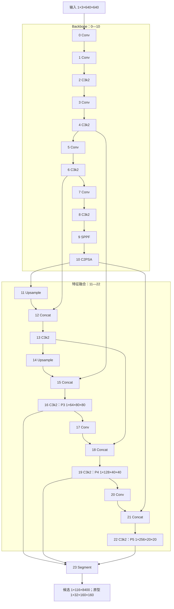

# M1：从一帧图像到每个物体的轮廓

更新：2026-10-02。对象为本项目锁定的 Ultralytics 8.4.171 / YOLO11n-seg，使用现有 COCO 80 类预训练权重。本轮源码检查、GPU 张量实验、掩膜对照与损失教学实验已执行；个人理解与复述尚待验收。具体数字和证据查[实际观察报告](../reports/model_notes.md)。

**先读第 1 节，能解释模型输出后，再进入第 2—5 节。** 不必一次背下所有层名。第 6 节给出复述框架和验收问题；相关基础可配合[第一课讲义](../codex/01_第一课_从一张图理解目标检测.md)。

| 任务 | 这次需要弄懂什么 | 已准备的实操证据 |
| --- | --- | --- |
| M1-01 | 模型要回答什么，输出字段怎样读 | 两个杯子的教学图、真实桌面预测字段 |
| M1-02 | 特征怎样经过主干、融合与分割头 | 锁定 YAML、实际 24 个模块和完整连接图 |
| M1-03 | 每一步的数据形状是什么 | GPU 640×640 前向，三种模式的返回记录 |
| M1-04 | 8400 个候选怎样变成框和掩膜 | 两图筛选计数，掩膜逐像素对照 |
| M1-05 | 标签怎样产生损失，效果怎样评价 | 教学前向 / 反向、手工样例 IoU / AP |
| M1-06 | 如何独立讲清整条流程 | 复述模板、个人答题与未理解问题清单 |

<a id="m1-01"></a>

## 1. M1-01：先看懂模型到底输出什么

想象桌面上有两个杯子。类别都是 cup，但它们是两个独立对象。四种任务要求回答的问题不同：

| 任务 | 要回答的问题 | 两个杯子的输出 |
| --- | --- | --- |
| 分类 | 图中有什么类别？ | 图像级“有杯子”，不直接给出各自位置 |
| 检测 | 每个对象是什么、在哪里？ | 两个框，分别关联类别和分数 |
| 语义分割 | 每个像素属于什么类别？ | 两个杯子的像素都标为 cup，不提供实例身份 |
| 实例分割 | 每个独立对象分别占哪些像素？ | 杯子 A、B 各有一个掩膜，并关联类别等信息 |


上图是手工绘制的教学示意，两个杯子的轮廓和框均已知，没有运行模型。它用来解释任务，不作为预训练模型效果证据。

当前项目需要实例分割。对一次实际预测，应分别读以下信息：

| 字段 / 概念 | 如何理解 | 当前访问方式 |
| --- | --- | --- |
| 类别 | 模型认为对象是什么 | `result.boxes.cls`，再通过 `result.names` 找名称 |
| 置信度 | 用于排序和阈值筛选的预测分数 | `result.boxes.conf` |
| 框 | 包围预测对象的矩形范围 | `result.boxes.xyxy`，顺序为左、上、右、下 |
| 掩膜 | 与某个预测实例对应的像素集合 | `result.masks.data[i]` |
| 当前预测实例数 | 本帧最终保留多少个预测 | `len(result.boxes)`；有掩膜时应逐实例对应 |

分数 0.90 不能直接解释成“项目准确率 90%”。预测实例数也不等于真实物体数：漏检会减少结果，重复预测或误检会增加结果。原图中的真实轮廓需要人工标注，不能把预测掩膜直接当作真值。

**与你刚才的问题的联系：**当前还是一个 COCO 80 类模型。项目三类的 ID 0/1/2 是后续数据约定，原模型中的 cup/bottle/cell phone 分别是 41/39/67。默认传入 `classes=[41,39,67]`；`--all-classes` 取消筛选，两种模式使用同一权重。实时预览原图与结果也只是两个视图。

本节练习：看[桌面预测图](../reports/model/M1/desktop_project_result.jpg)，说出哪些区域是框、哪些是掩膜，以及图上 cup 的数量为什么不能直接作为真实杯子数量。对照报告中的一个实例，解释 `class_id`、`confidence`、四个 `xyxy` 数字和 `mask_area_pixels`。

<a id="m1-02"></a>

## 2. M1-02：结构中每一段负责什么

模型配置在 [yolo11-seg.yaml](../third_party/ultralytics/ultralytics/cfg/models/11/yolo11-seg.yaml)。一行配置是 `[from, repeats, module, args]`：输入来自哪里、重复次数、模块类型和参数。`from=-1` 表示上一层；`[-1,6]` 表示同时取上一层和第 6 层。实际通道与重复数还要经过 `n` 规模的宽度 / 深度缩放，不能照抄通用 YAML 中的数字。

这次加载的模型共有 **24 个顶层模块，索引 0—23**。顶层模块包含内部卷积等子模块，因此这个数量与 YAML 注释中的“203 layers”不是同一种统计口径。

| 部分 | 本模型位置 | 作用 |
| --- | --- | --- |
| Backbone 主干 | 0—10 | 从图像逐步提取特征，降低空间尺寸并组织通道信息 |
| 特征融合 | 11—22 | 上采样后与较浅特征拼接，再通过下采样融合不同尺度的信息 |
| Segment 分割头 | 23，输入来自 16/19/22 | 预测框、类别、每个候选的掩膜系数，以及共享原型 |

YAML 把特征融合与 Segment 都写在 `head` 部分；学习时把融合段单独称为 Neck，是为了说明职责。



这个图逐条对应本轮记录的 `module.f`；所有层的通道与 shape 见[报告](../reports/model_notes.md#layers)。

先理解三个核心模块的目的：C3k2 在保留与变换特征的分支之间组织信息；SPPF 通过连续池化聚合更大范围的上下文；C2PSA 在部分特征分支中使用注意力与前馈处理。具体实现都在 [block.py](../third_party/ultralytics/ultralytics/nn/modules/block.py)，分别从第 1069、211、1442 行开始。不要把这些模块已有的机制当作本项目新提出的方法。

P3/P4/P5 在此对应步长 8/16/32。较细尺度有更多空间位置，但不表示小物体只允许出现在 P3；三个尺度的候选会一起参与后处理。当前模型的原型由 P3 特征生成，[Proto](../third_party/ultralytics/ultralytics/nn/modules/block.py) 中包含上采样。

本节练习：沿图追踪第 16 层来自哪里，再找出第 19、22 层为什么既有下采样输入，又有拼接输入。

<a id="m1-03"></a>

## 3. M1-03：用真实张量理解输入与输出

本轮使用两张已有图片；网络输入固定为 FP32 的 `[1,3,640,640]`，在 `cuda:0` 执行。预处理按当前设置完成等比例缩放与填充、BGR 转 RGB、HWC 转 BCHW，并除以 255。原图不是正方形时，填充区域之后还需要从框和掩膜坐标处理中消除。

shape 中四个数字分别是 batch、通道、高、宽。例如 `[1,64,80,80]` 表示一张图经过处理后得到 64 个 80×80 的特征通道，不是 64 个物体。

三个尺度的位置总数：

$\[
80\times80+40\times40+20\times20=8400.
\]$

普通推理的候选张量是 `[1,116,8400]`。其中每个位置有 `4 + 80 + 32 = 116` 个值：解码后的框、80 类分数、32 个掩膜系数。当前没有额外独立的 objectness 通道。框在这一步是 `xywh`，进入 NMS 后变成 `xyxy`。

共享原型为 `[1,32,160,160]`。32 是掩膜表达的通道数，不是最多只能检出 32 个实例。`Segment.npr` 本轮实测为 64，它是原型模块的中间通道参数；不要把它和最终 32 个原型混淆。通用 YAML 中的 256 经 `n` 的宽度缩放得到 64。

| 模式 | 此锁定版本的实际返回 | 用途 |
| --- | --- | --- |
| 训练模式 | 字典：`boxes`、`scores`、`feats`、`mask_coefficient`、`proto` | 供损失函数处理原始回归分布、类别 logits 与掩膜数据 |
| 普通 PyTorch 推理 | `((decoded, proto), raw_dict)` | 同时包含解码结果及原始中间结果 |
| `head.export=True` | `(decoded, proto)` | 只保留两个输出张量；本次未重新导出 ONNX |
| 高层 `model.predict()` 的最终结果 | `Results`：`boxes=[N,6]`，`masks=[N,H,W]` | 已经过后处理，N 随画面变化 |

训练字典中的 `boxes=[1,64,8400]` 是四条边各 16 个分布 bin 的 logits，尚不是四个坐标；`scores=[1,80,8400]` 尚未经过 sigmoid。解码后框只占 4 个通道。返回结构依据 [head.py](../third_party/ultralytics/ultralytics/nn/modules/head.py) 第 180、206、358、382 行和本轮运行记录，不能用其他版本的旧返回格式代替。

本节练习：解释为什么 8400 个候选可以最后只剩 3 个实例，并指出 116、80、32、64 四个数字分别代表什么。

<a id="m1-04"></a>

## 4. M1-04：候选怎样变成框和掩膜

本轮使用 `conf=0.25`、NMS `iou=0.7`、`max_det=100`，与 E0 配置一致。步骤是：先按类别最大分数筛选候选；每个候选选最高分的类别；可选地只保留项目三类；按类别执行 NMS 去除重叠候选；再生成保留实例的掩膜，过滤空掩膜。

| 图片 / 模式 | 原始候选 | 过置信度 | 过类别筛选，NMS 前 | NMS 后 |
| --- | --- | --- | --- | --- |
| 公交车图 / 全类别 | 8400 | 45 | 45 | 5 |
| 公交车图 / 三类 | 8400 | 45 | 0 | 0 |
| 桌面图 / 全类别 | 8400 | 36 | 36 | 7 |
| 桌面图 / 三类 | 8400 | 36 | 15 | 3 |

因此，三类筛选确实参与后处理，而不仅在绘图时隐藏文字；它也没有把网络的 80 类分数计算改成 3 类计算。本轮每个候选只取最高分类别，例如最高分被判为 cup 的候选，不会因为 bottle 的分数也不低而自动改成 bottle。

NMS 的作用是减少同一对象附近的重叠候选。它比较的是预测框之间的 IoU，不是预测框与真值框之间的评价 IoU。框去重本身不能保证分类与轮廓正确。

设第 k 个实例的 32 个系数为 \(a_{k,c}\)，共享原型为 \(P_c\)，该实例的低分辨率掩膜 logits 是：

\[
L_k(u,v)=\sum_{c=1}^{32}a_{k,c}P_c(u,v).
\]

原型和系数可以包含负值，单个原型也不一定是完整物体。系数选择和组合共享特征后，才得到某个实例的空间响应。本项目启用 `retina_masks=True`，随后按原图比例去填充、插值到原尺寸、用 logits>0 二值化，再按原图框裁剪。logits>0 与 sigmoid(logits)>0.5 等价。


图中实际 cup 是已有桌面图上的一次预测。脚本中的 `reconstruct_mask()` 明确写出上述步骤，未调用官方掩膜生成函数；结果与同一候选、同一原型的官方 `SegmentationPredictor.construct_result()` **逐像素一致**。这验证了当前两图和当前设置下的学习实现；完整 M5 还需独立预处理 / NMS、更多图片及边界情况验收。

参考源码：[NMS](../third_party/ultralytics/ultralytics/utils/nms.py) 第 13 行；[分割结果构建](../third_party/ultralytics/ultralytics/models/yolo/segment/predict.py) 第 86 行；[process_mask_native / scale_masks / crop_mask](../third_party/ultralytics/ultralytics/utils/ops.py) 第 558 / 586 / 504 行。

本节练习：分别改变置信度和 NMS IoU 时，你预计哪些阶段的数量会变？为什么掩膜需要先处理填充，再回到原图坐标？

<a id="m1-05"></a>

## 5. M1-05：学习训练目标与评价

### 5.1 标签和预测怎样产生损失

训练时需要类别、框和实例掩膜真值。当前 `SegmentationModel.init_criterion()` 选择 `v8SegmentationLoss`；名称带 v8 不表示实际加载的是 YOLOv8，而是此源码沿用的损失类名。

在计算损失之前，`TaskAlignedAssigner` 用预测分类分数与框的匹配情况分配正样本和目标分数。分类监督并非简单地给所有 8400 个候选贴同一个图像标签。

| 项目 | 当前实现 | 要约束什么 |
| --- | --- | --- |
| `box_loss` | CIoU，结合目标分数权重 | 预测框的范围、中心和形状 |
| `cls_loss` | BCEWithLogitsLoss，对分配后的目标分数计算 | 候选的类别分数 |
| `dfl_loss` | 对连续目标在相邻两个分布 bin 上加权 | 四条边的距离分布 |
| `seg_loss` | 系数与原型组合后的逐像素 BCE，框内裁剪与面积归一化 | 各实例的预测轮廓 |
| `sem_loss` | 当前通用损失容器保留的分支项 | 本 YOLO11 实测为 0，当前没有该附加输出 |

DFL 可以先用一个数字理解：若目标距离是 3.4，则主要监督 bin 3 和 bin 4，权重分别为 0.6 和 0.4；不要求把连续距离直接取整。框解码时，对分布做 softmax 后按 bin 编号计算期望。

本轮在模型的临时副本上，用手工杯子图及对应标签执行一次训练模式前向和反向，检查主干、原型和系数分支都有非零梯度。没有 optimizer.step，没有保存权重，也没有项目数据训练。它说明损失与反向链路可以执行，不能用一次教学损失判断收敛或改进。具体值在[报告](../reports/model_notes.md#loss-demo)。

源码：[loss.py](../third_party/ultralytics/ultralytics/utils/loss.py) 中 `v8DetectionLoss` 第 347 行、`v8SegmentationLoss` 第 501 行、`single_mask_loss` 第 575 行、`DFLoss` 第 89 行；[tal.py](../third_party/ultralytics/ultralytics/utils/tal.py) 的 `TaskAlignedAssigner` 第 14 行。

### 5.2 如何区分定位、轮廓和检出质量

\[
IoU=\frac{|预测区域\cap真值区域|}{|预测区域\cup真值区域|},\quad
Precision=\frac{TP}{TP+FP},\quad Recall=\frac{TP}{TP+FN}.
\]

框 IoU 比较矩形，mask IoU 比较像素集合。教学图中把杯子 A 平移 5 像素，框 IoU 为 0.9074，而 mask IoU 为 0.8372；同一个位移对细轮廓、杯把孔洞的影响与矩形范围不同。这是手工样例的数值，不是模型实测精度。

一次正确匹配需要类别正确、IoU 达到阈值，并满足一对一匹配。同一真值不能因为被预测两次就计为两个 TP。教学样例只有两个真值杯子，却对杯子 A 预测两次、漏掉 B，在 IoU=0.5 下 TP=1、FP=1、FN=1，因此 Precision=Recall=0.5。

AP 对按分数排序的预测形成的 Precision–Recall 曲线进行汇总，不等于某一阈值下的 Precision 或两者乘积。mAP50 在 IoU=0.5 下按类别平均；mAP50-95 进一步对 0.50、0.55、…、0.95 共十个 IoU 阈值平均。检测 AP 和分割 AP 分别使用框与掩膜的匹配结果。当前锁定实现的 `compute_ap()` 使用 101 个 recall 点插值后积分，教学 AP50 实算为 0.495；不要强行将它写成 0.5。

这些教学指标只说明计算方式。项目正式评价还需要冻结的标注数据与明确的测试协议。应用 FPS 衡量运行速度，不是检出正确率；帧内实例数也不是跨帧去重后的累计物体数。

参考源码：[metrics.py](../third_party/ultralytics/ultralytics/utils/metrics.py) 第 85、177、769、801 行；[验证匹配](../third_party/ultralytics/ultralytics/engine/validator.py) 第 315 行；[分割评价](../third_party/ultralytics/ultralytics/models/yolo/segment/val.py) 第 139 行。

<a id="m1-06"></a>

## 6. M1-06：把整条流程讲出来

先按下面的顺序复述，再补关键数字：

> 输入一帧图像，先缩放填充并转成模型张量。主干提取特征，融合段组织不同尺度的信息。分割头对三个尺度的位置预测框、类别分数和掩膜系数，同时生成共享原型。经过置信度、类别筛选与 NMS 后，保留若干实例。每个实例用自己的系数组合原型，恢复到原图尺寸并裁剪，得到独立掩膜；最后把框、类别、分数和轮廓画到画面上。

这是一份练习模板，尚不能证明你已独立掌握。按以下问题完成自己的解释；我们在主聊天中逐项核对，再勾选对应任务。

| 对应任务 | 需要独立回答 / 操作 | 个人学习验收 |
| --- | --- | --- |
| M1-01 | 两个杯子对应几类、几个实例、几个 mask？解释一个真实预测的四类字段；为什么分数不是实测准确率？ | 待回答 |
| M1-02 | 在结构图找到第 16/19/22 层和 Segment，说明上采样与拼接来自哪里 | 待操作与解释 |
| M1-03 | 解释输入、三尺度、116×8400 和 32×160×160；区分三种模式 | 待解释 |
| M1-04 | 沿真实计数解释筛选，再用系数 / 原型说明一个实例的掩膜 | 待复现与解释 |
| M1-05 | 区分四项主要损失，手算 IoU、TP/FP/FN，解释 AP 与 FPS | 待手算与解释 |
| M1-06 | 不照读模板，独立说明整条流程，并指出两个尚未理解的问题 | 待复述 |

未理解的问题在这里逐次补充：目前待确认你对特征通道、DFL、候选分配和原型组合的理解；这些是学习核对项，不是已经发现的模型运行故障。

## 7. 复现实操与文件入口

```powershell
Set-Location 'E:\秋招\项目相关\YOLO'
conda activate yolo
python scripts/inspect_model.py --output reports/model/M1_recheck_01
```

[检查脚本](../scripts/inspect_model.py) 默认输出到 `reports/model/M1/`。本次目录已保存证据，因此再次运行应指定新的、空的输出目录；程序拒绝覆盖非空目录。脚本校验源码版本、commit、加载位置和权重 SHA256，使用已有两张图片，不需要打开摄像头或安装新依赖。

核心证据只有[一份 JSON](../reports/model/M1/summary.json)、两张教学 / 重建图和两张预测图。没有保存每层大数组；需要深入观察时，由同一脚本从已锁定输入重现。主线状态统一见[进度跟踪](../plan/00_YOLO_分阶段推进与进度跟踪.md#m1)。
