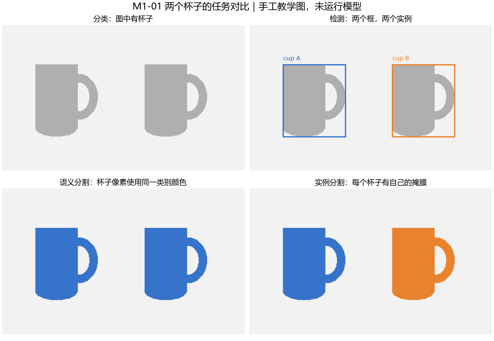
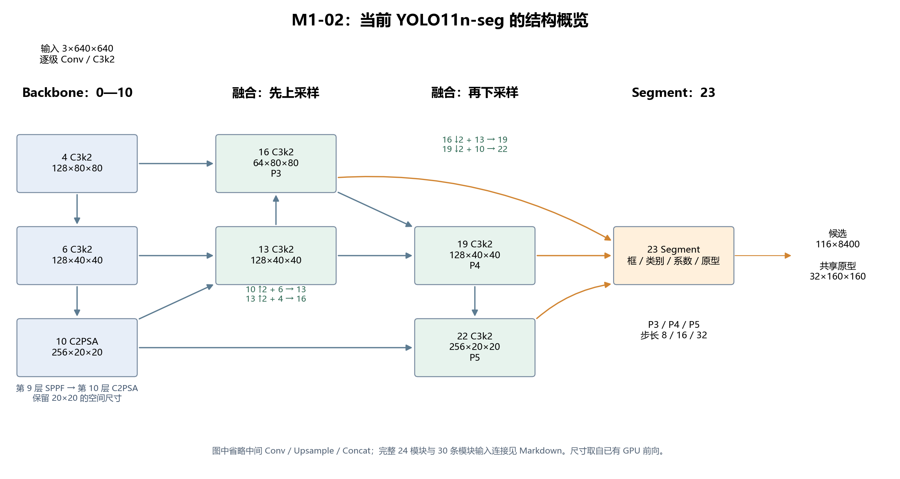
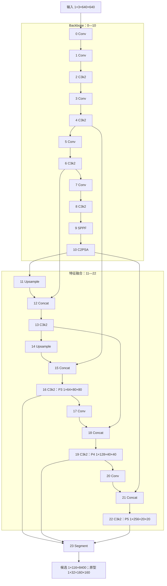
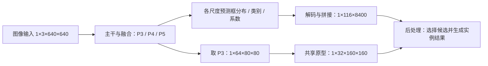

# M1：从一帧图像到每个物体的轮廓

更新：2026-10-03。对象为本项目锁定的 Ultralytics 8.4.171 / YOLO11n-seg，使用现有 COCO 80 类预训练权重。源码检查、GPU 张量实验、掩膜对照与损失教学实验已执行；结合既有讨论、M1-05 正确问答、用户模型流程与项目边界复述，以及本轮案例和评价补充，M1 核心学习收尾完成，6/6。具体数字和工程证据查[实际观察报告](../reports/model_notes.md)；正式商品训练和质量评价在后续阶段开展。

**项目范围更新：**2026-10-03 用户正式确认后续改为两种固定盒装奶与一种瑞幸杯装咖啡的包装识别 / 实例分割，具体商品名与类别映射待 M2-01 冻结，见[商品方向与假期安排](../plan/00_YOLO_分阶段推进与进度跟踪.md#product-scope)。本笔记中的杯子 / 瓶子 / 手机、80 类输出与三类过滤均来自已执行的 E0 学习例子，保留原数据；新商品训练、指标与部署证据尚未生成。

**2026-10-03 调整：M1 以掌握项目、能够面试讲解为目标。** 从下面第 0 节开始，每次围绕一个项目问题，由主聊天直接讲解、结合已有结果，再讨论少量追问。第 1—5 节是查阅材料，按问题定位；逐章通读、背诵模块参数和完整推导不作为推进条件。任务、结构、候选、原型组合、后处理、训练和评价的核心内容已讨论，用户已大致学习系统笔记；[第 6 节](#m1-06)已合并口述、追问和实际回答，完成本轮学习收尾。主线进入 M2-01 商品登记，再开展 M2-02 辅助试标。核心学习通过不代表已完成项目训练或全部独立操作；面试口述熟练度和源码细节随后续工程继续练习。

| 任务 | 这次需要弄懂什么 | 已准备的实操证据 |
| --- | --- | --- |
| M1-01 | 模型要回答什么，输出字段怎样读 | 两个杯子的教学图、真实桌面预测字段 |
| M1-02 | 特征怎样经过主干、融合与分割头 | 锁定 YAML、实际 24 个模块和完整连接图 |
| M1-03 | 每一步的数据形状是什么 | 两图专项 GPU 前向、分支 hook、三种模式及数值对应检查 |
| M1-04 | 8400 个候选怎样变成框和掩膜 | 两图专项复查、同图阈值对照、NMS 逐步记录与掩膜逐像素对照 |
| M1-05 | 标签怎样产生损失，效果怎样评价 | 教学前向 / 反向、手工样例 IoU / AP |
| M1-06 | 如何独立讲清整条流程 | 复述模板、个人答题与未理解问题清单 |

<a id="interview-route"></a>

## 0. 先按项目和面试问题掌握 M1

### 0.1 怎么学、学到什么程度

每次学习采用同一个流程：先听 5—10 分钟的直接讲解，看一份实际图 / 配置 / 运行记录，再用自己的话回答两三个问题。答不清的地方当场补充；能解释后继续项目，知识细节随着数据准备、训练和部署中的问题再深入。单个主题通常可以先安排 15—30 分钟，实际按理解情况调整。

| 主题 | 面试中需要讲清 | 首轮可以暂缓 |
| --- | --- | --- |
| M1-01 任务与结果 | 为什么做实例分割；类别、分数、框、掩膜与预测实例数的含义 | 扩展任务谱系和额外坐标习题 |
| M1-02 整体结构 | Backbone / 特征融合 / Segment 的职责；多尺度怎样帮助处理大小不同的物体 | 逐层参数、完整 YAML 解析和全部 block 内部实现 |
| M1-03 输入与输出 | 640×640 输入；当前仍是 80 类；116×8400 和 32 个原型各指什么 | 所有层的 shape 与三种返回容器的背诵 |
| M1-04 筛选与轮廓 | 置信度筛选、三类过滤、NMS；系数与共享原型怎样产生各自的掩膜 | 独立后处理复现的全部代码细节，正式实现留到 M5 |
| M1-05 训练与评价 | 训练和推理的区别；分类、框、DFL、分割损失的作用；Precision / Recall / box 与 mask mAP | 损失完整公式、AP 插值推导和论文历史榜单 |
| M1-06 项目经历 | 两分钟讲清任务、方案、已做工作、一个问题与处理、当前不足和下一步 | 与本项目经历无关的模型版本细节 |

合格的回答需要既能说明作用，也能联系项目举例。仅背“主干、融合、头”三个名词不够；能够解释为什么多尺度、筛选三类是否改了网络、掩膜怎样对应实例即可先推进，源码深读按具体追问补充。

### 0.2 现阶段怎样介绍项目

下面按已有执行记录给出口述示例。是否能独立复现、是否亲自处理过某个问题，按自己的实际参与情况说明。

> 项目后续面向两种盒装奶和一种瑞幸杯装咖啡，根据可见包装识别商品、定位并分割每个实例，采用 YOLO11n-seg。目前完成的是通用 COCO 预训练模型的工程验证，新商品尚未训练。此前用杯子、瓶子和手机跑通了图片、视频与摄像头推理，以及 ONNX 导出、ONNX Runtime 和 TensorRT FP32 原始输出对照，也做了环境归档与新进程复现。接下来会自采商品图片、人工确认类别与轮廓，按拍摄组划分数据，完成微调基线和留出评价，再根据验证错误补样本并推进实时部署。SE 结构改动保留为后续对照，是否采用按真实结果决定。

这段介绍的证据见 [M0 报告](../reports/M0_阶段验收报告.md)和[模型观察报告](../reports/model_notes.md)。已有代码及自动化检查是工程产出，能否独立讲解 / 操作另行核对；学习材料生成不等于个人已掌握。

### 0.3 M1 收尾：把已经学过的内容串起来

已结合桌面图讨论 8400→36→15→3 的筛选、NMS、系数与共享原型、插值和去填充。用户确认了筛选计数，继续追问并学习了掩膜与实例对应及尺寸恢复。M1-05 接着讨论训练损失、Precision / Recall、AP / mAP、FPS / 延迟和数据集用途；问答记录见[第 5.3 节](#m1-05-answers)。原后处理实操保留在[专项观察记录](../reports/model_notes.md#m1-04-check)。

可先使用下面的回答，再结合候选计数和实际重复框解释：

> 图片先缩放填充并转成模型张量。模型输出候选与原型；后处理按分数和类别筛选，再用逐类别 NMS 去除重复框。保留候选的框、类别、分数和系数始终绑定在一起；每组系数与共享原型生成一张分数图，恢复尺寸并二值化、裁剪，得到独立掩膜。桌面例子是 8400→36→15→3，结果仍可能有误分类和漏检。

现在用[第 6 节](#m1-06)把任务、流程、已做工作、实际问题与下一步串成一次简短复述。用户已给出模型流程，明确仍使用预训练模型、三类是后处理筛选、迁移学习尚未开展，并提出用指标判断效果；主聊天补齐了实例术语、完整后处理、真实案例、独立评价与商品包装范围。本轮核心学习验收完成，助手口述稿继续作为练习材料，知识细节结合 M2/M3 数据与训练实操补充。

只需按当前问题查阅对应段落，源码在想确认某个具体操作时再打开。

### 0.4 怎样形成可讲的经历

后续每次工程任务都留下一个可复述案例：问题是什么 → 查看了什么证据 → 怎样处理 → 用什么结果验证。当前已有依赖冲突、模型导出与后端对照、候选筛选和误检观察等素材；按自己的参与程度使用。正式训练、结构改进、独立部署质量评价和长期摄像头稳定性需要继续实际开展。

商品方向新增的实际经历应包括：模型轮廓草稿怎样人工改成商品标签，漏检怎样补齐，按拍摄组如何防止泄漏，以及新三类模型怎样验证。训练标签不含预测置信度，改成 1 不能替代审核；现有 COCO 模型不具备三商品类别。首版约 350 张只是数据起点，结果以留出评价为准。

只有两张图片的原始输出 / 掩膜对照不能写成正式准确率；尚未验证的 FP16、FPS、加速倍数或改进收益不写成结果。后续简历与面试内容随真实实验更新。

<a id="m1-01"></a>

## 1. M1-01：先看懂模型到底输出什么

想象桌面上有两个杯子。类别都是 cup，但它们是两个独立对象。四种任务要求回答的问题不同：

| 任务 | 要回答的问题 | 两个杯子的输出 |
| --- | --- | --- |
| 分类 | 图中有什么类别？ | 图像级“有杯子”，不直接给出各自位置 |
| 检测 | 每个对象是什么、在哪里？ | 两个框，分别关联类别和分数 |
| 语义分割 | 每个像素属于什么类别？ | 两个杯子的像素都标为 cup，不提供实例身份 |
| 实例分割 | 每个独立对象分别占哪些像素？ | 杯子 A、B 各有一个掩膜，并关联类别等信息 |



上图是手工绘制的教学示意，两个杯子的轮廓和框均已知，没有运行模型。它用来解释任务，不作为预训练模型效果证据。

当前项目需要实例分割。对一次实际预测，应分别读以下信息：

| 字段 / 概念 | 如何理解 | 当前访问方式 |
| --- | --- | --- |
| 类别 | 模型认为对象是什么 | `result.boxes.cls`，再通过 `result.names` 找名称 |
| 置信度 | 用于排序和阈值筛选的预测分数 | `result.boxes.conf` |
| 框 | 包围预测对象的矩形范围 | `result.boxes.xyxy`，顺序为左、上、右、下 |
| 掩膜 | 与某个预测实例对应的像素集合 | `result.masks.data[i]` |
| 当前预测实例数 | 本帧最终保留多少个预测 | `len(result.boxes)`；有掩膜时应逐实例对应 |

分数 0.90 不能直接解释成“项目准确率 90%”。预测实例数也不等于真实物体数：漏检会减少结果，重复预测或误检会增加结果。原图中的真实轮廓需要人工标注，不能把预测掩膜直接当作真值。

**与你刚才的问题的联系：**这里使用的仍是 COCO 80 类 E0 模型，cup/bottle/cell phone 分别是 41/39/67。默认传入 `classes=[41,39,67]`；`--all-classes` 取消筛选，两种模式使用同一权重。旧方案的项目 ID 0/1/2 属于杯子 / 瓶子 / 手机约定，后续商品任务会在 M2-01 另行冻结映射，不能混用。实时预览原图与结果也只是两个视图。

本节练习：看[桌面预测图](../reports/model/M1/desktop_project_result.jpg)，说出哪些区域是框、哪些是掩膜，以及图上 cup 的数量为什么不能直接作为真实杯子数量。对照报告中的一个实例，解释 `class_id`、`confidence`、四个 `xyxy` 数字和 `mask_area_pixels`。

<a id="m1-02"></a>

## 2. M1-02：结构中每一段负责什么

本节要做到：能够在当前模型中找到主干、融合段和分割头，沿着实际连接说清特征怎样流动，并知道到哪个源码文件查具体实现。结构核对和讲解已完成，当前连同前面任务在 M1-06 综合复述中核对；源码细节按后续具体问题查阅。

### 2.1 先看三个部分的职责

输入是一张图，模型内部流动的是特征张量。特征的通道代表学习得到的不同响应，并不固定对应某一种物体；“64 个通道”不能理解成“64 个目标”。空间尺寸越小，位置越粗，但每个响应可以综合更大范围的信息。

这次加载的模型共有 **24 个顶层模块，索引 0—23**。顶层模块包含内部卷积等子模块，因此这个数量与 YAML 注释中的“203 layers”不是同一种统计口径。

| 部分 | 本模型位置 | 作用 |
| --- | --- | --- |
| Backbone 主干 | 0—10 | 从图像逐步提取特征，降低空间尺寸并组织通道信息 |
| 特征融合 | 11—22 | 上采样后与较浅特征拼接，再通过下采样融合不同尺度的信息 |
| Segment 分割头 | 23，输入来自 16/19/22 | 预测框、类别、每个候选的掩膜系数，以及共享原型 |

YAML 把特征融合与 Segment 都写在 `head` 部分；学习时把融合段单独称为 Neck，是为了说明职责。



概览图省略中间采样、卷积与拼接模块；下面的完整连接图保留全部 24 个模块。前向 shape 来自已有 GPU 实操，本次重新检查已加载模块及 YAML，没有重复训练或采集摄像头画面。



这个图逐条对应本轮记录的 `module.f`；所有层的通道与 shape 见[报告](../reports/model_notes.md#layers)。

### 2.2 怎样读 YAML，为什么数字会变化

模型配置在 [yolo11-seg.yaml](../third_party/ultralytics/ultralytics/cfg/models/11/yolo11-seg.yaml)。一行是 `[from, repeats, module, args]`：输入来源、重复次数、模块类型和参数。`from=-1` 表示上一层；`[-1,6]` 表示同时取上一层和第 6 层。层编号从 0 开始，先编号 backbone，再接 head。

```yaml
# 第 0 层：从上一项输入，Conv 的基础输出通道 64、核 3、步长 2
- [-1, 1, Conv, [64, 3, 2]]
# 第 12 层：拼接上一层与第 6 层，沿通道维 dimension=1
- [[-1, 6], 1, Concat, [1]]
# 第 23 层：接收三个尺度，80 类、32 个 mask 系数、基础原型中间通道 256
- [[16, 19, 22], 1, Segment, [nc, 32, 256]]
```

当前是 `n` 规模，缩放参数为 `[depth=0.50, width=0.25, max_channels=1024]`。结构解析由 `parse_model()` 完成：通道经过宽度缩放并按 8 对齐；重复次数经过深度缩放后，对 C3k2 / C2PSA 等模块放进模块内部。

| YAML 中的基础值 | 当前模型中的实际值 | 原因 |
| --- | --- | --- |
| 第 0 层 Conv 输出 64 通道 | 16 通道 | 64×0.25=16 |
| 第 16 层 C3k2 输出 256 通道 | 64 通道 | 256×0.25=64 |
| C3k2 的 repeats=2 | 一个内部 block | 2×0.50=1；此数不是把整个顶层模块复制两次 |
| Segment 的 npr=256 | 中间通道 64 | 对原型模块中间通道应用宽度缩放 |
| Segment 的 nc=80、nm=32 | 仍是 80 类、32 个系数 | 两者与上述中间通道缩放的含义不同 |

因此，读取 YAML 时要同时查看 `scales`、解析器和已加载模块。`C3k2` 参数里的 False/True 指内部 block 的选择，不是关闭 / 打开整个模块。

### 2.3 Backbone：提取特征，逐级降低空间尺寸

在 640×640 输入下，步长为 2 的卷积让宽高依次变为 320、160、80、40、20。第 0 层实际是 `Conv2d(3→16,k=3,s=2,p=1)`，后接 BatchNorm 和 SiLU。C3k2 在这些尺度上继续加工特征；第 9、10 层在 20×20 特征上加入池化上下文与注意力处理。

后续融合主要取第 4 层 `[1,128,80,80]`、第 6 层 `[1,128,40,40]` 和第 10 层 `[1,256,20,20]`。这里较浅的特征保留更细的空间分辨率，较深的特征综合更多上下文。两者会在融合段一起使用，不能把某一层当成已经画好的目标轮廓。

### 2.4 特征融合：先向上采样，再向下采样

第 11—16 层先把较粗特征放大到较细尺度，与主干对应尺寸的特征拼接，再用 C3k2 加工。这里的 `nn.Upsample` 使用 nearest，放大特征的宽高；它不会凭空补回原图细节。

第 17—22 层再用步长 2 的 Conv 下采样，与前面同尺寸的融合特征拼接。这样第 16、19、22 层都包含经过融合的信息，而不只是原始主干输出。

| 拼接层 | 输入 1 | 输入 2 | Concat 后输出 | 后续加工 |
| --- | --- | --- | --- | --- |
| 12 | 第 11 层：256×40×40 | 第 6 层：128×40×40 | 384×40×40 | 第 13 层变为 128×40×40 |
| 15 | 第 14 层：128×80×80 | 第 4 层：128×80×80 | 256×80×80 | 第 16 层变为 64×80×80 |
| 18 | 第 17 层：64×40×40 | 第 13 层：128×40×40 | 192×40×40 | 第 19 层变为 128×40×40 |
| 21 | 第 20 层：128×20×20 | 第 10 层：256×20×20 | 384×20×20 | 第 22 层变为 256×20×20 |

表中省略 batch=1。Concat 沿通道维拼接，宽高必须相同，通道数相加。它不是逐元素相加；384 个通道也不是新增 384 个实例。拼接后的卷积加工负责重新组织这些特征。

P3/P4/P5 在此对应步长 8/16/32。送入分割头的是融合后的第 16/19/22 层：P3 有 80×80 个位置，P4 有 40×40 个位置，P5 有 20×20 个位置。较细尺度有更多空间位置，但不表示小物体只允许出现在 P3；三个尺度的候选会一起参与后处理。

### 2.5 C3k2、SPPF、C2PSA 各自做什么

**C3k2：分支加工后再融合。** 它继承 C2f 的前向：先用卷积得到特征并拆为两部分，其中一部分继续经过内部 block；保留各阶段结果并沿通道维拼接，再经卷积融合。当前八个 C3k2 的外层内部重复数都是 1，其中第 2/4/13/16/19 层的内部类型为 Bottleneck，第 6/8/22 层为 C3k。内部 C3k 还含子模块，因此“内部重复数 1”不代表只有一个卷积。源码从 `C3k2.__init__()` 跟到 `C2f.forward()`，再查看实际选用的 block。

**SPPF：用连续池化聚合不同范围。** 当前第 9 层先用卷积处理特征，再连续三次使用 kernel=5、stride=1、padding=2 的 MaxPool，将未池化与三次池化结果拼接后融合。池化不改变 20×20 尺寸，连续池化覆盖的范围不同；不要把它理解成三个 P3/P4/P5 输出分支。

**C2PSA：在部分通道上做注意力与前馈处理。** 第 10 层先把特征分为两支，保留一支，对另一支执行 PSABlock，再拼接并融合。当前输入与输出都是 256×20×20，被处理分支为 128 通道，含一个 PSABlock。注意力通过空间位置之间的关系重组信息；本层不是 SE，也不直接输出物体框。

上述实现都在 [block.py](../third_party/ultralytics/ultralytics/nn/modules/block.py)，实际行号和模块属性已登记在结构记录中。

**本轮发现的实现差异：**已加载权重的 SPPF `cv1.act` 是 SiLU；用当前锁定源码的构造函数新建 SPPF，默认 `cv1.act` 是 Identity。已有权重保存了模块的实际配置，不能仅凭 YAML 相同就假定所有模块内部属性也相同。本笔记以当前加载权重及前向记录为准；本轮没有替换激活或修改模型。

### 2.6 Segment：三路特征怎样接到预测分支

第 23 层输入顺序是 `[16,19,22]`，实际通道为 `[64,128,256]`，对应步长 `[8,16,32]`。它继承 Detect，另外增加掩膜系数和原型模块。

| 实际分支 | 每个尺度的末端输出通道 | 作用 |
| --- | --- | --- |
| `cv2` | 64 = 4×reg_max(16) | 四条边的回归分布，解码后成为 4 个框值 |
| `cv3` | 80 | 当前 COCO 80 类的 logits，推理时经 sigmoid |
| `cv4` | 32 | 每个候选的 32 个掩膜组合系数 |
| `proto` | 最终 32 个原型 | 从 P3 特征生成共享的 160×160 原型 |

三尺度各分支的空间位置最终拼在一起，总位置数是 6400+1600+400=8400；推理候选为 `[1,116,8400]`，116=4+80+32。

原型只取 `x[0]`，即第 16 层 P3。当前 `Proto` 的中间通道为 64，包含 `ConvTranspose2d` 将 80×80 放大到 160×160，最终输出 `[1,32,160,160]`。这里的可学习转置卷积与融合段的 nearest Upsample 是两种不同模块。最终实例 mask 还需要后处理组合和恢复尺寸，详见 M1-04。

### 2.7 按什么顺序打开源码

| 顺序 | 文件 / 起始行 | 本次要找的内容 |
| --- | --- | --- |
| 1 | [yolo11-seg.yaml](../third_party/ultralytics/ultralytics/cfg/models/11/yolo11-seg.yaml) | scales、backbone/head、from 和 Segment 输入 |
| 2 | [tasks.py](../third_party/ultralytics/ultralytics/nn/tasks.py) 第 2041 行 `parse_model` | 怎样解析模块名称、缩放通道 / 重复数、构造连接 |
| 3 | [conv.py](../third_party/ultralytics/ultralytics/nn/modules/conv.py) 第 48 / 625 行 | Conv 和 Concat 的真实操作 |
| 4 | [block.py](../third_party/ultralytics/ultralytics/nn/modules/block.py) 第 1069 / 291 行 | C3k2 构造、C2f 定义及其前向 |
| 5 | 同一 block.py，第 211 / 1442 行 | SPPF 池化和 C2PSA 分支 |
| 6 | [head.py](../third_party/ultralytics/ultralytics/nn/modules/head.py) 第 298 / 358 / 382 行 | Segment 的分支、输入、forward 与系数拼接 |
| 7 | 同一 block.py，第 85 行 `Proto` | 原型从哪路特征生成，怎样上采样 |

第一次阅读只沿当前模型经过的分支跟踪。`Segment26` 等其他头留在版本专题；当前实际类型是 Segment，end2end=False。

### 2.8 本次已完成哪些核对

[结构检查脚本](../scripts/inspect_structure.py)已重新加载当前权重，核对 YAML 与 checkpoint 中的 backbone/head/scales/nc、24 个模块的类型 / from / 参数数量、内部重复数、四处 Concat 的通道和空间尺寸，以及 Segment 分支。共核对 30 条输入连接（含原图到第 0 层），另有完整图中的一条示意输出箭头。

原始结构记录见 [structure_check.json](../reports/model/M1-02/structure_check.json)，shape 引用[已有 GPU 前向记录](../reports/model/M1/summary.json)，记录中保存了该证据的 SHA256 和原执行时间。本次只做结构检查与制图，没有重新执行模型前向或训练。

```powershell
conda activate yolo
python scripts/inspect_structure.py --output reports/model/M1-02_recheck_01
```

从项目根目录运行；输出目录需为空。再次执行会得到新的结构记录和概览图，不覆盖本次证据。

### 2.9 留给后续学习的练习

1. 找到 Backbone、融合段和 Segment，分别用一句话解释职责。
2. 沿第 10 层追踪到第 16 层，说明两次放大与拼接分别取哪层。
3. 手算四处 Concat 的通道数，并解释为什么宽高必须匹配。
4. 说明第 16/19/22 层与 P3/P4/P5、步长 8/16/32 的对应关系。
5. 解释 C3k2 的 False/True，区分 SPPF、C2PSA 和后续拟研究的 SE。
6. 指出哪些分支预测框 / 类别 / 系数，原型来自哪一路；解释 80 类筛选不会改动网络结构。

这些练习等你学习时再讨论，本次不要求立即答题。结构核对与个人学习分别记录；M1-02 的讲解和实操证据已完成，个人复述仍待验收。

<a id="m1-03"></a>

## 3. M1-03：用真实张量理解输入与输出

本节要做到：沿一张图片的真实前向，解释输入、三尺度特征、候选预测和共享原型的 shape / dtype / device，并区分训练、普通推理、export 与最终 Results。M1-02 解释模块与连接，本节把这些模块对应到实际数据。

本次专项检查重新运行了两张已有图片，网络输入固定为 FP32 的 `[1,3,640,640]`，在 `cuda:0` 执行。新记录为 [tensor_check.json](../reports/model/M1-03/tensor_check.json)，实际观察见[报告第 2.2 节](../reports/model_notes.md#m1-03-check)。本节的 shape 不是根据其他 YOLO 版本推测得到的。

### 3.1 先读懂三个属性

张量可以先理解为多维数值数组。`shape` 是各维度大小，`dtype` 是数值存储格式，`device` 是张量所在的计算设备。

| 属性 | 本次例子 | 如何解释 |
| --- | --- | --- |
| shape | `[1,3,640,640]` | BCHW：batch=1，通道=3，高=640，宽=640 |
| dtype | `torch.float32` | 每个元素用 32 位浮点数存储；FP32 不是图像尺寸 |
| device | `cuda:0` | 位于第 0 块 CUDA GPU，参与 GPU 计算 |

例如 `[1,64,80,80]` 表示一张图经过处理后得到 64 个 80×80 的特征通道。每个通道是网络学习得到的一种响应，不能解释成 64 个物体，也不能直接对应 64 个类别。BCHW 适用于本节四维图像 / 特征；后面的三维候选张量要按它自己的维度含义读。

### 3.2 摄像头图片怎样变成输入

当前**预处理**依次为：等比例缩放并填充到 640×640 → BGR 转 RGB → HWC 转 CHW → 增加 batch 维 → 转 FP32 / GPU → 除以 255。OpenCV 读取的 HWC 图片仍在 CPU 上；之后才得到网络使用的 BCHW 张量。两图归一化后的实际数值范围均为 `[0,1]`。

| 已有图片 | 原图 H×W | 等比例缩放后 H×W | 填充左 / 上 / 右 / 下 | 网络输入 |
| --- | --- | --- | --- | --- |
| 公交车 | 1080×810 | 640×480 | 80 / 0 / 80 / 0 | `[1,3,640,640]` |
| 桌面 | 480×640 | 480×640 | 0 / 80 / 0 / 80 | `[1,3,640,640]` |

以桌面图为例，宽已经是 640，因此缩放比例为 1；高为 480，上下各补 80 像素。网络输出的框先处于这个带填充的 640×640 坐标系中，后处理需要消除填充并映射回原图。不能直接把输入坐标当成摄像头原图坐标。

### 3.3 从图像到三尺度特征

| 位置 | 本次输出 shape | 观察要点 |
| --- | --- | --- |
| 输入 | `[1,3,640,640]` | 三个颜色通道 |
| 第 0 层 Conv | `[1,16,320,320]` | 步长 2，空间尺寸减半，通道变为 16 |
| 第 4 层主干特征 | `[1,128,80,80]` | 尚未经过后面的融合段 |
| 第 6 层主干特征 | `[1,128,40,40]` | 为融合段提供一路特征 |
| 第 10 层 C2PSA | `[1,256,20,20]` | 主干末端特征 |
| 第 16 层 P3 | `[1,64,80,80]` | 融合后送入分割头，步长 8 |
| 第 19 层 P4 | `[1,128,40,40]` | 融合后送入分割头，步长 16 |
| 第 22 层 P5 | `[1,256,20,20]` | 融合后送入分割头，步长 32 |

表中张量均为 `torch.float32 / cuda:0`。主干第 4 层与融合后第 16 层的空间尺寸都是 80×80，但通道不同、内容也不同；不能只看宽高就认定它们是同一份特征。

### 3.4 三个分支如何形成 8400 个候选

Segment 在 P3 / P4 / P5 各自计算框回归、类别和掩膜系数。下面列出每个尺度分支的末端张量，四维数组仍按 BCHW 读取：

| 分支 | P3 输出 | P4 输出 | P5 输出 | 展平并拼接后 |
| --- | --- | --- | --- | --- |
| 原始框回归 | `[1,64,80,80]` | `[1,64,40,40]` | `[1,64,20,20]` | `[1,64,8400]` |
| 原始类别 logits | `[1,80,80,80]` | `[1,80,40,40]` | `[1,80,20,20]` | `[1,80,8400]` |
| 掩膜系数 | `[1,32,80,80]` | `[1,32,40,40]` | `[1,32,20,20]` | `[1,32,8400]` |

P3 的空间位置展平后是 6400 个，P4 是 1600 个，P5 是 400 个；按位置维拼接得到：

\[
80\times80+40\times40+20\times20=8400.
\]

类别分支 P3 的 `[1,80,80,80]` 中，第一个 80 是类别通道数，后两个 80 是空间高和宽；它们数值相同，含义不同。

原始框回归的 64 则来自 `4×reg_max=4×16`：四条边分别预测 16 个分布 bin 的 logits。DFL 模块把它转为 `[1,4,8400]` 的距离表达，再结合候选位置和步长得到框坐标。本节先理解形状变化，分布监督的细节放到 M1-05。

### 3.5 为什么候选输出是 116×8400

普通推理的解码候选为 `[1,116,8400]`。这三个维度分别是 batch、每个候选携带的值、候选位置数。

| Python 切片 | shape | 当前含义 |
| --- | --- | --- |
| `decoded[:, :4, :]` | `[1,4,8400]` | 输入坐标系中的 `x中心,y中心,宽,高` |
| `decoded[:, 4:84, :]` | `[1,80,8400]` | 原始类别 logits 经 sigmoid 后的 80 类分数 |
| `decoded[:, 84:116, :]` | `[1,32,8400]` | 每个候选的 32 个掩膜系数，可正可负 |

因此 `4+80+32=116`。当前没有额外独立的 objectness 通道。类别 sigmoid 分别作用于各个类别，它不是要求 80 个分数加起来等于 1 的 softmax。

专项脚本已经逐数值核对：解码框与当前 DFL / 解码路径重建结果完全一致；类别段等于原始 scores 的 sigmoid；系数段等于原始系数，未被转成概率。

当前仍使用 80 类 COCO 权重。默认筛选 cup / bottle / cell phone 发生在后处理，网络的 116 通道保持不变。后续若真正建立三类分割头，且 nm 仍为 32，候选通道才可能成为 `4+3+32=39`，届时必须按实际模型重新运行确认。

### 3.6 共享原型与每个候选的系数

Proto 接收 P3 `[1,64,80,80]`，通过转置卷积上采样，本次中间输出为 `[1,64,160,160]`；最终得到共享原型 `[1,32,160,160]`。

32 是掩膜表达的通道数，不是物体数量或检测数量上限。当前 `Segment.npr=64` 是原型模块的中间通道参数，最终原型通道为 `nm=32`；通用 YAML 中的 npr=256 经 `n` 的宽度缩放得到 64。

每个候选都有自己的一组 32 个系数；同一张图的候选共享同一组原型。选出某个实例后，系数与原型组合生成该实例的轮廓。160×160 是原型的空间尺寸，后续还要完成尺度恢复与裁剪，M1-04 再逐步实操。



### 3.7 区分训练、普通推理和 export

| 模式 | 此锁定版本的实际返回 | 用途 |
| --- | --- | --- |
| 训练模式 | 字典：`boxes`、`scores`、`feats`、`mask_coefficient`、`proto` | 供损失函数处理原始回归分布、类别 logits 与掩膜数据 |
| 普通 PyTorch 推理 | `((decoded, proto), raw_dict)` | 同时包含解码结果及原始中间结果 |
| `head.export=True` | `(decoded, proto)` | 只保留两个输出张量；本次未重新导出 ONNX |
| 高层 `model.predict()` 的最终结果 | `Results`：`boxes=[N,6]`，`masks=[N,H,W]` | 已经过后处理，N 随画面变化 |

本次对公交车和桌面两图分别检查普通推理 / export；两者的 decoded 和 proto 均逐元素完全相同。export 检查是在 PyTorch 内切换分割头返回格式，没有生成新的 ONNX 文件，实际 ONNX 后端的容差对照仍查 M0 / 后续 M5。

训练模式仅在临时副本上做一次桌面图前向，用 `torch.no_grad()` 关闭梯度记录，没有标签、损失、反向或优化更新。训练模式的 BatchNorm 仍会更新副本运行统计，本次首个 BN 的计数从 1 变为 2；副本随后丢弃，原推理模型参数和持久缓冲区哈希保持一致。因此不要要求训练 / 推理输出数值相同，也不要把调用 `.train()` 当成完成了模型训练。

这里观察的是底层 `net(x)`，它返回候选与原型；你此前调用的高层 `model.predict()` 还会做后处理，再包装成 Results。`Results.boxes=[N,6]` 中每行是 xyxy、分数、类别；当前 retina_masks=True 时掩膜恢复到原图 H×W。8400 是固定输入下的候选位置总数，N 是本帧最后保留的实例数，随图片与阈值变化。首轮桌面三类结果的 N=3 是已有后处理记录，本次未重跑 NMS 或重新统计实例数。

### 3.8 怎样查源码、复现和练习

建议按顺序查看：

1. [inspect_model.py](../scripts/inspect_model.py) 的 `preprocess()`，第 75 行：图片如何变成输入。
2. [head.py](../third_party/ultralytics/ultralytics/nn/modules/head.py) 的 `Detect.forward()` 第 180 行和 `Segment.forward_head()` 第 382 行：原始预测如何返回。
3. 同文件 `_get_decode_boxes()` 第 219 行、`Detect._inference()` 第 206 行、`Segment._inference()` 第 377 行：解码、sigmoid、系数拼接。
4. [block.py](../third_party/ultralytics/ultralytics/nn/modules/block.py) 的 `Proto.forward()` 第 102 行，以及 `Segment.forward()` 第 358 行：原型和各模式返回。

这些位置来自本次锁定源码，函数范围和文件哈希保存在 JSON。专项脚本复用首轮预处理与张量描述函数，仅新增所需的分支 hook 和模式检查，原记录保留。

```powershell
conda activate yolo
python scripts/inspect_tensors.py --output tmp/M1-03_recheck
```

在项目根目录执行；输出目录必须为空。正式专项记录已保存，不必为了阅读本节再次运行。需要复现时，使用自己尚未使用的新目录，避免覆盖原始证据。

本节练习等你学习时再讨论：

1. 手算桌面图为什么上下各补 80 像素，指出输出框最初所在的坐标系。
2. 解释 `[1,64,80,80]` 与 `[1,80,80,80]` 各维度的含义。
3. 推导 8400 和 116，说明为何筛选三类后通道数仍为 116。
4. 区分框分支的 64、P3 特征通道的 64、Proto 中间通道的 64，以及最终原型的 32。
5. 说明训练模式、普通推理、export 和 Results 分别返回什么；解释为什么 8400 个候选可最终只留下 3 个实例。

本次真实张量专项实操与讲解材料完成；个人理解与复现仍待核对，M1-03 暂不勾选。M1-01 保留待你后续学习讨论。

<a id="m1-04"></a>

## 4. M1-04：候选怎样变成框和掩膜

本轮使用 `conf=0.25`、NMS `iou=0.7`、`max_det=100`，与 E0 配置一致。步骤是：先按类别最大分数筛选候选；每个候选选最高分的类别；可选地只保留项目三类；按类别执行 NMS 去除重叠候选；再生成保留实例的掩膜，过滤空掩膜。

| 图片 / 模式 | 原始候选 | 过置信度 | 过类别筛选，NMS 前 | NMS 后 |
| --- | --- | --- | --- | --- |
| 公交车图 / 全类别 | 8400 | 45 | 45 | 5 |
| 公交车图 / 三类 | 8400 | 45 | 0 | 0 |
| 桌面图 / 全类别 | 8400 | 36 | 36 | 7 |
| 桌面图 / 三类 | 8400 | 36 | 15 | 3 |

因此，三类筛选确实参与后处理，而不仅在绘图时隐藏文字；它也没有把网络的 80 类分数计算改成 3 类计算。本轮每个候选只取最高分类别，例如最高分被判为 cup 的候选，不会因为 bottle 的分数也不低而自动改成 bottle。

NMS 的作用是减少同一对象附近的重叠候选。它比较的是预测框之间的 IoU，不是预测框与真值框之间的评价 IoU。框去重本身不能保证分类与轮廓正确。

设第 k 个实例的 32 个系数为 \(a_{k,c}\)，共享原型为 \(P_c\)，该实例的低分辨率掩膜 logits 是：

\[
L_k(u,v)=\sum_{c=1}^{32}a_{k,c}P_c(u,v).
\]

原型和系数可以包含负值，单个原型也不一定是完整物体。系数选择和组合共享特征后，才得到某个实例的空间响应。本项目启用 `retina_masks=True`，随后按原图比例去填充、插值到原尺寸、用 logits>0 二值化，再按原图框裁剪。logits>0 与 sigmoid(logits)>0.5 等价。


图中实际 cup 是已有桌面图上的一次预测。脚本中的 `reconstruct_mask()` 明确写出上述步骤，未调用官方掩膜生成函数；结果与同一候选、同一原型的官方 `SegmentationPredictor.construct_result()` **逐像素一致**。这验证了当前两图和当前设置下的学习实现；完整 M5 还需独立预处理 / NMS、更多图片及边界情况验收。

参考源码：[NMS](../third_party/ultralytics/ultralytics/utils/nms.py) 第 13 行；[分割结果构建](../third_party/ultralytics/ultralytics/models/yolo/segment/predict.py) 第 86 行；[process_mask_native / scale_masks / crop_mask](../third_party/ultralytics/ultralytics/utils/ops.py) 第 558 / 586 / 504 行。

### 4.1 2026-10-03：沿实际桌面图讲完整推理

专项脚本为[inspect_postprocess.py](../scripts/inspect_postprocess.py)，结果见[postprocess_check.json](../reports/model/M1-04/postprocess_check.json)。复用两张 E0 输入，GPU FP32 检查通过；每张图只前向一次，同图阈值模式共用原始输出。此前证据保留，复用现有说明图，不新增重复图片或大张量。

**预处理。** 桌面原图高 480、宽 640，固定输入要求 640×640，因此保持比例，上下各填充 80。BGR 转 RGB，HWC 转 CHW，增加 batch，将 uint8 转 FP32 并除以 255，得到 `[1,3,640,640]`，范围 0～1。FP32 表示计算精度，不是图像尺寸。保留缩放与填充信息，后面还原坐标要用。

**分数与类别。** 类别分支的 logits 逐类做 sigmoid，80 个分数不要求相加等于 1。当前头没有单独 objectness 通道；取每个候选的最高分类别，分数严格大于 0.25 才保留。桌面得到 36 个；再只保留 cup / bottle / cell phone，变成 15 个。当前 COCO ID 为 41 / 39 / 67，不能与未来训练数据的 0 / 1 / 2 混用。

**NMS。** 按类别优先保留最高分框，抑制与它的框 IoU 大于阈值的同类低分候选，再继续处理剩余候选；不同类别默认不互相抑制。手机候选 7274 的分数 0.634283，7275 为 0.623958，两框 IoU=0.982827。它们同类且 0.982827>0.7，因此保留 7274、抑制 7275。7274 共抑制 9 个手机候选，cup 7474 抑制 3 个，cup 7679 保留，得到 15→3。学习轨迹与官方 NMS 保留索引完全一致。

**框还原。** 手机候选 7274 的坐标变化为：

```text
输入 xywh：[549.197,358.964,81.576,97.520]
输入 xyxy：[508.409,310.204,589.985,407.724]
原图 xyxy：[508.409,230.204,589.985,327.724]
```

本图未缩放，只需将 y1、y2 各减 80；其他长宽比还要去填充、除以实际缩放比例并裁到图像范围。

**掩膜还原。** 框、类别、分数和 32 个系数随同一个候选索引一起保留；专项检查逐元素核对了这种对应关系。

```text
系数 [3,32] × 展平原型 [32,25600]
→ [3,25600] → [3,160,160] 的分数图
→ 去掉对应填充、双线性插值到 [3,480,640]
→ logits>0 二值化、按各自原图框裁剪
→ 三张二值掩膜，与三个候选一一对应
```

因此不能把 160×160 的掩膜直接贴到原图。当前预测为手机 1、cup 2；历史用户确认最右物体是瓶子，仍被预测为 cup，NMS 并没有修复这次误分类。预测数量不等于真值数量。

### 4.2 同图阈值对照

以下为实际运行结果，同一桌面图、同一原始输出和三类范围，每行只改变指定阈值：

| conf | NMS IoU | 过分数 | 三类 / NMS 前 | NMS 后 | 预测类别 |
| --- | --- | --- | --- | --- | --- |
| 0.25 | 0.70 | 36 | 15 | 3 | 手机 1、cup 2 |
| 0.10 | 0.70 | 66 | 25 | 3 | 手机 1、cup 2 |
| 0.50 | 0.70 | 16 | 6 | 1 | 手机 1 |
| 0.25 | 0.30 | 36 | 15 | 3 | 手机 1、cup 2 |
| 0.25 | 0.90 | 36 | 15 | 3 | 手机 1、cup 2 |

提高 conf 后杯子候选被分数过滤；降低 conf 增加了候选，但经 NMS 后没有增加最终实例。调高 NMS IoU 使抑制更宽松，本图 0.30～0.90 数量不变：实际抑制框的 IoU 均大于 0.97，而两个保留 cup 的框 IoU 约为 0.056。不能从一张图推出所有图像都无阈值影响，也不能用预测数量代替准确率。

专项检查共有两张独立输入、八种图片 / 阈值模式、25 次掩膜对照（包含重复对象），学习掩膜与官方结果逐像素一致，框还原也一致；公交车三类正确返回空结果。原始候选、权重和此前三份学习 JSON 未改动。没有模型训练、摄像头采集、部署导出或性能评价。

已有输出拒绝覆盖；需复查时明确选择新的输出文件：

```powershell
python -B scripts/inspect_postprocess.py --output reports/model/M1-04/recheck.json
```

### 4.3 用两道题核对理解

1. 把 conf 从 0.25 提高到 0.50，为什么本图两个 cup 消失？这是否说明识别变准确了？
2. 两个同类框的 IoU=0.98，NMS 阈值从 0.7 调到 0.9，会不会让两个框都保留？说明判断依据。

可选追问：为什么手机框的 y 坐标要减 80，掩膜也要处理相同的填充？实操已通过，个人回答待核对，M1-04 不自动勾选；随后学习 M1-05。

<a id="m1-05"></a>

## 5. M1-05：学习训练目标与评价

### 5.1 标签和预测怎样产生损失

训练时需要类别、框和实例掩膜真值。当前 `SegmentationModel.init_criterion()` 选择 `v8SegmentationLoss`；名称带 v8 不表示实际加载的是 YOLOv8，而是此源码沿用的损失类名。

在计算损失之前，`TaskAlignedAssigner` 用预测分类分数与框的匹配情况分配正样本和目标分数。分类监督并非简单地给所有 8400 个候选贴同一个图像标签。

| 项目 | 当前实现 | 要约束什么 |
| --- | --- | --- |
| `box_loss` | CIoU，结合目标分数权重 | 预测框的范围、中心和形状 |
| `cls_loss` | BCEWithLogitsLoss，对分配后的目标分数计算 | 候选的类别分数 |
| `dfl_loss` | 对连续目标在相邻两个分布 bin 上加权 | 四条边的距离分布 |
| `seg_loss` | 系数与原型组合后的逐像素 BCE，框内裁剪与面积归一化 | 各实例的预测轮廓 |
| `sem_loss` | 当前通用损失容器保留的分支项 | 本 YOLO11 实测为 0，当前没有该附加输出 |

DFL 可以先用一个数字理解：若目标距离是 3.4，则主要监督 bin 3 和 bin 4，权重分别为 0.6 和 0.4；不要求把连续距离直接取整。框解码时，对分布做 softmax 后按 bin 编号计算期望。

本轮在模型的临时副本上，用手工杯子图及对应标签执行一次训练模式前向和反向，检查主干、原型和系数分支都有非零梯度。没有 optimizer.step，没有保存权重，也没有项目数据训练。它说明损失与反向链路可以执行，不能用一次教学损失判断收敛或改进。具体值在[报告](../reports/model_notes.md#loss-demo)。

源码：[loss.py](../third_party/ultralytics/ultralytics/utils/loss.py) 中 `v8DetectionLoss` 第 347 行、`v8SegmentationLoss` 第 501 行、`single_mask_loss` 第 575 行、`DFLoss` 第 89 行；[tal.py](../third_party/ultralytics/ultralytics/utils/tal.py) 的 `TaskAlignedAssigner` 第 14 行。

### 5.2 如何区分定位、轮廓和检出质量

\[
IoU=\frac{|预测区域\cap真值区域|}{|预测区域\cup真值区域|},\quad
Precision=\frac{TP}{TP+FP},\quad Recall=\frac{TP}{TP+FN}.
\]

框 IoU 比较矩形，mask IoU 比较像素集合。教学图中把杯子 A 平移 5 像素，框 IoU 为 0.9074，而 mask IoU 为 0.8372；同一个位移对细轮廓、杯把孔洞的影响与矩形范围不同。这是手工样例的数值，不是模型实测精度。

一次正确匹配需要类别正确、IoU 达到阈值，并满足一对一匹配。同一真值不能因为被预测两次就计为两个 TP。教学样例只有两个真值杯子，却对杯子 A 预测两次、漏掉 B，在 IoU=0.5 下 TP=1、FP=1、FN=1，因此 Precision=Recall=0.5。

AP 对按分数排序的预测形成的 Precision–Recall 曲线进行汇总，不等于某一阈值下的 Precision 或两者乘积。mAP50 在 IoU=0.5 下按类别平均；mAP50-95 进一步对 0.50、0.55、…、0.95 共十个 IoU 阈值平均。检测 AP 和分割 AP 分别使用框与掩膜的匹配结果。当前锁定实现的 `compute_ap()` 使用 101 个 recall 点插值后积分，教学 AP50 实算为 0.495；不要强行将它写成 0.5。

这些教学指标只说明计算方式。项目正式评价还需要冻结的标注数据与明确的测试协议。应用 FPS 衡量运行速度，不是检出正确率；帧内实例数也不是跨帧去重后的累计物体数。

参考源码：[metrics.py](../third_party/ultralytics/ultralytics/utils/metrics.py) 第 85、177、769、801 行；[验证匹配](../third_party/ultralytics/ultralytics/engine/validator.py) 第 315 行；[分割评价](../third_party/ultralytics/ultralytics/models/yolo/segment/val.py) 第 139 行。

<a id="m1-05-answers"></a>

### 5.3 2026-10-03：学习问答记录

主聊天已讲解 TP / FP / FN、Precision / Recall、AP 与 mAP50 / mAP50-95、box 与 mask 评价、候选监督与四项主要损失、反向传播与优化器更新，以及 FPS / 延迟和 train / val / test 的用途。

| 题目 | 用户实际回答 | 核对结论 |
| --- | --- | --- |
| 真实 3 个杯子，预测 5 个，3 个分别正确匹配、2 个误检，Precision / Recall 是多少？ | “0.6和1” | 正确：TP=3、FP=2、FN=0，Precision=60%、Recall=100% |
| 类别和框基本正确，掩膜却包含旁边桌面，哪项损失最直接针对？ | “分割损失” | 正确，直接对应 seg_loss |
| 训练损失下降但验证集 mask mAP 未提高，能否据此说实际分割效果变好？ | “不能” | 正确，需要独立数据上的质量证据 |

这些回答是学习核对，不是项目训练或正式测试结果。AP / mAP 和速度的完整复述结合 M1-06 集中核对；当前没有因讲解执行新训练、摄像头采集、模型导出或性能实验。

<a id="m1-06"></a>

## 6. M1-06：把整条流程讲出来

### 6.1 一帧图像的模型流程

先按下面的顺序复述，再按追问补关键数字：

> 输入一帧图像，先缩放填充并转成模型张量。主干提取特征，融合段组织不同尺度的信息。分割头对三个尺度的位置预测框、类别分数和掩膜系数，同时生成共享原型。经过置信度、类别筛选与 NMS 后，保留若干实例。每个实例用自己的系数组合原型，恢复到原图尺寸并裁剪，得到独立掩膜；最后把框、类别、分数和轮廓画到画面上。

### 6.2 现阶段的两分钟项目介绍

下面是基于现有证据的口述示例；自己的操作与助手辅助完成的工作按实际参与情况说明。当前模型仍是通用预训练模型，未来商品方案与已经完成的验证分别表述。

> 我的项目目标是识别两种固定盒装奶和一种瑞幸咖啡杯，根据可见包装输出类别、位置和每个实例的轮廓，采用 YOLO11n-seg。实例分割能够分别表示画面里的每一个物体，便于后续显示本帧数量和轮廓。
>
> 模型先从整张图片提取特征，融合不同尺度的信息，再预测候选框、类别分数和掩膜系数，同时生成共享原型。后处理按分数和类别筛选，用 NMS 去除重复框；每个保留实例用自己的系数组合共享原型，再恢复到原图尺寸，得到对应的掩膜。
>
> 目前在助手辅助下完成的是通用 COCO 80 类预训练模型的工程验证，曾筛选杯子、瓶子和手机作为测试例子，这没有改变模型的类别结构。已跑通图片、视频和摄像头推理，以及 ONNX 导出、ONNX Runtime 和 TensorRT FP32 的原始输出对照；实时双画面入口已有原型，新商品尚未训练。
>
> 一个实际问题是环境里继承的 TensorFlow 限制旧版 protobuf，与部署依赖冲突。我选择统一训练与部署环境，在助手辅助下移除继承的 TensorFlow、调整依赖，再通过包依赖检查、原模型推理和部署执行回归验证。桌面测试也记录了遮挡手机漏检和瓶子误分类，这些质量问题还要在后续数据和训练中处理。
>
> 接下来先冻结商品类别，拍照并人工审核实例标签，按拍摄组划分训练、验证和测试集，利用预训练权重微调。训练关注分类、框、DFL 和分割损失，评价关注 Precision、Recall 与 box/mask mAP，实时应用再测实际 FPS 和延迟。完成基线后，根据错误案例补充数据，再决定是否开展 SE 结构对照和完整独立部署。

工程事实依据：[M0 阶段报告](../reports/M0_阶段验收报告.md)、[模型实际观察](../reports/model_notes.md)和[实时入口说明](M0_环境与模型使用手册.md#live-camera)。原始输出对照不代替完整部署质量验收；实时原型不代替长期稳定性测试。

### 6.3 面试追问速答

| 追问 | 现阶段的回答要点 |
| --- | --- |
| 当前是三个类别的模型吗？ | 当前仍是 COCO 80 类，旧例子只在后处理筛选三类。新的三商品模型要通过数据与微调建立。 |
| 8400 和 32 是物体数量吗？ | 8400 是三个尺度的候选位置数；32 是原型与系数的维度，都不是最终实例数。 |
| 为什么同类别能得到不同掩膜？ | 每个候选有自己的 32 个系数，同一帧共享原型；筛选后框与系数按相同实例索引保留。 |
| 160×160 怎么显示在原画面上？ | 对掩膜分数去除填充并插值到原图尺寸，再二值化和按框裁剪；保留的原始画面用于叠加显示。 |
| 如何判断模型进步？ | 在固定独立数据上比较 Precision / Recall、box/mask mAP 和错误案例，并单独测运行速度。训练损失下降不能代替质量评价。 |
| 当前有哪些真实不足？ | 已记录遮挡漏检和瓶子误分类；新商品数据 / 权重、正式精度、完整部署后处理及长期摄像头稳定性仍待相应阶段验证。 |

### 6.4 综合复述与状态

本轮用户复述“Backbone 提取特征 → Neck 融合 → 各位置预测框、类别与掩膜关系 → 原型组合生成掩膜”。主线正确；主聊天将“掩膜关系”明确为掩膜系数，并补充分数 / 类别筛选、NMS、去填充与插值恢复。用户进一步明确：“当前还没训练，都是用的预训练模型”“后处理特定识别三种物品，其余的迁移学习等操作目前还没开展”。这些回答准确区分了当前版本与后续训练。

对“举一个实际问题”，用户最初表示不理解题意；主聊天用 E0 瓶子误分类、遮挡手机漏检进行解释，并说明这些问题已记录、尚未修复。用户提出通过指标评价、达到三种商品可识别的目标；主聊天补充审核标签与迁移微调、固定独立数据上的 box/mask mAP、Precision / Recall，以及固定商品包装的范围。用户本轮未独立完整复述某项故障处理，案例仍用第 6.2 节的证据口述稿练习；不记为用户已经独立修复错误或训练出新模型。

按项目与面试目标，本轮以既有学习讨论、正确问答、用户流程 / 版本边界复述与讲解补缺口完成 M1 核心学习收尾，6/6；主线 12/54、完整模块 2/9。该验收覆盖核心学习和项目说明，不宣称所有源码细节已熟练、整段两分钟口述已独立流畅完成，或所有工程操作已独立复现。后续训练与最终成果整理中继续核对口述熟练度和真实案例。

| 对应任务 | 需要独立回答 / 操作 | 个人学习验收 |
| --- | --- | --- |
| M1-01 | 区分类别与实例；解释真实预测的类别、框、分数、掩膜，说明预测数量不等于真值 | 核心学习通过：已有四种任务与框 / 掩膜回答，已讨论分数及预测数量 |
| M1-02 | 解释主干、融合、分割头的职责与多尺度作用 | 核心学习通过：既有结构学习与本轮主干 / 融合 / 预测主线复述 |
| M1-03 | 解释输入、116×8400、共享原型；说明三类过滤没有改变 80 类网络 | 核心学习通过：已讨论候选、输出维度、原型 / 系数，本轮复述组合主线 |
| M1-04 | 沿已有计数说明筛选和 NMS；解释系数 / 原型与实例掩膜的关系 | 核心学习通过：用户确认筛选计数，讨论实例对应与尺寸恢复，补齐流程遗漏 |
| M1-05 | 区分训练 / 推理、主要损失、漏检 / 误检与 box/mask 评价，说明项目指标如何取得 | 核心学习通过：讲解完成，三项问答正确，证据见第 5.3 节 |
| M1-06 | 两分钟介绍项目，并围绕一个实际问题说明处理与验证，分清已做和计划 | 核心学习收尾通过：模型主线与版本边界已由用户复述，案例 / 评价已补充；完整口述继续练习 |

未理解的问题按当前讨论逐次补充。特征通道与原型组合按核心流程解释；DFL 推导和候选分配内部实现作为后续训练 / 源码专题，不以穷尽这些细节作为进入数据准备的条件。

## 7. 复现实操与文件入口

```powershell
Set-Location 'E:\秋招\项目相关\YOLO'
conda activate yolo
python scripts/inspect_model.py --output reports/model/M1_recheck_01
```

[检查脚本](../scripts/inspect_model.py) 默认输出到 `reports/model/M1/`。本次目录已保存证据，因此再次运行应指定新的、空的输出目录；程序拒绝覆盖非空目录。脚本校验源码版本、commit、加载位置和权重 SHA256，使用已有两张图片，不需要打开摄像头或安装新依赖。

首轮实操核心证据为[一份 JSON](../reports/model/M1/summary.json)、两张教学 / 重建图和两张预测图；M1-02 专项另保存一份结构记录与一张概览图，M1-03 专项保存一份张量记录。没有保存每层大数组；需要深入观察时，由相应脚本从已锁定输入重现。主线状态统一见[进度跟踪](../plan/00_YOLO_分阶段推进与进度跟踪.md#m1)。
