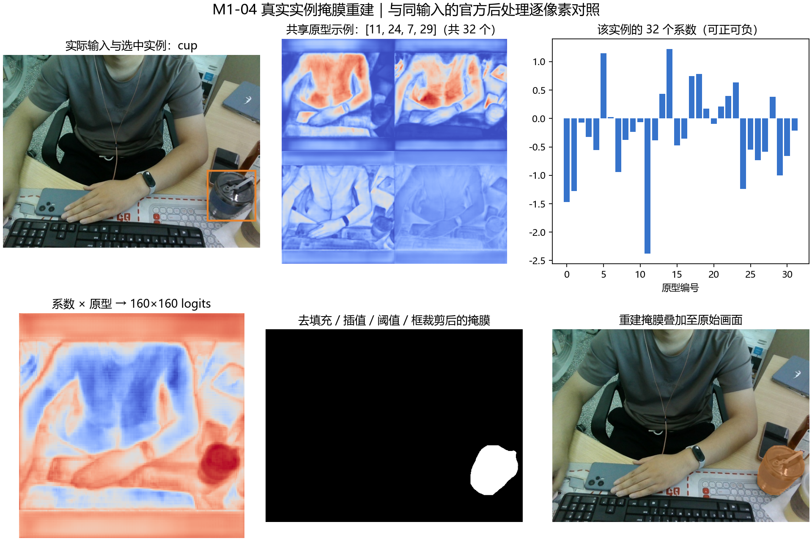

# M1 锁定模型的实际观察报告

执行日期：2026-10-02；首轮 GPU 实操记录时间：17:44:10（Asia/Shanghai）。同日追加 M1-02 专项结构核对及 18:25:07 的 M1-03 专项张量检查，分别见第 2.1 / 2.2 节。[学习笔记](../docs/模型学习笔记.md)用于跟读与解释，本报告登记实际观察和证据边界。以下各节保留执行当时的状态；2026-10-03 核心学习收尾状态见第 7 节，当前 M1 为 6/6，完整口述熟练度随工程继续练习。

**后续项目方向：**2026-10-03 用户正式采用三种固定包装商品的识别 / 实例分割，见[新安排](../plan/00_YOLO_分阶段推进与进度跟踪.md#product-scope)。本报告保存旧 E0 模型的结构、张量与后处理学习证据；其中 cup / bottle / cell phone 和 116 通道不是新商品训练结果。新数据、权重、指标和部署结果尚待对应阶段实际执行。

## 1. 运行对象与复现入口

| 项目 | 本轮实际值 |
| --- | --- |
| Python | `D:\software\anaconda\envs\yolo\python.exe`，现有 yolo 环境 |
| 源码 | Ultralytics 8.4.171，commit `86f5c8c401a630da651d321e691ab0af540812cf`；运行前校验上游工作区无修改 |
| 权重 | 原 COCO 80 类 `yolo11n-seg.pt`；SHA256 `55ed65c56c91713d23e8402371c6c49a6fd84f257f7dce452e8d70e41dcbe152` |
| 实际执行 | `cuda:0`，FP32，输入 `[1,3,640,640]` |
| 输入 | [公交车原图](../runs/E0/M0-04_20261002_bus_all/input_first.jpg)、[桌面原图](../runs/E0/M0-04_20261002_desktop_image/input_first.jpg)，均为已有 M0 文件 |
| 配置 | 沿用 [e0.yaml](../configs/e0.yaml) 的 conf=0.25、iou=0.7、max_det=100、retina_masks=True |
| 脚本与原始记录 | [inspect_model.py](../scripts/inspect_model.py)、[summary.json](model/M1/summary.json)，包含输入 / 源码 / 脚本 / 产出哈希 |

复现时从项目根目录运行 `python scripts/inspect_model.py --output reports/model/M1_recheck_01`；输出目录需为空。当前 `reports/model/M1/` 保留本次证据。

模型 `scale=n`，24 个顶层模块，融合前参数总数 2,876,848；Segment 的 nc=80、nm=32、npr=64、reg_max=16、strides=[8,16,32]，end2end=False。未修改网络配置或原权重文件。

## 2. 逐层实际连接与张量

以下为公交车图片 GPU 前向 hook 记录。除最后的组合返回外，张量均为 FP32 / cuda:0。`-1` 表示上一层，列表表示多路输入。

| 索引 | 模块 | from | 输出 shape |
| --- | --- | --- | --- |
| 0 | Conv | -1 | [1,16,320,320] |
| 1 | Conv | -1 | [1,32,160,160] |
| 2 | C3k2 | -1 | [1,64,160,160] |
| 3 | Conv | -1 | [1,64,80,80] |
| 4 | C3k2 | -1 | [1,128,80,80] |
| 5 | Conv | -1 | [1,128,40,40] |
| 6 | C3k2 | -1 | [1,128,40,40] |
| 7 | Conv | -1 | [1,256,20,20] |
| 8 | C3k2 | -1 | [1,256,20,20] |
| 9 | SPPF | -1 | [1,256,20,20] |
| 10 | C2PSA | -1 | [1,256,20,20] |
| 11 | Upsample | -1 | [1,256,40,40] |
| 12 | Concat | [-1,6] | [1,384,40,40] |
| 13 | C3k2 | -1 | [1,128,40,40] |
| 14 | Upsample | -1 | [1,128,80,80] |
| 15 | Concat | [-1,4] | [1,256,80,80] |
| 16 | C3k2，P3 | -1 | [1,64,80,80] |
| 17 | Conv | -1 | [1,64,40,40] |
| 18 | Concat | [-1,13] | [1,192,40,40] |
| 19 | C3k2，P4 | -1 | [1,128,40,40] |
| 20 | Conv | -1 | [1,128,20,20] |
| 21 | Concat | [-1,10] | [1,384,20,20] |
| 22 | C3k2，P5 | -1 | [1,256,20,20] |
| 23 | Segment | [16,19,22] | 普通推理：`((候选,原型),raw_dict)` |

完整连接图保存在[学习笔记第 2 节](../docs/模型学习笔记.md#m1-02)，由本表中的实际 `from` 对照建立。

| 返回内容 | shape / 结构 |
| --- | --- |
| 解码候选 | [1,116,8400] = 4 框 + 80 类分数 + 32 系数 |
| 原型 | [1,32,160,160] |
| raw_dict / 训练 boxes | [1,64,8400]，四条边各 16 个 bin |
| raw_dict / 训练 scores | [1,80,8400] |
| raw_dict / 训练 mask_coefficient | [1,32,8400] |
| 普通模式 | `((decoded,proto),raw_dict)` |
| export 模式 | `(decoded,proto)`；本轮与普通模式的两张量完全相同 |
| 训练模式 | 字典中保留原始预测、三个 feats 和 proto；已在临时副本上实测 |

此处 export 模式是 PyTorch 分割头返回结构检查，不是新增 ONNX 导出或后端性能测试。

### 2.1 M1-02 专项结构核对

按用户“先开展 M1-02，M1-01 后续学习再讨论”的安排，使用新增 [inspect_structure.py](../scripts/inspect_structure.py)重新加载原权重检查结构，并引用上述已保存的 GPU 前向 shape。证据保存于 [structure_check.json](model/M1-02/structure_check.json)，概览图见[学习笔记第 2 节](../docs/模型学习笔记.md#m1-02)。

| 核对内容 | 本次结果 |
| --- | --- |
| 权重 / 源码 | 原 SHA256 与锁定 commit 一致，上游源码无修改 |
| YAML / checkpoint | backbone、head、scales、nc 四项全部一致 |
| 顶层结构 | 24 个模块的类型、from 和参数数与前向记录一致；30 条输入连接，含原图输入 |
| 四个 Concat | 第 12/15/18/21 层通道和为 384/256/192/384，空间尺寸匹配，dimension=1 |
| 八个 C3k2 | 缩放后的内部重复数均为 1；第 2/4/13/16/19 层用 Bottleneck，第 6/8/22 层用 C3k |
| C2PSA | 第 10 层处理分支为 128 通道，含一个 PSABlock |
| Segment | 输入来自 16/19/22，通道 64/128/256，步长 8/16/32；cv2/cv3/cv4 的三尺度末端通道各为 64/80/32 |
| Proto | 取第 16 层 P3；中间通道 64，输出原型通道 32，使用 ConvTranspose2d 上采样 |

本次额外核对 SPPF：加载权重的 `cv1.act` 为 SiLU，而当前源码构造函数的新实例默认是 Identity。当前模块执行保留权重中的实际配置，本次没有替换它。学习笔记已将加载属性和新建默认值分开说明，避免只凭 YAML 相同断言内部所有属性相同。

新增脚本不执行前向、反向或训练；图中的张量尺寸来自原 M1 JSON，并核对其源码 / 权重哈希。结构记录保存新脚本、YAML、参考 JSON、源码与图的哈希，没有改写首轮 M1 记录。讲解已补齐配置缩放、上下采样、拼接、三个核心模块、Segment 分支、源码阅读顺序和练习。

结构核对与讲解材料完成；个人理解与复述仍待后续讨论。M1-01 保留待用户学习，当前不要求立即答题，也不因跳过本次 M1-01 讨论而阻塞结构准备。

### 2.2 M1-03 专项张量检查

新增 [inspect_tensors.py](../scripts/inspect_tensors.py)，复用首轮 `inspect_model.py` 的预处理、张量描述和来源定位函数。使用相同公交车 / 桌面图片，重新执行两图 GPU FP32 前向，记录 7 个关键层、三尺度的框 / 类别 / 系数分支，以及原型上采样和最终输出。仅新增一份 [tensor_check.json](model/M1-03/tensor_check.json)，约 33 KB；讲解合并到[原学习笔记第 3 节](../docs/模型学习笔记.md#m1-03)，不保存大数组或额外图片。

| 本次检查 | 实际结果 |
| --- | --- |
| 运行身份 | 锁定版本 / commit / 导入路径一致，上游工作区无修改；原权重 SHA256 一致 |
| 输入预处理 | bus 原图 1080×810 → 640×480，左右各补 80；desktop 原图 480×640，上下各补 80；输入均 `[1,3,640,640]` / FP32 / cuda:0，数值范围 `[0,1]` |
| 分割头输入 | P3/P4/P5 分别为 `[1,64,80,80]` / `[1,128,40,40]` / `[1,256,20,20]` |
| 三尺度分支末端 | 框 / 类别 / 系数通道为 64 / 80 / 32；空间尺寸各为 80×80、40×40、20×20 |
| 候选位置 | 6400+1600+400=8400；两图 decoded 均 `[1,116,8400]` |
| 框解码 | raw boxes `[1,64,8400]` → DFL 距离 `[1,4,8400]` → 当前解码与步长缩放；重建与 decoded 前四通道逐元素完全一致 |
| 类别段 / 系数段 | decoded 第 4:84 通道等于 raw scores 的 sigmoid；84:116 等于 raw mask_coefficient，均逐元素完全一致 |
| 原型路径 | P3 → 原型上采样 `[1,64,160,160]` → proto `[1,32,160,160]`；普通返回的 proto 与 raw dict 中同一原型一致 |
| 普通 / export | 两图的 decoded、proto 在两种返回模式下逐元素完全一致；没有新增 ONNX 导出 |
| 训练模式 | 临时副本在桌面输入上仅前向，返回 boxes / scores / feats / mask_coefficient / proto 字典；对应张量 shape 与普通模式 raw dict 一致，未要求数值一致 |
| 副本与原模型 | 首个 BN 计数在副本由 1 变为 2；副本丢弃，原推理模型 state_dict（参数及持久缓冲区）哈希保持一致；原权重文件哈希未变 |

每张图的 JSON 还保留一个后处理前最高分候选。桌面例子的候选索引为 8168，类别为 COCO 0 / person，分数约 0.889400，框为输入坐标系 xywh `[259.758,292.256,519.646,422.194]`，32 个系数既有正数也有负数。它是候选示例，不是新增的最终实例结果或真值；按项目三类过滤时 person 不会保留。完整数值保存在 JSON，学习时不需要背诵。

本次训练模式没有标签、损失、反向或 optimizer.step，不能记为项目训练；没有重跑 NMS、保存预测图、打开摄像头、安装依赖或测试部署性能。第 3 节的实例计数仍引用首轮记录。解释已补齐 BCHW、预处理坐标、分支展平、64/80/32/116/8400、原型与模式区别，并给出源码顺序、复现命令和练习。M1-03 工程实操完成，个人理解与复现待核对，任务仍未勾选。

## 3. 候选筛选与实际预测

| 图片 / 模式 | 全部候选 | 过置信度 | 过类别筛选 | NMS 后 / 非空 mask 后 | 预测类别计数 |
| --- | --- | --- | --- | --- | --- |
| bus / 全类别 | 8400 | 45 | 45 | 5 / 5 | person=4、bus=1 |
| bus / 三类 | 8400 | 45 | 0 | 0 / 0 | 空结果 |
| desktop / 全类别 | 8400 | 36 | 36 | 7 / 7 | person=1、cell phone=1、keyboard=2、cup=2、book=1 |
| desktop / 三类 | 8400 | 36 | 15 | 3 / 3 | cell phone=1、cup=2 |

三类筛选与全类别模式使用相同网络原始输出，只改变后处理。图示：[公交车三类结果](model/M1/bus_project_result.jpg)、[桌面三类结果](model/M1/desktop_project_result.jpg)。上表是预测计数，不是真值统计；历史遮挡手机漏检及瓶子误分类仍未修复。

每个保留候选在 NMS 输出中为 `[xyxy,confidence,class_id,32个系数]`，共 38 列；最终 Results 的 boxes 只保留前 6 列。summary 中登记了每个实例的坐标、分数、mask 面积、32 个系数和保留候选索引。

### 3.1 M1-04 专项复查与阈值学习

2026-10-03 15:48:21，运行[专项脚本](../scripts/inspect_postprocess.py)，结果为 `postprocess_checks_passed`。新证据仅保留一份[JSON](model/M1-04/postprocess_check.json)，24,560 字节；没有保存大张量、重复输入或新增预测图。

两图基线筛选计数、NMS 计数及类别均与首轮一致。每张图只做一次 GPU FP32 前向，阈值模式复用同一份候选与原型；后处理未修改原始候选。

| 桌面三类设置 | 过分数 | NMS 前 | NMS 后 / 非空掩膜后 |
| --- | --- | --- | --- |
| conf=0.25，IoU=0.70 | 36 | 15 | 3 / 3 |
| conf=0.10，IoU=0.70 | 66 | 25 | 3 / 3 |
| conf=0.50，IoU=0.70 | 16 | 6 | 1 / 1 |
| conf=0.25，IoU=0.30 | 36 | 15 | 3 / 3 |
| conf=0.25，IoU=0.90 | 36 | 15 | 3 / 3 |

JSON 保存完整贪心 NMS 学习轨迹，与官方索引一致。手机 7274 / 7275 的分数为 0.634283 / 0.623958，框 IoU=0.982827；7274 共抑制 9 个同类候选，cup 7474 抑制 3 个，cup 7679 保留，得到 15→3。实际抑制框的 IoU 均大于 0.97，因此本图 IoU=0.30～0.90 数量相同，不构成通用阈值结论。

框与 32 个系数均逐元素对应原始索引；学习掩膜与官方 `construct_result()` 逐像素一致，框还原一致，公交车三类空结果通过。共两张独立输入、八种图片 / 阈值模式、25 次掩膜比较，含重复实例，不是 25 张测试图片。

桌面上下各补 80，手机输入 xyxy `[508.409,310.204,589.985,407.724]` 还原为 `[508.409,230.204,589.985,327.724]`。三类系数 `[3,32]` 与原型 `[32,25600]` 相乘形成 `[3,160,160]` 分数图，最终掩膜 `[3,480,640]`。

权重和首轮 / M1-02 / M1-03 JSON 哈希未变；上游源码锁定且无改动。未训练、采集摄像头、导出模型或测速。M5 完整部署与个人理解验收仍未完成；讲解及两道题见[学习笔记](../docs/模型学习笔记.md#m1-04)。

## 4. 掩膜重建对照

脚本 `reconstruct_mask()` 独立写出系数与原型相乘、去填充、双线性插值、logits>0 阈值与框裁剪。对照参考是同输入 / 同候选下官方 `SegmentationPredictor.construct_result()`，未比较不同模型或不同输入。

本轮公交车全类别的 5 个实例、桌面全类别的 7 个实例及三类的 3 个实例，重建 mask 均与参考逐像素一致，框缩放结果完全一致。公交车三类空结果也正确返回无 mask。上述 15 次实例比较包含桌面不同模式下的重复对象，不应写成 15 个独立测试样本；实际只验证了两张图片。

这满足本轮学习实现对照，不替代 M5 的独立 NMS、完整部署及固定图片集验证。没有摄像头采集、FPS 基准、FP16 或优化效果结论。

## 5. 训练模式与反向教学实验

使用[手工两杯图](model/M1/task_comparison.png)及其明确的实例标签，在模型临时副本上启用训练模式与梯度；使用默认损失增益 box=7.5、cls=0.5、dfl=1.5，并设置 overlap_mask=False。这是教学输入，不是公共 / 自采正式数据集，也没有新增 E1/E2/E3 训练实验。

| 加权损失项 | 一次运行值 |
| --- | --- |
| box_loss | 0.339880 |
| seg_loss | 2.376784 |
| cls_loss | 4.836901 |
| dfl_loss | 0.966101 |
| sem_loss | 0.000000 |
| 合计 | 8.519667 |

损失有限；反向后主干首层、原型模块、掩膜系数分支均有非零梯度。未执行 optimizer.step，未保存副本权重；原模型文件哈希前后相同。副本中的 BatchNorm 运行统计随训练前向改变，仅存在于内存，副本随后丢弃。没有计算收敛趋势或改进幅度。

调试时发现加载的预训练模型参数默认不要求梯度；已在临时副本上显式调用 `requires_grad_(True)` 后完成检查。该调整只用于教学副本，未改上游源码或已有推理入口。

## 6. 教学评价样例

手工真值包含两个 cup；人为构造两个预测都指向 A，B 被漏掉。平移预测相对 A 的框 IoU=0.907407、mask IoU=0.837207；另一预测与 A 完全重合。按锁定版本的一对一匹配，在 IoU=0.5 下 TP=1、FP=1、FN=1，固定分数阈值保留两预测时 Precision=Recall=0.5。

| 教学指标 | 框 | mask |
| --- | --- | --- |
| AP50 / 单类 mAP50 | 0.495000 | 0.495000 |
| 单类 mAP50-95 | 0.470250 | 0.420750 |

数值由该版本的匹配和 101 点插值积分实际计算，完整各阈值结果在 JSON。它们属于构造样例，不是 E0 的真实精度或项目最终结果。

## 7. 源码、产出与学习验收

summary 的 `source_refs` 保存 25 个类 / 函数的实际文件、起止行与文件 SHA256，包括结构解析、各模块、分割头、NMS、mask、损失、分配与评价。教学脚本依赖锁定内部接口；升级源码后应重新检查返回结构和源码位置。

当前产出集中为四个各有用途的检查脚本、两份职责不同的 Markdown：首轮 `reports/model/M1/` 保存 JSON、两张说明图和两张预测图；`reports/model/M1-02/` 保存结构 JSON 与概览图，`reports/model/M1-03/` 仅保存一份张量 JSON，`reports/model/M1-04/` 仅保存一份后处理 JSON。没有保存每层大张量或重复原图。

工程检查通过。2026-10-03 主聊天完成 M1-01～05 的核心讨论：用户已说明四种任务与框 / 掩膜，确认桌面 8400→36→15→3 的筛选，并继续学习原型组合、实例对应和尺寸恢复。M1-05 中，用户正确回答了 Precision=0.6 / Recall=1、轮廓错误对应分割损失，以及训练损失下降不能证明独立数据效果提高。

本轮用户复述了 Backbone 提取特征、Neck 融合、各位置候选预测与原型组合的主线，并明确“当前还没训练，都是用的预训练模型”“后处理特定识别三种物品，其余的迁移学习等操作目前还没开展”。主聊天补充“掩膜系数”的术语、筛选 / NMS、尺寸恢复，以及固定独立数据上的质量评价。用户对实际案例题意表示不理解，主聊天用 E0 瓶子误分类和遮挡手机漏检解释；本轮未获得用户对故障处理的完整独立复述，不将案例讲解写成用户已独立修复或完成训练。

结合上述互动、已有工程检查和收尾补充，按项目与面试目标完成 M1 核心学习，6/6；主线 12/54、完整模块 2/9。验收覆盖核心学习、流程和版本边界核对；完整两分钟口述、实际案例的熟练讲解与独立复现继续在训练和最终成果整理中练习，不据此宣称已掌握全部源码或验证了新商品质量。

口述示例、关键追问、实际问答与剩余内容合并在[学习笔记第 5.3 / 6 节](../docs/模型学习笔记.md#m1-05-answers)。本轮只整理学习与进度，未执行新模型实验、训练、采集、导出或测速；原工程 JSON、源码与权重保留。下一项工程任务为 M2-01 商品登记与标注约定。
